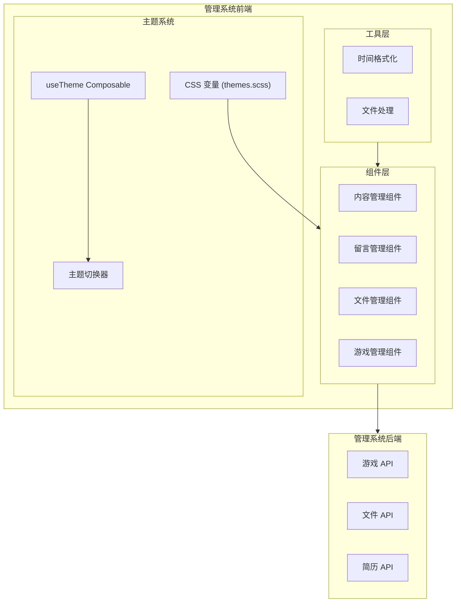
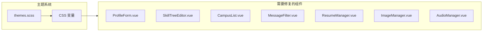

# 设计文档

## 概述

本设计文档描述了管理系统前端 P0 级别修复的技术实现方案，包括暗色主题样式修复和数据显示异常问题修复。修复工作主要涉及以下几个方面：

1. **暗色主题样式修复**：通过使用 CSS 变量替换硬编码颜色值，确保所有组件在暗色主题下正确显示
2. **数据显示修复**：修复游戏管理模块的数据加载和显示问题
3. **功能修复**：修复高级配置面板、文件浏览器、简历管理等功能问题
4. **时间格式修复**：统一使用北京时间显示

## 架构

### 整体架构



### 暗色主题修复架构



## 组件和接口

### 1. 主题样式修复

#### 1.1 CSS 变量使用规范

所有组件样式应使用 `themes.scss` 中定义的 CSS 变量：

```scss
// 背景颜色
--bg-color          // 主背景色
--bg-color-page     // 页面背景色
--card-bg           // 卡片背景色

// 文字颜色
--text-primary      // 主要文字
--text-regular      // 常规文字
--text-secondary    // 次要文字

// 边框颜色
--border-color      // 主边框色
--border-color-light // 浅边框色
```

#### 1.2 需要修复的组件样式

| 组件 | 问题 | 修复方案 |
|------|------|----------|
| ProfileForm.vue | `.form-section` 使用硬编码 `#fff` | 改为 `var(--card-bg)` |
| SkillTreeEditor.vue | `.tree-container` 使用硬编码 `#fff`，文字使用灰色 | 改为 `var(--card-bg)`，文字改为 `var(--text-primary)` |
| CampusList.vue | `.list-container` 使用硬编码 `#fff` | 改为 `var(--card-bg)` |
| ResumeManager.vue | `.stat-card` 使用硬编码颜色 | 改为 CSS 变量 |
| ImageManager.vue | `.upload-section` 使用硬编码 `#F5F7FA` | 改为 `var(--bg-color-page)` |
| AudioManager.vue | `.upload-section`、`.audio-item` 使用硬编码颜色 | 改为 CSS 变量 |

### 2. 游戏数据显示修复

#### 2.1 AdvancedConfigPanel 错误修复

**问题分析**：
- 错误信息：`Cannot read properties of undefined (reading 'types')`
- 原因：`modelValue.enemies.types` 在组件挂载时可能为 `undefined`

**修复方案**：
```typescript
// 添加防御性检查
const enemyTypes = computed(() => {
  return props.modelValue?.enemies?.types 
    ? Object.entries(props.modelValue.enemies.types) 
    : []
})
```

#### 2.2 ElSlider 组件错误修复

**问题分析**：
- 错误信息：ElSlider 组件在 mounted hook 执行时出错
- 原因：`modelValue` 属性在组件挂载时为 `undefined`

**修复方案**：
```typescript
// 为 slider 添加默认值
:model-value="modelValue?.audio?.musicVolume ?? 0.5"
```

### 3. 基础参数配置扩展

#### 3.1 新增配置项接口

```typescript
interface ExtendedBasicConfig extends BasicConfig {
  // 分关卡配置
  stageConfigs: StageBasicConfig[]
  
  // 敌我双方配置
  playerConfig: PlayerBasicConfig
  enemyGlobalConfig: EnemyGlobalConfig
  
  // 敌人单体配置
  enemyTypeConfigs: Record<EnemyType, EnemyTypeBasicConfig>
}

interface StageBasicConfig {
  stageId: number
  enemySpawnRate: number
  totalEnemies: number
  difficulty: number
}

interface PlayerBasicConfig {
  initialHealth: number
  initialSpeed: number
  damageMultiplier: number
}

interface EnemyGlobalConfig {
  healthMultiplier: number
  speedMultiplier: number
  damageMultiplier: number
}

interface EnemyTypeBasicConfig {
  enabled: boolean
  health: number
  speed: number
  damage: number
}
```

### 4. 文件浏览器功能修复

#### 4.1 FileTree 组件接口扩展

```typescript
interface FileTreeEmits {
  select: (node: FileInfo) => void
  download: (node: FileInfo) => void
  delete: (node: FileInfo) => void
  rename: (node: FileInfo) => void
  upload: (node: FileInfo) => void
  open: (node: FileInfo) => void      // 新增：打开文件
  locate: (node: FileInfo) => void    // 新增：定位文件
}
```

### 5. 简历管理修复

#### 5.1 文件名编码处理

```typescript
// 后端：使用 encodeURIComponent 编码文件名
const encodedFilename = encodeURIComponent(originalFilename)

// 前端：使用 decodeURIComponent 解码文件名
const decodedFilename = decodeURIComponent(encodedFilename)
```

#### 5.2 简历下载版本修复

```typescript
// 确保下载 API 返回正确版本
async function downloadResume(version: number) {
  // 添加时间戳防止缓存
  const timestamp = Date.now()
  return request.get(`/files/resume/${version}/download`, {
    params: { t: timestamp },
    responseType: 'blob'
  })
}
```

### 6. 时间格式化修复

#### 6.1 北京时间格式化函数

```typescript
/**
 * 将时间转换为北京时间并格式化
 * @param dateStr - ISO 格式的时间字符串
 * @param format - 输出格式，默认 'YYYY-MM-DD HH:mm'
 * @returns 北京时间格式化字符串
 */
function formatBeijingTime(dateStr: string, format: string = 'YYYY-MM-DD HH:mm'): string {
  if (!dateStr) return '-'
  
  const date = new Date(dateStr)
  // 获取 UTC 时间并加上 8 小时偏移
  const beijingOffset = 8 * 60 * 60 * 1000
  const beijingTime = new Date(date.getTime() + beijingOffset)
  
  const y = beijingTime.getUTCFullYear()
  const m = String(beijingTime.getUTCMonth() + 1).padStart(2, '0')
  const d = String(beijingTime.getUTCDate()).padStart(2, '0')
  const h = String(beijingTime.getUTCHours()).padStart(2, '0')
  const min = String(beijingTime.getUTCMinutes()).padStart(2, '0')
  const sec = String(beijingTime.getUTCSeconds()).padStart(2, '0')
  
  return format
    .replace('YYYY', String(y))
    .replace('MM', m)
    .replace('DD', d)
    .replace('HH', h)
    .replace('mm', min)
    .replace('ss', sec)
}
```

## 数据模型

### 1. 主题配置数据模型

```typescript
type ThemeMode = 'dark' | 'light' | 'system'

interface ThemeState {
  mode: ThemeMode
  systemPrefersDark: boolean
  resolvedTheme: 'dark' | 'light'
}
```

### 2. 游戏配置数据模型

```typescript
interface GameConfigRecord {
  id: number
  enabled: boolean
  debug_mode: boolean
  config: GameConfig
  updated_at: string
}

interface GameConfig {
  basic: BasicConfig
  advanced: AdvancedConfig
}

// AdvancedConfig 需要确保所有嵌套属性都有默认值
interface AdvancedConfig {
  scene: SceneConfig
  player: PlayerConfig
  movement: MovementConfig
  shooting: ShootingConfig
  effects: EffectsConfig
  audio: AudioConfig
  performance: PerformanceConfig
  enemies: EnemiesConfig  // 确保 types 属性存在
  stages: StageConfig[]
}
```

### 3. 文件信息数据模型

```typescript
interface FileInfo {
  name: string
  path: string
  type: 'file' | 'directory'
  size?: number
  modifiedAt?: string
  children?: FileInfo[]
}

interface ResumeVersion {
  version: number
  filename: string        // UTF-8 编码的文件名
  fileSize: number
  downloadCount: number
  isActive: boolean
  createdAt: string       // ISO 格式，需转换为北京时间显示
}
```


## 正确性属性

*正确性属性是一种特征或行为，应该在系统的所有有效执行中保持为真——本质上是关于系统应该做什么的形式化陈述。属性作为人类可读规范和机器可验证正确性保证之间的桥梁。*

### Property 1: 暗色主题样式一致性

*对于任意*启用暗色主题的页面，所有使用 `.form-section`、`.list-container`、`.upload-section`、`.tree-container`、`.stat-card`、`.audio-item` 等容器类的元素，其计算后的背景色应该是暗色（亮度值 < 50）。

**验证: 需求 1.1, 1.3, 1.5, 2.1, 3.1, 3.2, 3.3, 3.4**

### Property 2: 暗色主题文字可见性

*对于任意*启用暗色主题的页面，所有文字元素的颜色与背景色的对比度应该满足 WCAG AA 标准（对比度 >= 4.5:1）。

**验证: 需求 1.2, 1.4, 4.1, 4.2**

### Property 3: 数据渲染完整性

*对于任意*有效的排行榜数据数组，LeaderboardTable 组件渲染后应该包含与数据数组长度相等的行数，且每行都包含排名、玩家名、分数字段。

**验证: 需求 5.1, 5.2, 6.2**

### Property 4: 成就数据渲染完整性

*对于任意*有效的成就数据数组，AchievementList 组件渲染后应该包含与数据数组长度相等的行数，且每行都包含 ID、名称、条件类型、目标值字段。

**验证: 需求 7.1, 7.2**

### Property 5: 配置数据防御性处理

*对于任意*可能不完整的配置数据对象，AdvancedConfigPanel 组件应该能够正常渲染而不抛出错误，缺失的属性应该使用默认值。

**验证: 需求 9.2, 9.4**

### Property 6: 时间格式化正确性

*对于任意*有效的 ISO 格式时间字符串，formatBeijingTime 函数的输出应该是 UTC+8 时区的时间，且格式匹配 `YYYY-MM-DD HH:mm` 或 `YYYY-MM-DD HH:mm:ss`。

**验证: 需求 14.1, 14.2, 14.3**

### Property 7: 中文文件名编码往返一致性

*对于任意*包含中文字符的文件名，经过 encodeURIComponent 编码后再经过 decodeURIComponent 解码，应该得到与原始文件名相同的字符串。

**验证: 需求 12.1, 12.2**

## 错误处理

### 1. 配置数据加载错误

```typescript
// 当配置数据加载失败时
try {
  const config = await getGameConfig()
  // 处理配置
} catch (error) {
  ElMessage.error('加载游戏配置失败')
  // 使用默认配置
  localConfig.value = getDefaultLocalConfig()
}
```

### 2. 配置数据结构不完整

```typescript
// 使用可选链和空值合并运算符
const enemyTypes = computed(() => {
  return props.modelValue?.enemies?.types 
    ? Object.entries(props.modelValue.enemies.types) 
    : []
})

// Slider 组件默认值
:model-value="modelValue?.audio?.musicVolume ?? 0.5"
```

### 3. 文件操作错误

```typescript
// 文件操作失败时显示具体错误信息
try {
  await deleteFile(path)
  ElMessage.success('删除成功')
} catch (error: any) {
  ElMessage.error(error.message || '删除失败，请稍后重试')
}
```

### 4. 时间格式化错误

```typescript
// 无效时间字符串处理
function formatBeijingTime(dateStr: string): string {
  if (!dateStr) return '-'
  
  const date = new Date(dateStr)
  if (isNaN(date.getTime())) return '-'
  
  // 正常格式化逻辑
}
```

## 测试策略

### 单元测试

1. **时间格式化函数测试**
   - 测试 UTC 时间转换为北京时间的正确性
   - 测试各种边界情况（空字符串、无效日期、时区边界）

2. **配置数据处理测试**
   - 测试不完整配置数据的处理
   - 测试默认值填充逻辑

3. **文件名编码测试**
   - 测试中文文件名的编码和解码
   - 测试特殊字符处理

### 属性测试

使用 fast-check 库进行属性测试，每个属性测试至少运行 100 次迭代。

1. **Property 6: 时间格式化正确性**
   - 生成随机的有效 ISO 时间字符串
   - 验证输出格式和时区转换正确性
   - **Feature: admin-dark-theme-fix, Property 6: 时间格式化正确性**

2. **Property 7: 中文文件名编码往返一致性**
   - 生成随机的中文字符串
   - 验证编码-解码往返一致性
   - **Feature: admin-dark-theme-fix, Property 7: 中文文件名编码往返一致性**

3. **Property 5: 配置数据防御性处理**
   - 生成随机的不完整配置对象
   - 验证组件不抛出错误
   - **Feature: admin-dark-theme-fix, Property 5: 配置数据防御性处理**

### 集成测试

1. **暗色主题样式测试**
   - 切换到暗色主题
   - 验证各组件的样式正确应用

2. **数据显示测试**
   - 模拟 API 响应
   - 验证数据正确渲染

### 端到端测试

1. **主题切换流程测试**
   - 测试主题切换功能
   - 验证样式变化

2. **游戏配置修改流程测试**
   - 测试配置修改和保存
   - 验证配置生效
