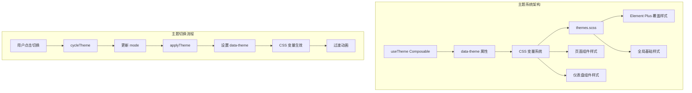
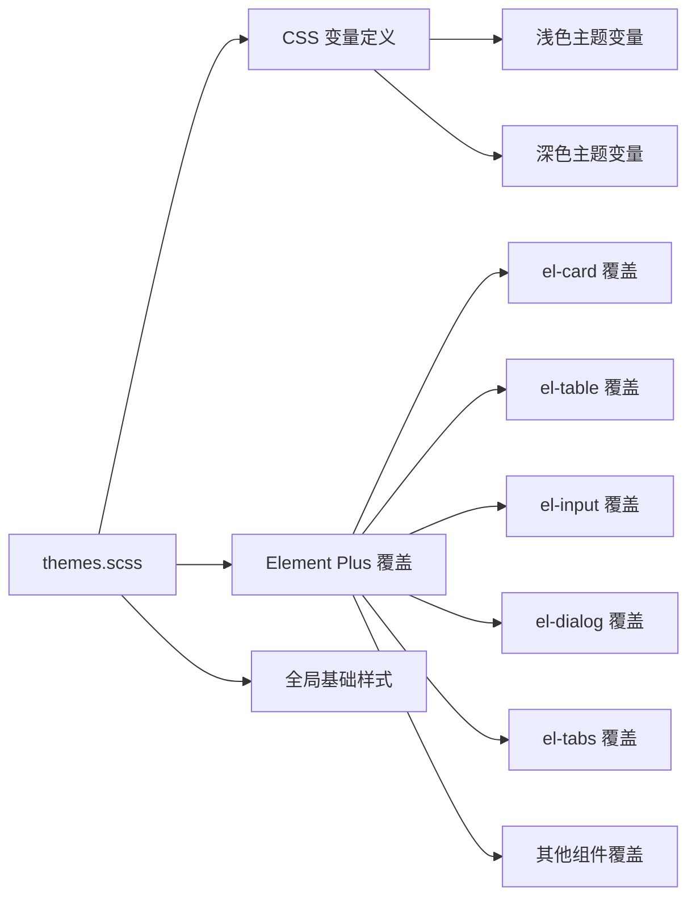

# 设计文档

## 概述

本设计文档描述管理系统主题系统完善功能的技术实现方案。核心目标是通过扩展现有的 CSS 变量系统，为 Element Plus 组件添加深色模式覆盖样式，并更新所有页面组件中的硬编码颜色值为主题变量引用。

### 设计原则

1. **最小侵入性**：尽量通过全局样式覆盖实现，减少对单个组件的修改
2. **一致性**：所有组件使用统一的主题变量命名规范
3. **可维护性**：集中管理主题样式，便于后续扩展和维护
4. **向后兼容**：保持浅色主题的现有表现不变

## 架构

### 整体架构图



### 样式层级结构



## 组件和接口

### 1. themes.scss 扩展

现有的 `themes.scss` 文件已定义了基础的 CSS 变量，需要扩展以下内容：

#### 新增 Element Plus 覆盖样式

```scss
/* ========== Element Plus 深色模式覆盖 ========== */
[data-theme="dark"] {
  /* 卡片组件 */
  .el-card {
    background-color: var(--card-bg);
    border-color: var(--card-border);
    
    &__header {
      border-bottom-color: var(--border-color);
    }
  }
  
  /* 表格组件 */
  .el-table {
    background-color: var(--bg-color);
    color: var(--text-primary);
    
    th.el-table__cell {
      background-color: var(--table-header-bg);
      color: var(--text-primary);
    }
    
    tr {
      background-color: var(--bg-color);
      
      &:hover > td.el-table__cell {
        background-color: var(--table-row-hover-bg);
      }
    }
    
    td.el-table__cell {
      border-bottom-color: var(--table-border);
    }
    
    &--border {
      border-color: var(--table-border);
      
      &::after,
      &::before {
        background-color: var(--table-border);
      }
    }
  }
  
  /* 输入框组件 */
  .el-input {
    &__wrapper {
      background-color: var(--input-bg);
      box-shadow: 0 0 0 1px var(--input-border) inset;
      
      &:hover {
        box-shadow: 0 0 0 1px var(--input-border-hover) inset;
      }
      
      &.is-focus {
        box-shadow: 0 0 0 1px var(--input-border-focus) inset;
      }
    }
    
    &__inner {
      color: var(--text-primary);
      
      &::placeholder {
        color: var(--text-placeholder);
      }
    }
  }
  
  /* 选择器组件 */
  .el-select {
    &__wrapper {
      background-color: var(--input-bg);
      box-shadow: 0 0 0 1px var(--input-border) inset;
    }
  }
  
  /* 对话框组件 */
  .el-dialog {
    background-color: var(--bg-color);
    
    &__header {
      border-bottom-color: var(--border-color);
    }
    
    &__title {
      color: var(--text-primary);
    }
    
    &__footer {
      border-top-color: var(--border-color);
    }
  }
  
  /* 标签页组件 */
  .el-tabs {
    &--border-card {
      background-color: var(--bg-color);
      border-color: var(--border-color);
      
      > .el-tabs__header {
        background-color: var(--bg-color-page);
        border-bottom-color: var(--border-color);
        
        .el-tabs__item {
          color: var(--text-regular);
          border-color: var(--border-color);
          
          &.is-active {
            background-color: var(--bg-color);
            color: var(--primary-color);
          }
        }
      }
    }
    
    &__content {
      background-color: var(--bg-color);
    }
  }
  
  /* 下拉菜单组件 */
  .el-dropdown-menu {
    background-color: var(--bg-color);
    border-color: var(--border-color);
    
    &__item {
      color: var(--text-regular);
      
      &:hover {
        background-color: var(--table-row-hover-bg);
        color: var(--primary-color);
      }
    }
  }
  
  /* 分页组件 */
  .el-pagination {
    button {
      background-color: var(--bg-color);
      color: var(--text-primary);
      
      &:disabled {
        background-color: var(--bg-color);
        color: var(--text-placeholder);
      }
    }
    
    .el-pager li {
      background-color: var(--bg-color);
      color: var(--text-primary);
      
      &.is-active {
        color: var(--primary-color);
      }
    }
  }
  
  /* 日期选择器组件 */
  .el-date-editor {
    &.el-input__wrapper {
      background-color: var(--input-bg);
    }
  }
  
  /* 消息提示组件 */
  .el-message {
    background-color: var(--bg-color);
    border-color: var(--border-color);
    
    &__content {
      color: var(--text-primary);
    }
  }
  
  /* 通知组件 */
  .el-notification {
    background-color: var(--bg-color);
    border-color: var(--border-color);
    
    &__title {
      color: var(--text-primary);
    }
    
    &__content {
      color: var(--text-regular);
    }
  }
  
  /* 面包屑组件 */
  .el-breadcrumb {
    &__inner {
      color: var(--text-regular);
    }
    
    &__separator {
      color: var(--text-secondary);
    }
  }
  
  /* 空状态组件 */
  .el-empty {
    &__description {
      color: var(--text-secondary);
    }
  }
  
  /* 加载组件 */
  .el-loading-mask {
    background-color: var(--bg-color-overlay);
  }
  
  /* 弹出框组件 */
  .el-popper {
    background-color: var(--bg-color);
    border-color: var(--border-color);
    color: var(--text-primary);
  }
  
  /* 工具提示组件 */
  .el-tooltip__popper {
    background-color: var(--bg-color);
    border-color: var(--border-color);
    color: var(--text-primary);
  }
  
  /* 单选按钮组 */
  .el-radio-button {
    &__inner {
      background-color: var(--bg-color);
      border-color: var(--border-color);
      color: var(--text-regular);
    }
    
    &__original-radio:checked + .el-radio-button__inner {
      background-color: var(--primary-color);
      border-color: var(--primary-color);
    }
  }
  
  /* 开关组件 */
  .el-switch {
    &__label {
      color: var(--text-regular);
    }
  }
  
  /* 警告提示组件 */
  .el-alert {
    &--info {
      background-color: rgba(64, 158, 255, 0.1);
      
      .el-alert__description {
        color: var(--text-regular);
      }
    }
  }
  
  /* 分割线组件 */
  .el-divider {
    border-color: var(--border-color);
    
    &__text {
      background-color: var(--bg-color);
      color: var(--text-regular);
    }
  }
  
  /* 标签组件 */
  .el-tag {
    &--info {
      background-color: rgba(144, 147, 153, 0.1);
      border-color: rgba(144, 147, 153, 0.2);
      color: var(--text-secondary);
    }
  }
}
```

### 2. 页面组件样式更新

#### 通用样式模式

所有页面组件需要遵循以下样式更新模式：

```scss
// 替换前（硬编码颜色）
.page-container {
  background-color: #f5f7fa;
}

.page-header {
  background: #fff;
  color: #303133;
}

// 替换后（主题变量）
.page-container {
  background-color: var(--bg-color-page);
}

.page-header {
  background: var(--bg-color);
  color: var(--text-primary);
}
```

#### 颜色映射表

| 硬编码颜色 | 主题变量 | 用途 |
|-----------|---------|------|
| `#ffffff` / `#fff` | `var(--bg-color)` | 卡片、面板背景 |
| `#f5f7fa` / `#F5F7FA` | `var(--bg-color-page)` | 页面背景、工具栏背景 |
| `#303133` | `var(--text-primary)` | 主要文字 |
| `#606266` | `var(--text-regular)` | 常规文字 |
| `#909399` | `var(--text-secondary)` | 次要文字 |
| `#c0c4cc` | `var(--text-placeholder)` | 占位符文字 |
| `#dcdfe6` | `var(--border-color)` | 边框颜色 |
| `#e4e7ed` | `var(--border-color-light)` | 浅边框颜色 |
| `#ebeef5` / `#EBEEF5` | `var(--border-color-lighter)` | 更浅边框颜色 |

## 数据模型

本功能不涉及新的数据模型，主要是样式层面的更新。现有的主题状态管理已在 `useTheme.ts` 中实现：

```typescript
// 主题模式类型
type ThemeMode = 'dark' | 'light' | 'system'

// 主题状态
const mode = ref<ThemeMode>('light')
const systemPrefersDark = ref(false)

// 解析后的实际主题
const resolvedTheme = computed<'dark' | 'light'>(() => {
  if (mode.value === 'system') {
    return systemPrefersDark.value ? 'dark' : 'light'
  }
  return mode.value
})
```


## 正确性属性

*正确性属性是一种应该在系统所有有效执行中保持为真的特征或行为——本质上是关于系统应该做什么的形式化陈述。属性作为人类可读规范和机器可验证正确性保证之间的桥梁。*

基于验收标准的分析，以下是可测试的正确性属性：

### 属性 1: Element Plus 组件深色主题样式一致性

*对于任意* Element Plus 组件（el-card、el-table、el-input、el-select、el-dialog、el-tabs、el-dropdown-menu、el-pagination），当主题切换到深色模式时，该组件的背景色应该与 `--bg-color` 或 `--card-bg` 变量的计算值匹配，边框色应该与 `--border-color` 或 `--card-border` 变量的计算值匹配。

**验证: 需求 1.1, 1.2, 1.3, 1.4, 1.5, 1.6, 1.8**

### 属性 2: 页面组件深色主题样式一致性

*对于任意* 页面组件（Dashboard、Content、Message、File、Game、SEO），当主题切换到深色模式时：
- 页面容器背景色应该与 `--bg-color-page` 变量的计算值匹配
- 页面头部/卡片背景色应该与 `--bg-color` 变量的计算值匹配
- 主要文字颜色应该与 `--text-primary` 变量的计算值匹配
- 次要文字颜色应该与 `--text-secondary` 变量的计算值匹配

**验证: 需求 2.1, 2.2, 2.3, 2.4, 2.5, 2.6, 3.1, 3.2, 4.1, 4.2, 5.1, 5.2, 5.3, 6.1, 6.2, 6.3, 6.4, 7.1**

### 属性 3: 主题过渡动画正确性

*对于任意* 主题切换操作：
- 当 `prefers-reduced-motion` 未设置时，所有颜色相关属性的过渡时间应该为 300ms
- 当 `prefers-reduced-motion: reduce` 设置时，过渡时间应该为 0ms（无动画）

**验证: 需求 8.1, 8.2**

## 错误处理

### 1. CSS 变量回退

当 CSS 变量未定义或无效时，应提供合理的回退值：

```scss
// 使用回退值确保样式不会完全失效
.element {
  background-color: var(--bg-color, #ffffff);
  color: var(--text-primary, #303133);
}
```

### 2. 主题状态持久化失败

当 localStorage 不可用时（如隐私模式），主题系统应：
- 继续正常工作，使用默认主题
- 在控制台输出警告信息
- 不影响用户的正常使用

现有的 `useTheme.ts` 已经处理了这种情况：

```typescript
try {
  localStorage.setItem(STORAGE_KEY, newMode)
} catch (error) {
  console.warn('[useTheme] localStorage 不可用，主题偏好不会被持久化')
}
```

### 3. 系统主题检测失败

当无法检测系统主题偏好时，应回退到浅色主题：

```typescript
const mediaQuery = window.matchMedia('(prefers-color-scheme: dark)')
systemPrefersDark.value = mediaQuery?.matches ?? false
```

## 测试策略

### 单元测试

单元测试用于验证特定示例和边缘情况：

1. **主题切换逻辑测试**
   - 测试 `setTheme()` 函数正确设置主题模式
   - 测试 `cycleTheme()` 函数按正确顺序循环切换
   - 测试 `resolvedTheme` 计算属性正确解析系统主题

2. **CSS 变量应用测试**
   - 测试 `data-theme` 属性正确设置到 `document.documentElement`
   - 测试主题变量在不同主题下返回正确的值

### 属性测试

属性测试用于验证跨所有输入的通用属性：

1. **属性 1 测试: Element Plus 组件样式一致性**
   - 使用 Vitest + @vue/test-utils
   - 生成随机的 Element Plus 组件实例
   - 切换到深色主题后验证计算样式
   - 最少运行 100 次迭代

2. **属性 2 测试: 页面组件样式一致性**
   - 使用 Vitest + @vue/test-utils
   - 遍历所有页面组件
   - 切换到深色主题后验证关键元素的计算样式
   - 最少运行 100 次迭代

3. **属性 3 测试: 过渡动画正确性**
   - 使用 Vitest
   - 模拟 `prefers-reduced-motion` 媒体查询
   - 验证过渡时间设置
   - 最少运行 100 次迭代

### 视觉回归测试（可选）

使用 Playwright 或 Cypress 进行视觉回归测试：

1. 截取浅色主题下各页面的截图
2. 切换到深色主题
3. 截取深色主题下各页面的截图
4. 对比截图确保没有意外的视觉变化

### 测试配置

```typescript
// vitest.config.ts
export default defineConfig({
  test: {
    // 属性测试最少运行 100 次
    testTimeout: 30000,
    // 启用 DOM 环境
    environment: 'jsdom',
  }
})
```

### 测试标签格式

每个属性测试必须包含以下注释标签：

```typescript
/**
 * Feature: admin-theme-system, Property 1: Element Plus 组件深色主题样式一致性
 * 对于任意 Element Plus 组件，在深色主题下应该使用正确的主题变量
 */
```
