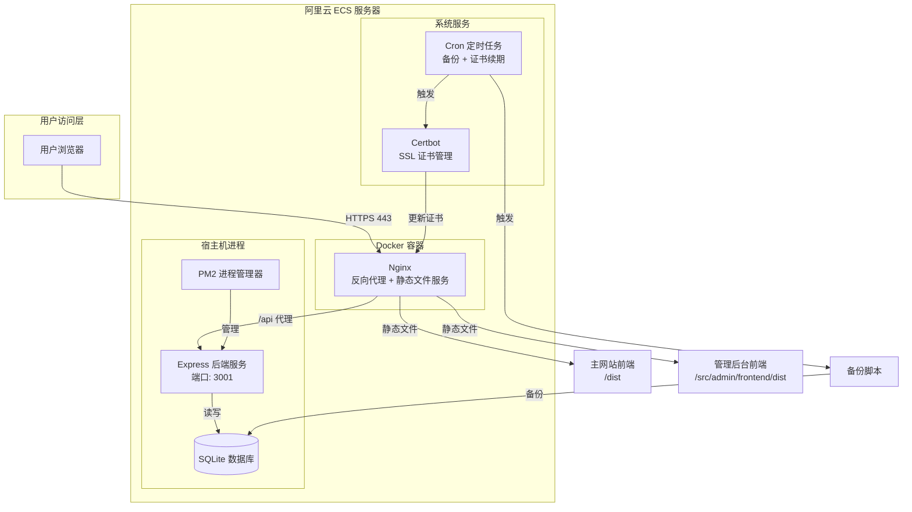

# 设计文档：阿里云部署系统

## 概述

本文档描述了将 Vue3 个人作品集网站部署到阿里云 ECS 服务器的完整技术设计方案。该系统包括前端静态资源部署、后端 API 服务部署、域名配置、HTTPS 证书管理以及自动化部署流程。

### 系统目标

1. **可靠性**：确保服务稳定运行，自动处理故障恢复
2. **安全性**：实施 HTTPS 加密、防火墙配置、安全加固措施
3. **性能**：优化资源使用，在 2GB 内存服务器上高效运行
4. **可维护性**：提供自动化部署、日志管理、备份恢复机制
5. **可扩展性**：支持多环境部署、零停机更新

### 技术栈

- **前端主应用**：Vue3 + TypeScript + Vite
- **管理后台前端**：Vue3 + TypeScript + Vite
- **管理后台后端**：Express + TypeScript + SQLite
- **容器化**：Docker + Docker Compose
- **Web 服务器**：Nginx
- **进程管理**：PM2
- **SSL 证书**：Let's Encrypt + Certbot
- **CI/CD**：GitHub Actions
- **服务器**：阿里云 ECS（2GB 内存）

### 部署架构图



## 架构设计

### 高层架构

系统采用前后端分离架构，通过 Nginx 作为统一入口：

1. **前端层**：
   - 主网站前端：个人作品集展示
   - 管理后台前端：内容管理界面
   - 均为 Vue3 SPA 应用，构建为静态资源

2. **反向代理层**：
   - Nginx 处理所有 HTTP/HTTPS 请求
   - 静态文件直接服务
   - API 请求代理到后端服务
   - SSL/TLS 终止

3. **应用层**：
   - Express 后端服务提供 RESTful API
   - PM2 管理进程生命周期
   - 处理业务逻辑和数据访问

4. **数据层**：
   - SQLite 数据库存储业务数据
   - 文件系统存储上传文件

5. **基础设施层**：
   - Docker 容器化 Nginx
   - 系统级服务（Certbot、Cron）
   - 防火墙和安全配置

### 部署模式选择

考虑到服务器资源限制（2GB 内存）和系统复杂度，采用混合部署模式：

- **容器化部署**：Nginx（轻量级，资源占用少）
- **宿主机部署**：Node.js 后端（避免容器开销，便于调试）

这种模式的优势：
- Nginx 容器化便于版本管理和快速回滚
- 后端直接运行减少内存开销（约节省 100-200MB）
- PM2 提供更好的进程监控和日志管理
- 简化数据库文件访问和备份

## 组件和接口

### 1. Frontend_Builder（前端构建器）

**职责**：编译和优化前端应用

**接口**：

```typescript
interface FrontendBuilder {
  // 构建主网站前端
  buildMainFrontend(): Promise<BuildResult>
  
  // 构建管理后台前端
  buildAdminFrontend(): Promise<BuildResult>
  
  // 验证构建产物
  validateBuild(distPath: string): Promise<ValidationResult>
}

interface BuildResult {
  success: boolean
  distPath: string
  assets: string[]
  errors?: string[]
}
```

**实现细节**：

- 使用 Vite 构建工具
- 主网站：在根目录执行 `npm run build`
- 管理后台：在 `src/admin/frontend` 执行 `npm run build`
- 应用优化：代码分割、Tree Shaking、资源压缩
- 输出目录：`dist/` 和 `src/admin/frontend/dist/`

**构建脚本示例**：

```bash
#!/bin/bash
# build-frontend.sh

set -e

echo "开始构建前端应用..."

# 构建主网站
echo "构建主网站前端..."
npm run build

# 构建管理后台
echo "构建管理后台前端..."
cd src/admin/frontend
npm run build
cd ../../..

echo "前端构建完成"
```

### 2. Backend_Builder（后端构建器）

**职责**：编译 TypeScript 后端代码

**接口**：

```typescript
interface BackendBuilder {
  // 构建后端服务
  buildBackend(): Promise<BuildResult>
  
  // 安装生产依赖
  installProductionDeps(): Promise<void>
}
```

**实现细节**：

- 使用 TypeScript 编译器（tsc）
- 在 `src/admin/backend` 执行 `npm run build`
- 编译输出到 `src/admin/backend/dist/`
- 仅安装生产依赖：`npm ci --production`


**构建脚本示例**：

```bash
#!/bin/bash
# build-backend.sh

set -e

echo "开始构建后端服务..."

cd src/admin/backend

# 安装依赖
npm ci

# 编译 TypeScript
npm run build

# 安装生产依赖（可选，部署时执行）
# npm ci --production

echo "后端构建完成"
```

### 3. Docker_Manager（Docker 管理器）

**职责**：管理 Docker 容器和镜像

**接口**：

```typescript
interface DockerManager {
  // 构建镜像
  buildImage(tag: string): Promise<void>
  
  // 启动容器
  startContainer(config: ContainerConfig): Promise<string>
  
  // 停止容器
  stopContainer(containerId: string): Promise<void>
  
  // 健康检查
  checkHealth(containerId: string): Promise<HealthStatus>
}

interface ContainerConfig {
  image: string
  ports: PortMapping[]
  volumes: VolumeMapping[]
  environment: Record<string, string>
}
```


**Dockerfile 设计**：

```dockerfile
# 多阶段构建优化镜像大小

# 阶段 1：构建前端
FROM node:18-alpine AS frontend-builder

WORKDIR /app

# 复制主网站源码
COPY package*.json ./
RUN npm ci
COPY . .
RUN npm run build

# 构建管理后台前端
WORKDIR /app/src/admin/frontend
RUN npm ci
RUN npm run build

# 阶段 2：生产环境
FROM nginx:alpine

# 复制自定义 Nginx 配置
COPY nginx.conf /etc/nginx/nginx.conf

# 复制主网站构建产物
COPY --from=frontend-builder /app/dist /usr/share/nginx/html

# 复制管理后台构建产物
COPY --from=frontend-builder /app/src/admin/frontend/dist /usr/share/nginx/html/admin

# 暴露端口
EXPOSE 80 443

# 健康检查
HEALTHCHECK --interval=30s --timeout=3s --start-period=5s --retries=3 \
  CMD wget --quiet --tries=1 --spider http://localhost/ || exit 1

# 启动 Nginx
CMD ["nginx", "-g", "daemon off;"]
```

**docker-compose.yml 设计**：

```yaml
version: '3.8'

services:
  nginx:
    build:
      context: .
      dockerfile: Dockerfile
    container_name: portfolio-nginx
    ports:
      - "80:80"
      - "443:443"
    volumes:
      # SSL 证书
      - /etc/letsencrypt:/etc/letsencrypt:ro
      # Nginx 配置（支持热更新）
      - ./nginx.conf:/etc/nginx/nginx.conf:ro
      # 日志
      - ./logs/nginx:/var/log/nginx
    restart: unless-stopped
    networks:
      - portfolio-network

networks:
  portfolio-network:
    driver: bridge
```


### 4. Nginx_Configurator（Nginx 配置器）

**职责**：配置 Nginx 反向代理和静态文件服务

**配置结构**：

```nginx
# nginx.conf - 生产环境配置

user nginx;
worker_processes auto;  # 自动匹配 CPU 核心数
error_log /var/log/nginx/error.log warn;
pid /var/run/nginx.pid;

events {
    worker_connections 1024;
    use epoll;  # Linux 高性能事件模型
}

http {
    include /etc/nginx/mime.types;
    default_type application/octet-stream;

    # 日志格式
    log_format main '$remote_addr - $remote_user [$time_local] "$request" '
                    '$status $body_bytes_sent "$http_referer" '
                    '"$http_user_agent" "$http_x_forwarded_for"';

    access_log /var/log/nginx/access.log main;

    # 性能优化
    sendfile on;
    tcp_nopush on;
    tcp_nodelay on;
    keepalive_timeout 65;
    types_hash_max_size 2048;
    client_max_body_size 10M;  # 文件上传限制

    # Gzip 压缩
    gzip on;
    gzip_vary on;
    gzip_proxied any;
    gzip_comp_level 6;
    gzip_types text/plain text/css text/xml text/javascript 
               application/json application/javascript application/xml+rss 
               application/rss+xml font/truetype font/opentype 
               application/vnd.ms-fontobject image/svg+xml;
    gzip_min_length 1000;

    # HTTP 重定向到 HTTPS
    server {
        listen 80;
        server_name yourdomain.com www.yourdomain.com;
        
        # Let's Encrypt 验证
        location /.well-known/acme-challenge/ {
            root /var/www/certbot;
        }
        
        # 强制 HTTPS
        location / {
            return 301 https://$server_name$request_uri;
        }
    }


    # HTTPS 主站点
    server {
        listen 443 ssl http2;
        server_name yourdomain.com www.yourdomain.com;
        root /usr/share/nginx/html;
        index index.html;

        # SSL 证书配置
        ssl_certificate /etc/letsencrypt/live/yourdomain.com/fullchain.pem;
        ssl_certificate_key /etc/letsencrypt/live/yourdomain.com/privkey.pem;
        
        # SSL 优化
        ssl_protocols TLSv1.2 TLSv1.3;
        ssl_ciphers HIGH:!aNULL:!MD5;
        ssl_prefer_server_ciphers on;
        ssl_session_cache shared:SSL:10m;
        ssl_session_timeout 10m;

        # 安全响应头
        add_header Strict-Transport-Security "max-age=31536000; includeSubDomains" always;
        add_header X-Frame-Options "DENY" always;
        add_header X-Content-Type-Options "nosniff" always;
        add_header X-XSS-Protection "1; mode=block" always;
        add_header Referrer-Policy "strict-origin-when-cross-origin" always;

        # 后端 API 代理
        location /api/ {
            proxy_pass http://host.docker.internal:3001;
            proxy_http_version 1.1;
            proxy_set_header Upgrade $http_upgrade;
            proxy_set_header Connection 'upgrade';
            proxy_set_header Host $host;
            proxy_set_header X-Real-IP $remote_addr;
            proxy_set_header X-Forwarded-For $proxy_add_x_forwarded_for;
            proxy_set_header X-Forwarded-Proto $scheme;
            proxy_cache_bypass $http_upgrade;
            
            # 超时设置
            proxy_connect_timeout 60s;
            proxy_send_timeout 60s;
            proxy_read_timeout 60s;
        }

        # 管理后台
        location /admin/ {
            alias /usr/share/nginx/html/admin/;
            try_files $uri $uri/ /admin/index.html;
            add_header Cache-Control "no-cache";
        }

        # 静态资源缓存
        location ~* \.(js|css|png|jpg|jpeg|gif|ico|svg|woff|woff2|ttf|eot)$ {
            expires 1y;
            add_header Cache-Control "public, immutable";
        }

        # SPA 路由支持
        location / {
            try_files $uri $uri/ /index.html;
            add_header Cache-Control "no-cache";
        }

        # 禁止访问隐藏文件
        location ~ /\. {
            deny all;
        }

        # 错误页面
        error_page 404 /index.html;
        error_page 500 502 503 504 /index.html;
    }
}
```


### 5. SSL_Manager（SSL 管理器）

**职责**：管理 SSL 证书的申请、续期和部署

**实现方案**：使用 Certbot + Let's Encrypt

**证书申请脚本**：

```bash
#!/bin/bash
# setup-ssl.sh - SSL 证书申请脚本

set -e

DOMAIN="yourdomain.com"
EMAIL="your-email@example.com"

echo "开始申请 SSL 证书..."

# 安装 Certbot
if ! command -v certbot &> /dev/null; then
    echo "安装 Certbot..."
    sudo apt-get update
    sudo apt-get install -y certbot
fi

# 停止 Nginx（如果正在运行）
sudo docker-compose down || true

# 申请证书（standalone 模式）
sudo certbot certonly \
    --standalone \
    --non-interactive \
    --agree-tos \
    --email "$EMAIL" \
    -d "$DOMAIN" \
    -d "www.$DOMAIN"

# 设置证书自动续期
echo "配置证书自动续期..."
sudo crontab -l > /tmp/crontab.bak 2>/dev/null || true
echo "0 2 * * * certbot renew --quiet --post-hook 'docker-compose restart nginx'" >> /tmp/crontab.bak
sudo crontab /tmp/crontab.bak
rm /tmp/crontab.bak

echo "SSL 证书申请完成"
echo "证书路径: /etc/letsencrypt/live/$DOMAIN/"
```

**证书续期策略**：

- 使用 Cron 定时任务，每天凌晨 2 点检查
- Certbot 自动判断是否需要续期（距离过期少于 30 天）
- 续期成功后自动重启 Nginx 容器使新证书生效


### 6. Domain_Configurator（域名配置器）

**职责**：验证域名配置和提供配置指南

**域名配置流程**：

1. **DNS 记录配置**（在域名服务商控制台）：
   ```
   类型: A
   主机记录: @
   记录值: <服务器公网IP>
   TTL: 600
   
   类型: A
   主机记录: www
   记录值: <服务器公网IP>
   TTL: 600
   ```

2. **域名验证脚本**：

```bash
#!/bin/bash
# verify-domain.sh - 域名解析验证

DOMAIN="yourdomain.com"
SERVER_IP="your-server-ip"

echo "验证域名解析..."

# 检查主域名
RESOLVED_IP=$(dig +short "$DOMAIN" | tail -n1)
if [ "$RESOLVED_IP" = "$SERVER_IP" ]; then
    echo "✓ 主域名解析正确: $DOMAIN -> $SERVER_IP"
else
    echo "✗ 主域名解析错误: $DOMAIN -> $RESOLVED_IP (期望: $SERVER_IP)"
fi

# 检查 www 子域名
WWW_IP=$(dig +short "www.$DOMAIN" | tail -n1)
if [ "$WWW_IP" = "$SERVER_IP" ]; then
    echo "✓ www 子域名解析正确: www.$DOMAIN -> $SERVER_IP"
else
    echo "✗ www 子域名解析错误: www.$DOMAIN -> $WWW_IP (期望: $SERVER_IP)"
fi
```

### 7. 环境变量管理

**环境变量结构**：

**主网站 .env.production**：
```bash
# 应用配置
VITE_APP_TITLE=黄彦杰 - 前端开发工程师
VITE_APP_DESCRIPTION=个人作品集网站
VITE_BASE_URL=/
VITE_SITE_URL=https://yourdomain.com

# API 配置
VITE_API_BASE_URL=/api

# 功能开关
VITE_ENABLE_ANALYTICS=true
VITE_ENABLE_CONTACT_FORM=true
VITE_ENABLE_PWA=true
```


**后端 .env.production**：
```bash
# 服务器配置
NODE_ENV=production
PORT=3001

# JWT 配置
JWT_SECRET=<生产环境强密码>
JWT_EXPIRES_IN=24h

# 数据库配置
DB_PATH=./data/admin.db

# 文件上传配置
UPLOAD_DIR=./uploads
MAX_FILE_SIZE=10485760

# 内存限制
NODE_OPTIONS=--max-old-space-size=450

# 日志配置
LOG_LEVEL=info

# CORS 配置
CORS_ORIGIN=https://yourdomain.com

# 管理员账户
ADMIN_USERNAME=admin
ADMIN_PASSWORD=<首次初始化密码>
```

**环境变量验证脚本**：

```bash
#!/bin/bash
# validate-env.sh - 环境变量验证

check_env_var() {
    if [ -z "${!1}" ]; then
        echo "✗ 缺少必需的环境变量: $1"
        return 1
    else
        echo "✓ $1 已设置"
        return 0
    fi
}

echo "验证后端环境变量..."
cd src/admin/backend

source .env.production

REQUIRED_VARS=(
    "NODE_ENV"
    "PORT"
    "JWT_SECRET"
    "DB_PATH"
)

ALL_OK=true
for var in "${REQUIRED_VARS[@]}"; do
    check_env_var "$var" || ALL_OK=false
done

if [ "$ALL_OK" = true ]; then
    echo "✓ 所有必需的环境变量已配置"
    exit 0
else
    echo "✗ 环境变量配置不完整"
    exit 1
fi
```


### 8. 数据库初始化

**数据库架构**：

```sql
-- schema.sql - 数据库表结构

-- 管理员表
CREATE TABLE IF NOT EXISTS admins (
    id INTEGER PRIMARY KEY AUTOINCREMENT,
    username TEXT UNIQUE NOT NULL,
    password_hash TEXT NOT NULL,
    created_at DATETIME DEFAULT CURRENT_TIMESTAMP,
    updated_at DATETIME DEFAULT CURRENT_TIMESTAMP
);

-- 留言表
CREATE TABLE IF NOT EXISTS messages (
    id INTEGER PRIMARY KEY AUTOINCREMENT,
    name TEXT NOT NULL,
    email TEXT NOT NULL,
    subject TEXT,
    message TEXT NOT NULL,
    status TEXT DEFAULT 'unread',
    created_at DATETIME DEFAULT CURRENT_TIMESTAMP
);

-- 文件上传记录表
CREATE TABLE IF NOT EXISTS uploads (
    id INTEGER PRIMARY KEY AUTOINCREMENT,
    filename TEXT NOT NULL,
    original_name TEXT NOT NULL,
    mime_type TEXT NOT NULL,
    size INTEGER NOT NULL,
    path TEXT NOT NULL,
    created_at DATETIME DEFAULT CURRENT_TIMESTAMP
);

-- 创建索引
CREATE INDEX IF NOT EXISTS idx_messages_status ON messages(status);
CREATE INDEX IF NOT EXISTS idx_messages_created_at ON messages(created_at);
CREATE INDEX IF NOT EXISTS idx_uploads_created_at ON uploads(created_at);
```

**初始化脚本**：

```bash
#!/bin/bash
# init-database.sh - 数据库初始化

set -e

DB_PATH="./data/admin.db"
SCHEMA_FILE="./src/schema.sql"

echo "初始化数据库..."

# 创建数据目录
mkdir -p ./data

# 检查数据库是否已存在
if [ -f "$DB_PATH" ]; then
    echo "数据库已存在，跳过初始化"
    exit 0
fi

# 创建数据库并执行 schema
sqlite3 "$DB_PATH" < "$SCHEMA_FILE"

echo "✓ 数据库表结构创建完成"

# 创建默认管理员账户
echo "创建默认管理员账户..."
node -e "
const bcrypt = require('bcrypt');
const sqlite3 = require('sqlite3').verbose();
const db = new sqlite3.Database('$DB_PATH');

const username = process.env.ADMIN_USERNAME || 'admin';
const password = process.env.ADMIN_PASSWORD || 'admin123';

bcrypt.hash(password, 10, (err, hash) => {
    if (err) throw err;
    db.run('INSERT INTO admins (username, password_hash) VALUES (?, ?)', 
        [username, hash], 
        (err) => {
            if (err) throw err;
            console.log('✓ 默认管理员账户创建完成');
            console.log('用户名:', username);
            console.log('密码:', password);
            console.log('请在首次登录后立即修改密码！');
            db.close();
        }
    );
});
"

# 设置数据库文件权限
chmod 644 "$DB_PATH"

echo "✓ 数据库初始化完成"
```


### 9. PM2 进程管理

**PM2 配置文件**（已存在于 `src/admin/backend/ecosystem.config.js`）：

关键配置说明：
- **内存限制**：500MB（满足需求 9.4）
- **自动重启**：进程崩溃时自动重启（满足需求 9.3）
- **最大重启次数**：10 次，防止无限重启（满足需求 9.7）
- **日志管理**：分离错误日志和输出日志（满足需求 9.6）
- **Node.js 参数**：限制堆内存 400MB，优化垃圾回收

**PM2 管理命令**：

```bash
# 启动服务
pm2 start ecosystem.config.js --env production

# 查看状态
pm2 status

# 查看日志
pm2 logs admin-backend

# 重启服务
pm2 restart admin-backend

# 停止服务
pm2 stop admin-backend

# 删除服务
pm2 delete admin-backend

# 保存 PM2 配置
pm2 save

# 设置开机自启动
pm2 startup
```

### 10. Health_Monitor（健康监控器）

**健康检查端点实现**：

```typescript
// src/admin/backend/src/routes/health.ts

import { Router } from 'express';
import { promises as fs } from 'fs';
import os from 'os';

const router = Router();

interface HealthStatus {
  status: 'ok' | 'error';
  timestamp: string;
  uptime: number;
  memory: {
    used: number;
    total: number;
    percentage: number;
  };
  disk?: {
    available: number;
    total: number;
    percentage: number;
  };
}

router.get('/health', async (req, res) => {
  try {
    const memUsage = process.memoryUsage();
    const totalMem = os.totalmem();
    const usedMem = memUsage.heapUsed;
    
    const health: HealthStatus = {
      status: 'ok',
      timestamp: new Date().toISOString(),
      uptime: process.uptime(),
      memory: {
        used: Math.round(usedMem / 1024 / 1024), // MB
        total: Math.round(totalMem / 1024 / 1024), // MB
        percentage: Math.round((usedMem / totalMem) * 100)
      }
    };
    
    res.json(health);
  } catch (error) {
    res.status(500).json({
      status: 'error',
      message: 'Health check failed'
    });
  }
});

export default router;
```


**监控脚本**：

```bash
#!/bin/bash
# monitor.sh - 服务监控脚本

HEALTH_URL="http://localhost:3001/api/health"
LOG_FILE="./logs/monitor.log"
ALERT_THRESHOLD=3

check_health() {
    response=$(curl -s -o /dev/null -w "%{http_code}" "$HEALTH_URL")
    if [ "$response" = "200" ]; then
        return 0
    else
        return 1
    fi
}

# 创建日志目录
mkdir -p ./logs

# 健康检查
FAIL_COUNT=0
while true; do
    if check_health; then
        echo "[$(date)] ✓ 服务正常" >> "$LOG_FILE"
        FAIL_COUNT=0
    else
        FAIL_COUNT=$((FAIL_COUNT + 1))
        echo "[$(date)] ✗ 服务异常 (失败次数: $FAIL_COUNT)" >> "$LOG_FILE"
        
        if [ $FAIL_COUNT -ge $ALERT_THRESHOLD ]; then
            echo "[$(date)] ⚠ 告警：服务连续失败 $FAIL_COUNT 次" >> "$LOG_FILE"
            # 这里可以添加告警通知逻辑（邮件、短信等）
        fi
    fi
    
    sleep 30
done
```

### 11. 日志管理

**日志轮转配置**（使用 logrotate）：

```bash
# /etc/logrotate.d/portfolio

/var/www/portfolio/logs/nginx/*.log {
    daily
    rotate 7
    compress
    delaycompress
    missingok
    notifempty
    create 0644 nginx nginx
    sharedscripts
    postrotate
        docker-compose exec nginx nginx -s reload > /dev/null 2>&1
    endscript
}

/var/www/portfolio/src/admin/backend/logs/*.log {
    daily
    rotate 7
    compress
    delaycompress
    missingok
    notifempty
    create 0644 node node
    sharedscripts
    postrotate
        pm2 reloadLogs
    endscript
}
```

**日志查看命令**：

```bash
# 查看 Nginx 访问日志
tail -f logs/nginx/access.log

# 查看 Nginx 错误日志
tail -f logs/nginx/error.log

# 查看后端日志
pm2 logs admin-backend

# 查看后端错误日志
tail -f src/admin/backend/logs/error.log
```


### 12. Backup_Manager（备份管理器）

**备份脚本**：

```bash
#!/bin/bash
# backup.sh - 数据库备份脚本

set -e

# 配置
DB_PATH="./src/admin/backend/data/admin.db"
BACKUP_DIR="./backups"
RETENTION_DAYS=30

# 创建备份目录
mkdir -p "$BACKUP_DIR"

# 生成备份文件名（包含时间戳）
TIMESTAMP=$(date +%Y%m%d_%H%M%S)
BACKUP_FILE="$BACKUP_DIR/admin_db_$TIMESTAMP.db"

echo "开始备份数据库..."

# 执行备份
if [ -f "$DB_PATH" ]; then
    cp "$DB_PATH" "$BACKUP_FILE"
    
    # 压缩备份文件
    gzip "$BACKUP_FILE"
    
    echo "✓ 备份完成: ${BACKUP_FILE}.gz"
    
    # 清理旧备份（保留最近 30 天）
    find "$BACKUP_DIR" -name "admin_db_*.db.gz" -mtime +$RETENTION_DAYS -delete
    echo "✓ 已清理 $RETENTION_DAYS 天前的旧备份"
else
    echo "✗ 数据库文件不存在: $DB_PATH"
    exit 1
fi

# 显示备份列表
echo ""
echo "当前备份列表："
ls -lh "$BACKUP_DIR"
```

**恢复脚本**：

```bash
#!/bin/bash
# restore.sh - 数据库恢复脚本

set -e

if [ -z "$1" ]; then
    echo "用法: ./restore.sh <备份文件>"
    echo "示例: ./restore.sh backups/admin_db_20240101_120000.db.gz"
    exit 1
fi

BACKUP_FILE="$1"
DB_PATH="./src/admin/backend/data/admin.db"
CURRENT_BACKUP="./backups/admin_db_before_restore_$(date +%Y%m%d_%H%M%S).db"

echo "开始恢复数据库..."

# 检查备份文件是否存在
if [ ! -f "$BACKUP_FILE" ]; then
    echo "✗ 备份文件不存在: $BACKUP_FILE"
    exit 1
fi

# 备份当前数据库
if [ -f "$DB_PATH" ]; then
    echo "备份当前数据库到: $CURRENT_BACKUP"
    cp "$DB_PATH" "$CURRENT_BACKUP"
    gzip "$CURRENT_BACKUP"
fi

# 解压并恢复
if [[ "$BACKUP_FILE" == *.gz ]]; then
    gunzip -c "$BACKUP_FILE" > "$DB_PATH"
else
    cp "$BACKUP_FILE" "$DB_PATH"
fi

echo "✓ 数据库恢复完成"
echo "✓ 当前数据库已备份到: ${CURRENT_BACKUP}.gz"

# 重启后端服务
echo "重启后端服务..."
pm2 restart admin-backend

echo "✓ 恢复操作完成"
```

**定时备份配置**（Crontab）：

```bash
# 每天凌晨 2 点执行备份
0 2 * * * cd /var/www/portfolio && ./backup.sh >> ./logs/backup.log 2>&1
```


### 13. 部署脚本自动化

**一键部署脚本**：

```bash
#!/bin/bash
# deploy.sh - 一键部署脚本

set -e

# 颜色输出
RED='\033[0;31m'
GREEN='\033[0;32m'
YELLOW='\033[1;33m'
NC='\033[0m' # No Color

log_info() {
    echo -e "${GREEN}[INFO]${NC} $1"
}

log_warn() {
    echo -e "${YELLOW}[WARN]${NC} $1"
}

log_error() {
    echo -e "${RED}[ERROR]${NC} $1"
}

# 检查必需的命令
check_requirements() {
    log_info "检查部署环境..."
    
    commands=("docker" "docker-compose" "node" "npm" "pm2")
    for cmd in "${commands[@]}"; do
        if ! command -v "$cmd" &> /dev/null; then
            log_error "缺少必需的命令: $cmd"
            exit 1
        fi
    done
    
    log_info "✓ 环境检查通过"
}

# 备份当前版本
backup_current() {
    log_info "备份当前版本..."
    
    BACKUP_DIR="./backups/deployments"
    TIMESTAMP=$(date +%Y%m%d_%H%M%S)
    
    mkdir -p "$BACKUP_DIR"
    
    # 备份数据库
    if [ -f "./src/admin/backend/data/admin.db" ]; then
        cp "./src/admin/backend/data/admin.db" "$BACKUP_DIR/admin_db_$TIMESTAMP.db"
        log_info "✓ 数据库已备份"
    fi
    
    # 记录当前 Git 版本
    git rev-parse HEAD > "$BACKUP_DIR/version_$TIMESTAMP.txt"
    log_info "✓ 版本信息已保存"
}

# 构建前端
build_frontend() {
    log_info "构建前端应用..."
    
    # 构建主网站
    log_info "构建主网站..."
    npm ci
    npm run build
    
    # 构建管理后台前端
    log_info "构建管理后台前端..."
    cd src/admin/frontend
    npm ci
    npm run build
    cd ../../..
    
    log_info "✓ 前端构建完成"
}

# 构建后端
build_backend() {
    log_info "构建后端服务..."
    
    cd src/admin/backend
    npm ci
    npm run build
    cd ../../..
    
    log_info "✓ 后端构建完成"
}

# 构建 Docker 镜像
build_docker() {
    log_info "构建 Docker 镜像..."
    
    docker-compose build
    
    log_info "✓ Docker 镜像构建完成"
}

# 部署服务
deploy_services() {
    log_info "部署服务..."
    
    # 启动 Nginx 容器
    log_info "启动 Nginx 容器..."
    docker-compose up -d
    
    # 启动后端服务
    log_info "启动后端服务..."
    cd src/admin/backend
    pm2 restart ecosystem.config.js --env production || pm2 start ecosystem.config.js --env production
    pm2 save
    cd ../../..
    
    log_info "✓ 服务部署完成"
}

# 健康检查
health_check() {
    log_info "执行健康检查..."
    
    sleep 5
    
    # 检查 Nginx
    if curl -f http://localhost/ > /dev/null 2>&1; then
        log_info "✓ Nginx 运行正常"
    else
        log_error "✗ Nginx 健康检查失败"
        return 1
    fi
    
    # 检查后端
    if curl -f http://localhost:3001/api/health > /dev/null 2>&1; then
        log_info "✓ 后端服务运行正常"
    else
        log_error "✗ 后端健康检查失败"
        return 1
    fi
    
    log_info "✓ 所有服务健康检查通过"
}

# 主流程
main() {
    log_info "========================================="
    log_info "开始部署流程"
    log_info "========================================="
    
    check_requirements
    backup_current
    build_frontend
    build_backend
    build_docker
    deploy_services
    health_check
    
    log_info "========================================="
    log_info "✓ 部署完成！"
    log_info "========================================="
}

# 执行部署
main
```


**回滚脚本**：

```bash
#!/bin/bash
# rollback.sh - 快速回滚脚本

set -e

RED='\033[0;31m'
GREEN='\033[0;32m'
YELLOW='\033[1;33m'
NC='\033[0m'

log_info() {
    echo -e "${GREEN}[INFO]${NC} $1"
}

log_error() {
    echo -e "${RED}[ERROR]${NC} $1"
}

BACKUP_DIR="./backups/deployments"

# 列出可用的备份
list_backups() {
    log_info "可用的备份版本："
    ls -lt "$BACKUP_DIR" | grep "version_" | head -5
}

# 回滚到指定版本
rollback() {
    if [ -z "$1" ]; then
        log_error "请指定要回滚的版本时间戳"
        list_backups
        exit 1
    fi
    
    TIMESTAMP="$1"
    VERSION_FILE="$BACKUP_DIR/version_$TIMESTAMP.txt"
    DB_BACKUP="$BACKUP_DIR/admin_db_$TIMESTAMP.db"
    
    if [ ! -f "$VERSION_FILE" ]; then
        log_error "版本文件不存在: $VERSION_FILE"
        exit 1
    fi
    
    COMMIT_HASH=$(cat "$VERSION_FILE")
    
    log_info "回滚到版本: $COMMIT_HASH"
    
    # 回滚代码
    git checkout "$COMMIT_HASH"
    
    # 恢复数据库
    if [ -f "$DB_BACKUP" ]; then
        log_info "恢复数据库..."
        cp "$DB_BACKUP" "./src/admin/backend/data/admin.db"
    fi
    
    # 重新部署
    log_info "重新部署..."
    ./deploy.sh
    
    log_info "✓ 回滚完成"
}

# 执行回滚
if [ "$1" = "list" ]; then
    list_backups
else
    rollback "$1"
fi
```

### 14. CI/CD 流水线（GitHub Actions）

**GitHub Actions 配置文件**：

```yaml
# .github/workflows/deploy.yml

name: 部署到阿里云

on:
  push:
    branches:
      - main
  workflow_dispatch:

jobs:
  deploy:
    runs-on: ubuntu-latest
    
    steps:
      - name: 检出代码
        uses: actions/checkout@v3
      
      - name: 设置 Node.js
        uses: actions/setup-node@v3
        with:
          node-version: '18'
          cache: 'npm'
      
      - name: 安装依赖
        run: npm ci
      
      - name: 代码检查
        run: npm run lint
      
      - name: 运行测试
        run: npm run test
      
      - name: 构建主网站
        run: npm run build
        env:
          VITE_SITE_URL: ${{ secrets.SITE_URL }}
          VITE_API_BASE_URL: /api
      
      - name: 构建管理后台前端
        run: |
          cd src/admin/frontend
          npm ci
          npm run build
      
      - name: 构建后端
        run: |
          cd src/admin/backend
          npm ci
          npm run build
      
      - name: 构建 Docker 镜像
        run: |
          docker build -t portfolio:${{ github.sha }} .
          docker tag portfolio:${{ github.sha }} portfolio:latest
      
      - name: 保存 Docker 镜像
        run: |
          docker save portfolio:latest | gzip > portfolio-image.tar.gz
      
      - name: 部署到服务器
        uses: appleboy/scp-action@master
        with:
          host: ${{ secrets.SERVER_HOST }}
          username: ${{ secrets.SERVER_USER }}
          key: ${{ secrets.SERVER_SSH_KEY }}
          source: "portfolio-image.tar.gz,docker-compose.yml,deploy.sh"
          target: "/var/www/portfolio"
      
      - name: 执行部署脚本
        uses: appleboy/ssh-action@master
        with:
          host: ${{ secrets.SERVER_HOST }}
          username: ${{ secrets.SERVER_USER }}
          key: ${{ secrets.SERVER_SSH_KEY }}
          script: |
            cd /var/www/portfolio
            docker load < portfolio-image.tar.gz
            chmod +x deploy.sh
            ./deploy.sh
      
      - name: 健康检查
        uses: appleboy/ssh-action@master
        with:
          host: ${{ secrets.SERVER_HOST }}
          username: ${{ secrets.SERVER_USER }}
          key: ${{ secrets.SERVER_SSH_KEY }}
          script: |
            sleep 10
            curl -f https://${{ secrets.DOMAIN }}/ || exit 1
            curl -f https://${{ secrets.DOMAIN }}/api/health || exit 1
      
      - name: 发送通知
        if: always()
        uses: 8398a7/action-slack@v3
        with:
          status: ${{ job.status }}
          text: '部署状态: ${{ job.status }}'
          webhook_url: ${{ secrets.SLACK_WEBHOOK }}
```


**GitHub Secrets 配置**：

需要在 GitHub 仓库设置中配置以下 Secrets：
- `SERVER_HOST`: 服务器 IP 地址
- `SERVER_USER`: SSH 用户名
- `SERVER_SSH_KEY`: SSH 私钥
- `SITE_URL`: 网站域名
- `DOMAIN`: 域名（用于健康检查）
- `SLACK_WEBHOOK`: Slack 通知 Webhook（可选）

### 15. 安全加固

**防火墙配置**（使用 UFW）：

```bash
#!/bin/bash
# setup-firewall.sh - 防火墙配置脚本

set -e

echo "配置防火墙..."

# 安装 UFW
sudo apt-get update
sudo apt-get install -y ufw

# 默认策略：拒绝所有入站，允许所有出站
sudo ufw default deny incoming
sudo ufw default allow outgoing

# 允许 SSH（端口 22）
sudo ufw allow 22/tcp

# 允许 HTTP（端口 80）
sudo ufw allow 80/tcp

# 允许 HTTPS（端口 443）
sudo ufw allow 443/tcp

# 启用防火墙
sudo ufw --force enable

# 显示状态
sudo ufw status verbose

echo "✓ 防火墙配置完成"
```

**SSH 安全加固**：

```bash
#!/bin/bash
# secure-ssh.sh - SSH 安全配置

set -e

echo "加固 SSH 配置..."

# 备份原配置
sudo cp /etc/ssh/sshd_config /etc/ssh/sshd_config.backup

# 禁用密码登录
sudo sed -i 's/#PasswordAuthentication yes/PasswordAuthentication no/' /etc/ssh/sshd_config
sudo sed -i 's/PasswordAuthentication yes/PasswordAuthentication no/' /etc/ssh/sshd_config

# 禁用 root 登录
sudo sed -i 's/#PermitRootLogin yes/PermitRootLogin no/' /etc/ssh/sshd_config
sudo sed -i 's/PermitRootLogin yes/PermitRootLogin no/' /etc/ssh/sshd_config

# 仅允许密钥认证
echo "PubkeyAuthentication yes" | sudo tee -a /etc/ssh/sshd_config

# 重启 SSH 服务
sudo systemctl restart sshd

echo "✓ SSH 安全配置完成"
echo "⚠ 请确保已配置 SSH 密钥，否则将无法登录！"
```

**Fail2ban 配置**：

```bash
#!/bin/bash
# setup-fail2ban.sh - 安装和配置 Fail2ban

set -e

echo "安装 Fail2ban..."

# 安装 Fail2ban
sudo apt-get update
sudo apt-get install -y fail2ban

# 创建本地配置
sudo tee /etc/fail2ban/jail.local > /dev/null <<EOF
[DEFAULT]
bantime = 3600
findtime = 600
maxretry = 5

[sshd]
enabled = true
port = 22
logpath = /var/log/auth.log

[nginx-http-auth]
enabled = true
port = http,https
logpath = /var/log/nginx/error.log

[nginx-limit-req]
enabled = true
port = http,https
logpath = /var/log/nginx/error.log
EOF

# 启动 Fail2ban
sudo systemctl enable fail2ban
sudo systemctl start fail2ban

# 显示状态
sudo fail2ban-client status

echo "✓ Fail2ban 配置完成"
```


**API 限流配置**（在后端实现）：

```typescript
// src/admin/backend/src/middleware/rateLimit.ts

import rateLimit from 'express-rate-limit';

// 通用 API 限流
export const apiLimiter = rateLimit({
  windowMs: 15 * 60 * 1000, // 15 分钟
  max: 100, // 限制 100 次请求
  message: '请求过于频繁，请稍后再试',
  standardHeaders: true,
  legacyHeaders: false,
});

// 登录接口严格限流
export const loginLimiter = rateLimit({
  windowMs: 15 * 60 * 1000, // 15 分钟
  max: 5, // 限制 5 次登录尝试
  message: '登录尝试次数过多，请 15 分钟后再试',
  skipSuccessfulRequests: true,
});

// 文件上传限流
export const uploadLimiter = rateLimit({
  windowMs: 60 * 60 * 1000, // 1 小时
  max: 20, // 限制 20 次上传
  message: '上传次数过多，请稍后再试',
});
```

### 16. 性能优化

**Nginx 性能优化配置**：

```nginx
# nginx.conf - 性能优化部分

# 工作进程数自动匹配 CPU 核心数
worker_processes auto;

# 工作进程优先级
worker_priority -5;

# 每个工作进程的最大文件描述符数
worker_rlimit_nofile 65535;

events {
    # 每个工作进程的最大连接数
    worker_connections 2048;
    
    # 使用高效的事件模型
    use epoll;
    
    # 尽可能多地接受连接
    multi_accept on;
}

http {
    # 开启高效文件传输
    sendfile on;
    tcp_nopush on;
    tcp_nodelay on;
    
    # 连接超时设置
    keepalive_timeout 65;
    keepalive_requests 100;
    
    # 客户端请求体大小限制
    client_body_buffer_size 128k;
    client_max_body_size 10m;
    client_header_buffer_size 1k;
    large_client_header_buffers 4 4k;
    
    # 输出缓冲
    output_buffers 1 32k;
    postpone_output 1460;
    
    # 开启 HTTP/2
    http2_max_field_size 16k;
    http2_max_header_size 32k;
}
```

**SQLite 性能优化**：

```typescript
// src/admin/backend/src/database/config.ts

import sqlite3 from 'sqlite3';
import { open } from 'sqlite';

export async function initDatabase() {
  const db = await open({
    filename: process.env.DB_PATH || './data/admin.db',
    driver: sqlite3.Database
  });
  
  // 启用 WAL 模式（Write-Ahead Logging）
  // 提升并发性能
  await db.exec('PRAGMA journal_mode = WAL;');
  
  // 设置同步模式为 NORMAL（平衡性能和安全性）
  await db.exec('PRAGMA synchronous = NORMAL;');
  
  // 增加缓存大小（2000 页 = 约 8MB）
  await db.exec('PRAGMA cache_size = -8000;');
  
  // 设置临时文件存储在内存中
  await db.exec('PRAGMA temp_store = MEMORY;');
  
  // 启用外键约束
  await db.exec('PRAGMA foreign_keys = ON;');
  
  return db;
}

// 定期执行 VACUUM 清理碎片
export async function vacuumDatabase(db: any) {
  console.log('开始数据库碎片整理...');
  await db.exec('VACUUM;');
  console.log('数据库碎片整理完成');
}
```

**定期 VACUUM 任务**（Crontab）：

```bash
# 每周日凌晨 3 点执行数据库碎片整理
0 3 * * 0 cd /var/www/portfolio/src/admin/backend && node -e "require('./dist/database/config').vacuumDatabase()" >> /var/www/portfolio/logs/vacuum.log 2>&1
```


### 17. 零停机部署

**蓝绿部署策略**：

```bash
#!/bin/bash
# blue-green-deploy.sh - 零停机部署脚本

set -e

GREEN='\033[0;32m'
BLUE='\033[0;34m'
NC='\033[0m'

log_info() {
    echo -e "${GREEN}[INFO]${NC} $1"
}

# 检查当前运行的容器
CURRENT_CONTAINER=$(docker ps --filter "name=portfolio-nginx" --format "{{.Names}}" | head -1)

if [ -z "$CURRENT_CONTAINER" ]; then
    NEW_COLOR="blue"
    OLD_COLOR="green"
else
    if [[ "$CURRENT_CONTAINER" == *"blue"* ]]; then
        NEW_COLOR="green"
        OLD_COLOR="blue"
    else
        NEW_COLOR="blue"
        OLD_COLOR="green"
    fi
fi

log_info "当前运行: $OLD_COLOR, 新版本: $NEW_COLOR"

# 构建新版本镜像
log_info "构建新版本镜像..."
docker build -t portfolio:$NEW_COLOR .

# 启动新容器（使用不同端口）
log_info "启动新容器..."
if [ "$NEW_COLOR" = "blue" ]; then
    NEW_PORT=8081
else
    NEW_PORT=8082
fi

docker run -d \
    --name portfolio-nginx-$NEW_COLOR \
    -p $NEW_PORT:80 \
    portfolio:$NEW_COLOR

# 等待新容器就绪
log_info "等待新容器就绪..."
sleep 5

# 健康检查
MAX_RETRIES=10
RETRY_COUNT=0

while [ $RETRY_COUNT -lt $MAX_RETRIES ]; do
    if curl -f http://localhost:$NEW_PORT/ > /dev/null 2>&1; then
        log_info "✓ 新容器健康检查通过"
        break
    fi
    
    RETRY_COUNT=$((RETRY_COUNT + 1))
    log_info "健康检查失败，重试 $RETRY_COUNT/$MAX_RETRIES..."
    sleep 2
done

if [ $RETRY_COUNT -eq $MAX_RETRIES ]; then
    log_info "✗ 新容器健康检查失败，回滚"
    docker stop portfolio-nginx-$NEW_COLOR
    docker rm portfolio-nginx-$NEW_COLOR
    exit 1
fi

# 切换流量（更新 Nginx 上游配置或更新端口映射）
log_info "切换流量到新容器..."

# 停止旧容器（等待 10 秒让现有连接完成）
if [ -n "$CURRENT_CONTAINER" ]; then
    log_info "等待现有连接完成..."
    sleep 10
    
    log_info "停止旧容器..."
    docker stop $CURRENT_CONTAINER
    docker rm $CURRENT_CONTAINER
fi

# 更新端口映射到标准端口
docker stop portfolio-nginx-$NEW_COLOR
docker rm portfolio-nginx-$NEW_COLOR

docker run -d \
    --name portfolio-nginx-$NEW_COLOR \
    -p 80:80 \
    -p 443:443 \
    -v /etc/letsencrypt:/etc/letsencrypt:ro \
    --restart unless-stopped \
    portfolio:$NEW_COLOR

log_info "✓ 零停机部署完成"
```

### 18. 部署验证

**自动化验证脚本**：

```bash
#!/bin/bash
# verify-deployment.sh - 部署验证脚本

set -e

RED='\033[0;31m'
GREEN='\033[0;32m'
NC='\033[0m'

DOMAIN="${1:-localhost}"
PASSED=0
FAILED=0

test_case() {
    local name="$1"
    local command="$2"
    
    echo -n "测试: $name ... "
    
    if eval "$command" > /dev/null 2>&1; then
        echo -e "${GREEN}✓ 通过${NC}"
        PASSED=$((PASSED + 1))
        return 0
    else
        echo -e "${RED}✗ 失败${NC}"
        FAILED=$((FAILED + 1))
        return 1
    fi
}

echo "========================================="
echo "开始部署验证"
echo "========================================="

# 1. 前端页面加载
test_case "前端页面加载" "curl -f -s https://$DOMAIN/ | grep -q '<title>'"

# 2. 管理后台页面加载
test_case "管理后台页面加载" "curl -f -s https://$DOMAIN/admin/ | grep -q '<title>'"

# 3. 后端健康检查
test_case "后端健康检查" "curl -f -s https://$DOMAIN/api/health | grep -q '\"status\":\"ok\"'"

# 4. HTTPS 证书有效性
test_case "HTTPS 证书有效" "echo | openssl s_client -connect $DOMAIN:443 -servername $DOMAIN 2>/dev/null | grep -q 'Verify return code: 0'"

# 5. HTTP 重定向到 HTTPS
test_case "HTTP 重定向到 HTTPS" "curl -s -o /dev/null -w '%{http_code}' http://$DOMAIN/ | grep -q '301'"

# 6. 静态资源可访问
test_case "静态资源可访问" "curl -f -s https://$DOMAIN/assets/ -I | grep -q '200'"

# 7. Gzip 压缩启用
test_case "Gzip 压缩启用" "curl -s -H 'Accept-Encoding: gzip' -I https://$DOMAIN/ | grep -q 'Content-Encoding: gzip'"

# 8. 安全响应头
test_case "X-Frame-Options 响应头" "curl -s -I https://$DOMAIN/ | grep -q 'X-Frame-Options'"
test_case "X-Content-Type-Options 响应头" "curl -s -I https://$DOMAIN/ | grep -q 'X-Content-Type-Options'"
test_case "Strict-Transport-Security 响应头" "curl -s -I https://$DOMAIN/ | grep -q 'Strict-Transport-Security'"

# 9. 数据库连接
test_case "数据库连接正常" "curl -f -s https://$DOMAIN/api/health | grep -q 'ok'"

# 10. PM2 进程运行
test_case "PM2 进程运行" "pm2 list | grep -q 'admin-backend.*online'"

echo "========================================="
echo "验证完成"
echo "通过: $PASSED, 失败: $FAILED"
echo "========================================="

if [ $FAILED -eq 0 ]; then
    echo -e "${GREEN}✓ 所有测试通过${NC}"
    exit 0
else
    echo -e "${RED}✗ 部分测试失败${NC}"
    exit 1
fi
```


## 数据模型

### 部署配置模型

```typescript
// 部署环境配置
interface DeploymentConfig {
  environment: 'development' | 'staging' | 'production';
  domain: string;
  serverIp: string;
  sshUser: string;
  sshKeyPath: string;
  deployPath: string;
}

// 构建结果
interface BuildResult {
  success: boolean;
  timestamp: string;
  buildTime: number; // 毫秒
  outputPath: string;
  assets: Asset[];
  errors?: string[];
}

interface Asset {
  name: string;
  size: number; // 字节
  type: 'js' | 'css' | 'html' | 'image' | 'font' | 'other';
  hash: string;
}

// 健康状态
interface HealthStatus {
  status: 'ok' | 'error';
  timestamp: string;
  uptime: number; // 秒
  memory: MemoryInfo;
  disk?: DiskInfo;
  services: ServiceStatus[];
}

interface MemoryInfo {
  used: number; // MB
  total: number; // MB
  percentage: number;
}

interface DiskInfo {
  available: number; // GB
  total: number; // GB
  percentage: number;
}

interface ServiceStatus {
  name: string;
  status: 'running' | 'stopped' | 'error';
  pid?: number;
  uptime?: number;
}

// 备份记录
interface BackupRecord {
  id: string;
  timestamp: string;
  type: 'database' | 'files' | 'full';
  size: number; // 字节
  path: string;
  checksum: string;
}

// 部署记录
interface DeploymentRecord {
  id: string;
  timestamp: string;
  version: string; // Git commit hash
  environment: string;
  status: 'success' | 'failed' | 'rolled_back';
  duration: number; // 秒
  deployedBy: string;
  changes: string[];
}
```

### 数据库模型

```typescript
// 管理员模型
interface Admin {
  id: number;
  username: string;
  password_hash: string;
  created_at: string;
  updated_at: string;
}

// 留言模型
interface Message {
  id: number;
  name: string;
  email: string;
  subject?: string;
  message: string;
  status: 'unread' | 'read' | 'replied';
  created_at: string;
}

// 文件上传模型
interface Upload {
  id: number;
  filename: string;
  original_name: string;
  mime_type: string;
  size: number;
  path: string;
  created_at: string;
}
```


## 正确性属性

*属性是系统在所有有效执行中都应该保持为真的特征或行为——本质上是关于系统应该做什么的形式化陈述。属性作为人类可读规范和机器可验证正确性保证之间的桥梁。*

### 属性反思

在分析所有验收标准后，我识别出以下冗余情况：

1. **Gzip 压缩配置**：需求 4.4 和 16.4 都测试 Gzip 压缩，可以合并为一个属性
2. **内存限制配置**：需求 9.4 和 16.5 都测试内存限制，可以合并
3. **构建输出验证**：多个构建相关的属性可以合并为更通用的构建验证属性
4. **健康检查**：多个健康检查相关的属性可以整合
5. **备份和恢复**：备份创建和恢复可以作为往返属性测试

经过反思，我将相关属性合并，确保每个属性提供独特的验证价值。

### 属性 1：前端构建产物完整性

*对于任何*有效的 Vue3 项目，执行构建命令后，应该生成包含 HTML、CSS、JavaScript 文件的 dist 目录，且文件应该被压缩优化。

**验证需求：1.1, 1.2, 1.4**

### 属性 2：构建错误处理

*对于任何*包含语法错误或类型错误的源代码，构建过程应该失败并输出详细的错误信息，不生成不完整的构建产物。

**验证需求：1.3, 2.3**

### 属性 3：TypeScript 编译完整性

*对于任何*有效的 TypeScript 后端项目，编译后的 dist 目录应该包含所有源文件对应的 JavaScript 文件，且保留依赖信息。

**验证需求：2.1, 2.2, 2.4**

### 属性 4：Docker 镜像优化

*对于任何*使用多阶段构建的 Dockerfile，最终镜像大小应该显著小于单阶段构建，且包含所有必需的运行时文件。

**验证需求：3.1, 3.2**

### 属性 5：容器端口映射

*对于任何*启动的 Nginx 容器，端口 80 和 443 应该正确映射到宿主机，且可以从外部访问。

**验证需求：3.3**

### 属性 6：容器健康检查机制

*对于任何*配置了健康检查的容器，当健康检查连续失败达到阈值次数时，容器状态应该被标记为不健康。

**验证需求：3.4, 3.5**

### 属性 7：数据持久化

*对于任何*使用数据卷的容器，停止并重启容器后，数据卷中的数据应该保持不变。

**验证需求：3.7**

### 属性 8：静态文件服务

*对于任何*存在于前端构建产物中的静态文件，通过 Nginx 应该能够正确访问并返回正确的 MIME 类型。

**验证需求：4.1**

### 属性 9：API 反向代理

*对于任何*以 /api 开头的请求路径，Nginx 应该将请求代理到后端服务端口 3001，且保留原始请求头信息。

**验证需求：4.2**

### 属性 10：SPA 路由回退

*对于任何*不匹配静态文件的路径请求，Nginx 应该返回 index.html，支持前端路由。

**验证需求：4.3**

### 属性 11：HTTP 响应优化

*对于任何*HTTP 响应，应该启用 Gzip 压缩（压缩级别 6），且静态资源应该包含长期缓存响应头（1 年）。

**验证需求：4.4, 4.5, 16.4**

### 属性 12：安全响应头

*对于任何*HTTP 响应，应该包含安全响应头：X-Frame-Options、X-Content-Type-Options、X-XSS-Protection 和 Strict-Transport-Security。

**验证需求：4.6**

### 属性 13：Nginx 配置验证

*对于任何*Nginx 配置文件，如果包含语法错误，nginx -t 测试命令应该失败并输出错误信息。

**验证需求：4.7**

### 属性 14：SSL 证书文件存在性

*对于任何*成功申请的 SSL 证书，证书文件（fullchain.pem 和 privkey.pem）应该存在于指定路径。

**验证需求：5.2**

### 属性 15：证书自动续期

*对于任何*距离过期少于 30 天的证书，自动续期脚本应该尝试续期，且续期成功后应该重载 Nginx 配置。

**验证需求：5.3, 5.4**

### 属性 16：证书申请失败处理

*对于任何*证书申请失败的情况，系统应该记录详细错误日志，且继续以 HTTP 模式运行而不是崩溃。

**验证需求：5.5**

### 属性 17：域名格式验证

*对于任何*输入的域名字符串，验证函数应该正确识别有效和无效的域名格式（符合 RFC 1035 规范）。

**验证需求：6.1**

### 属性 18：DNS 解析验证

*对于任何*已配置的域名，DNS 解析结果应该匹配配置的服务器 IP 地址。

**验证需求：6.3**

### 属性 19：环境变量加载

*对于任何*指定的部署环境（development、staging、production），系统应该加载对应的 .env 文件中的配置。

**验证需求：7.3, 18.2**

### 属性 20：环境变量验证

*对于任何*缺少必需环境变量的配置，验证脚本应该失败并输出缺失的变量名称。

**验证需求：7.4, 7.5**

### 属性 21：数据库初始化幂等性

*对于任何*已存在的数据库文件，重复执行初始化脚本应该跳过初始化，保留现有数据不变。

**验证需求：8.5**

### 属性 22：数据库 Schema 完整性

*对于任何*新创建的数据库，应该包含所有必需的表（admins、messages、uploads）和索引。

**验证需求：8.3**

### 属性 23：默认管理员账户创建

*对于任何*首次初始化的数据库，应该创建一个默认管理员账户，且密码应该被正确哈希存储。

**验证需求：8.4**

### 属性 24：进程自动重启

*对于任何*崩溃的后端进程，PM2 应该自动重启进程，且重启次数不超过配置的最大值。

**验证需求：9.3, 9.7**

### 属性 25：内存限制重启

*对于任何*内存使用超过 500MB 的后端进程，PM2 应该自动重启该进程。

**验证需求：9.4, 16.5**

### 属性 26：健康检查端点响应

*对于任何*正常运行的后端服务，访问 /api/health 端点应该返回 HTTP 200 状态码和包含 "status":"ok" 的 JSON 响应。

**验证需求：10.1, 10.2**

### 属性 27：健康检查告警

*对于任何*连续失败 3 次的健康检查，监控系统应该记录告警日志。

**验证需求：10.4**

### 属性 28：磁盘空间告警

*对于任何*磁盘空间使用率超过 80% 的情况，监控系统应该记录警告日志。

**验证需求：10.7**

### 属性 29：日志轮转和清理

*对于任何*超过 7 天的日志文件，日志轮转系统应该自动删除，且保留的日志应该被压缩。

**验证需求：11.4, 11.5, 11.6**

### 属性 30：日志内容完整性

*对于任何*HTTP 请求，访问日志应该包含时间戳、IP 地址、请求路径和响应状态码。

**验证需求：11.7**

### 属性 31：备份文件创建

*对于任何*执行的备份操作，应该在备份目录创建包含时间戳的数据库备份文件。

**验证需求：12.2**

### 属性 32：备份文件清理

*对于任何*超过 30 天的备份文件，备份管理器应该自动删除。

**验证需求：12.4**

### 属性 33：数据库备份和恢复往返

*对于任何*数据库状态，执行备份后再从该备份恢复，应该得到相同的数据库内容。

**验证需求：12.6, 12.7**

### 属性 34：部署流程原子性

*对于任何*部署步骤失败的情况，部署脚本应该立即停止，不执行后续步骤，且输出错误信息。

**验证需求：13.3**

### 属性 35：部署前备份

*对于任何*部署操作，在执行实际部署前应该先创建当前版本的备份。

**验证需求：13.4**

### 属性 36：部署后健康检查

*对于任何*完成的部署，应该自动执行健康检查验证所有服务正常运行。

**验证需求：13.6, 20.1**

### 属性 37：CI/CD 触发条件

*对于任何*推送到 main 分支的代码提交，CI/CD 流水线应该自动触发。

**验证需求：14.1**

### 属性 38：CI/CD 失败快速返回

*对于任何*流水线步骤失败的情况，应该立即停止后续步骤并发送失败通知。

**验证需求：14.6**

### 属性 39：防火墙端口限制

*对于任何*配置的防火墙规则，只有端口 22、80、443 应该允许入站连接。

**验证需求：15.1**

### 属性 40：SSH 密钥认证

*对于任何*SSH 连接尝试，应该拒绝密码认证，仅接受密钥认证。

**验证需求：15.2**

### 属性 41：API 请求限流

*对于任何*来自同一 IP 的请求，在 15 分钟内超过限制次数后，应该返回 429 状态码。

**验证需求：15.5**

### 属性 42：HTTPS 强制跳转

*对于任何*HTTP 请求（除 Let's Encrypt 验证路径外），应该返回 301 重定向到对应的 HTTPS URL。

**验证需求：15.6**

### 属性 43：密码强度验证

*对于任何*管理员密码，应该至少 12 位且包含大小写字母、数字和特殊字符。

**验证需求：15.7**

### 属性 44：HTTP/2 协议启用

*对于任何*HTTPS 连接，应该支持 HTTP/2 协议。

**验证需求：16.2**

### 属性 45：SQLite WAL 模式

*对于任何*初始化的数据库连接，应该启用 WAL（Write-Ahead Logging）模式。

**验证需求：16.6**

### 属性 46：多环境配置隔离

*对于任何*不同的部署环境，应该使用独立的数据库文件和不同的域名/端口。

**验证需求：18.3, 18.4**

### 属性 47：零停机部署顺序

*对于任何*零停机部署，应该先启动新容器，等待健康检查通过后再停止旧容器。

**验证需求：19.1, 19.2, 19.3**

### 属性 48：零停机部署回滚

*对于任何*新版本健康检查失败的部署，应该保持旧版本运行并回滚部署。

**验证需求：19.4**

### 属性 49：部署验证完整性

*对于任何*完成的部署，验证脚本应该检查前端页面、后端 API、HTTPS 证书、数据库连接和静态资源的可用性。

**验证需求：20.2, 20.3, 20.4, 20.5, 20.6**

### 属性 50：部署验证失败处理

*对于任何*验证失败的部署，应该输出详细错误信息并标记部署状态为失败。

**验证需求：20.7**


## 错误处理

### 错误分类

系统中的错误分为以下几类：

1. **构建错误**：源代码编译失败、依赖安装失败
2. **配置错误**：环境变量缺失、配置文件语法错误
3. **网络错误**：域名解析失败、SSL 证书申请失败、远程连接超时
4. **资源错误**：磁盘空间不足、内存超限
5. **运行时错误**：进程崩溃、数据库连接失败、健康检查失败
6. **部署错误**：Docker 镜像构建失败、容器启动失败、验证失败

### 错误处理策略

#### 1. 构建阶段错误

**策略**：快速失败（Fail Fast）

```bash
# 构建脚本中的错误处理
set -e  # 任何命令失败立即退出

build_with_error_handling() {
    if ! npm run build 2>&1 | tee build.log; then
        echo "构建失败，查看详细日志："
        tail -n 50 build.log
        exit 1
    fi
}
```

#### 2. 配置验证错误

**策略**：预检查（Pre-flight Check）

```bash
# 部署前验证所有配置
validate_config() {
    local errors=0
    
    # 检查环境变量
    if [ -z "$JWT_SECRET" ]; then
        echo "错误：JWT_SECRET 未设置"
        errors=$((errors + 1))
    fi
    
    # 检查 Nginx 配置
    if ! nginx -t 2>&1; then
        echo "错误：Nginx 配置无效"
        errors=$((errors + 1))
    fi
    
    if [ $errors -gt 0 ]; then
        echo "配置验证失败，发现 $errors 个错误"
        exit 1
    fi
}
```

#### 3. 网络错误

**策略**：重试机制（Retry with Exponential Backoff）

```bash
# 带重试的网络操作
retry_with_backoff() {
    local max_attempts=3
    local timeout=1
    local attempt=1
    
    while [ $attempt -le $max_attempts ]; do
        if "$@"; then
            return 0
        fi
        
        echo "尝试 $attempt 失败，等待 ${timeout}s 后重试..."
        sleep $timeout
        timeout=$((timeout * 2))
        attempt=$((attempt + 1))
    done
    
    echo "操作失败，已达到最大重试次数"
    return 1
}

# 使用示例
retry_with_backoff curl -f https://example.com/api/health
```

#### 4. 资源不足错误

**策略**：优雅降级（Graceful Degradation）

```typescript
// 内存不足时的处理
process.on('warning', (warning) => {
  if (warning.name === 'MaxListenersExceededWarning') {
    logger.warn('内存使用接近限制，触发垃圾回收');
    if (global.gc) {
      global.gc();
    }
  }
});

// 磁盘空间不足时的处理
async function checkDiskSpace() {
  const usage = await getDiskUsage();
  
  if (usage > 90) {
    logger.error('磁盘空间严重不足，停止接受新请求');
    // 清理临时文件
    await cleanupTempFiles();
    // 压缩旧日志
    await compressOldLogs();
  } else if (usage > 80) {
    logger.warn('磁盘空间不足，开始清理');
    await cleanupTempFiles();
  }
}
```

#### 5. 运行时错误

**策略**：自动恢复（Auto Recovery）

```javascript
// PM2 配置自动重启
module.exports = {
  apps: [{
    name: 'admin-backend',
    script: 'dist/app.js',
    // 崩溃时自动重启
    autorestart: true,
    // 最大重启次数
    max_restarts: 10,
    // 内存超限时重启
    max_memory_restart: '500M',
    // 错误日志
    error_file: 'logs/error.log',
    // 异常重启延迟
    restart_delay: 1000
  }]
};
```

#### 6. 部署错误

**策略**：原子部署 + 自动回滚（Atomic Deployment + Auto Rollback）

```bash
# 部署错误处理
deploy_with_rollback() {
    # 记录当前版本
    local current_version=$(git rev-parse HEAD)
    
    # 执行部署
    if ! ./deploy.sh; then
        echo "部署失败，开始回滚到版本 $current_version"
        git checkout "$current_version"
        ./deploy.sh
        
        # 发送告警通知
        send_alert "部署失败并已回滚到 $current_version"
        return 1
    fi
    
    # 部署后验证
    if ! ./verify-deployment.sh; then
        echo "部署验证失败，开始回滚"
        git checkout "$current_version"
        ./deploy.sh
        
        send_alert "部署验证失败并已回滚"
        return 1
    fi
    
    echo "部署成功"
    return 0
}
```

### 错误日志记录

所有错误都应该记录详细的上下文信息：

```typescript
// 结构化错误日志
interface ErrorLog {
  timestamp: string;
  level: 'error' | 'warn' | 'fatal';
  category: string;
  message: string;
  stack?: string;
  context: {
    environment: string;
    version: string;
    userId?: string;
    requestId?: string;
  };
}

// 错误日志记录函数
function logError(error: Error, context: any) {
  const errorLog: ErrorLog = {
    timestamp: new Date().toISOString(),
    level: 'error',
    category: error.name,
    message: error.message,
    stack: error.stack,
    context: {
      environment: process.env.NODE_ENV || 'unknown',
      version: process.env.APP_VERSION || 'unknown',
      ...context
    }
  };
  
  logger.error(JSON.stringify(errorLog));
}
```

### 错误通知

关键错误应该触发通知：

```bash
# 发送告警通知
send_alert() {
    local message="$1"
    local severity="${2:-error}"
    
    # 记录到日志
    echo "[$(date)] [$severity] $message" >> logs/alerts.log
    
    # 发送邮件（可选）
    if [ -n "$ALERT_EMAIL" ]; then
        echo "$message" | mail -s "部署告警: $severity" "$ALERT_EMAIL"
    fi
    
    # 发送到 Slack（可选）
    if [ -n "$SLACK_WEBHOOK" ]; then
        curl -X POST "$SLACK_WEBHOOK" \
            -H 'Content-Type: application/json' \
            -d "{\"text\":\"$message\",\"username\":\"部署机器人\"}"
    fi
}
```


## 测试策略

### 测试方法论

本系统采用双重测试方法：

1. **单元测试**：验证具体示例、边缘情况和错误条件
2. **属性测试**：验证跨所有输入的通用属性

两者互补，共同确保全面覆盖：
- 单元测试捕获具体的错误
- 属性测试验证通用的正确性

### 测试工具选择

#### 属性测试库

根据不同语言选择合适的属性测试库：

- **TypeScript/JavaScript**：fast-check
- **Shell 脚本**：通过 Bash 脚本 + 随机输入生成
- **配置文件**：通过验证脚本测试

#### 单元测试库

- **前端**：Vitest + Vue Test Utils
- **后端**：Jest + Supertest
- **E2E**：Playwright

### 属性测试配置

每个属性测试必须：
- 运行至少 100 次迭代（由于随机化）
- 引用设计文档中的属性编号
- 使用标准化的标签格式

**标签格式**：
```typescript
// Feature: aliyun-deployment, Property 1: 前端构建产物完整性
```

### 测试分类和实现

#### 1. 构建测试

**单元测试示例**：

```typescript
// tests/build/frontend.test.ts
import { describe, it, expect } from 'vitest';
import { execSync } from 'child_process';
import { existsSync, readdirSync } from 'fs';

describe('前端构建', () => {
  it('应该生成 dist 目录', () => {
    execSync('npm run build', { cwd: process.cwd() });
    expect(existsSync('dist')).toBe(true);
  });
  
  it('应该包含 index.html', () => {
    expect(existsSync('dist/index.html')).toBe(true);
  });
  
  it('应该包含 assets 目录', () => {
    expect(existsSync('dist/assets')).toBe(true);
  });
});
```

**属性测试示例**：

```typescript
// tests/build/frontend.property.test.ts
import { describe, it } from 'vitest';
import * as fc from 'fast-check';
import { buildFrontend, validateBuildOutput } from './helpers';

describe('前端构建属性测试', () => {
  // Feature: aliyun-deployment, Property 1: 前端构建产物完整性
  it('对于任何有效的 Vue3 项目，构建应该生成完整的产物', async () => {
    await fc.assert(
      fc.asyncProperty(
        fc.record({
          // 生成随机的项目配置
          viteConfig: fc.object(),
          envVars: fc.dictionary(fc.string(), fc.string())
        }),
        async ({ viteConfig, envVars }) => {
          const result = await buildFrontend({ viteConfig, envVars });
          
          // 验证构建产物完整性
          const validation = validateBuildOutput(result.distPath);
          
          return validation.hasHTML && 
                 validation.hasCSS && 
                 validation.hasJS &&
                 validation.isCompressed;
        }
      ),
      { numRuns: 100 }
    );
  });
});
```

#### 2. 配置验证测试

**属性测试示例**：

```typescript
// tests/config/nginx.property.test.ts
import { describe, it } from 'vitest';
import * as fc from 'fast-check';
import { validateNginxConfig } from './helpers';

describe('Nginx 配置属性测试', () => {
  // Feature: aliyun-deployment, Property 13: Nginx 配置验证
  it('对于任何包含语法错误的配置，验证应该失败', async () => {
    await fc.assert(
      fc.asyncProperty(
        fc.string().filter(s => s.includes('{')), // 生成可能有语法错误的配置
        async (invalidConfig) => {
          const result = await validateNginxConfig(invalidConfig);
          
          // 如果配置无效，验证应该失败
          if (!result.isValid) {
            return result.hasErrorMessage;
          }
          return true;
        }
      ),
      { numRuns: 100 }
    );
  });
});
```

#### 3. 部署流程测试

**单元测试示例**：

```bash
#!/bin/bash
# tests/deployment/deploy.test.sh

test_deployment_backup() {
    # 执行部署
    ./deploy.sh
    
    # 验证备份是否创建
    if [ ! -d "./backups/deployments" ]; then
        echo "FAIL: 备份目录未创建"
        return 1
    fi
    
    # 验证备份文件存在
    backup_count=$(ls -1 ./backups/deployments/version_*.txt 2>/dev/null | wc -l)
    if [ $backup_count -eq 0 ]; then
        echo "FAIL: 备份文件未创建"
        return 1
    fi
    
    echo "PASS: 部署前备份测试通过"
    return 0
}

test_deployment_rollback() {
    # 模拟部署失败
    export SIMULATE_FAILURE=true
    
    # 记录当前版本
    current_version=$(git rev-parse HEAD)
    
    # 执行部署（应该失败并回滚）
    ./deploy.sh || true
    
    # 验证是否回滚到原版本
    rollback_version=$(git rev-parse HEAD)
    
    if [ "$current_version" = "$rollback_version" ]; then
        echo "PASS: 部署回滚测试通过"
        return 0
    else
        echo "FAIL: 部署回滚失败"
        return 1
    fi
}

# 运行测试
test_deployment_backup
test_deployment_rollback
```

#### 4. 健康检查测试

**属性测试示例**：

```typescript
// tests/health/monitor.property.test.ts
import { describe, it } from 'vitest';
import * as fc from 'fast-check';
import { HealthMonitor } from '../../src/admin/backend/src/health';

describe('健康检查属性测试', () => {
  // Feature: aliyun-deployment, Property 26: 健康检查端点响应
  it('对于任何正常运行的服务，健康检查应该返回 ok', async () => {
    const monitor = new HealthMonitor();
    
    await fc.assert(
      fc.asyncProperty(
        fc.nat(1000), // 随机延迟
        async (delay) => {
          // 模拟服务运行
          await new Promise(resolve => setTimeout(resolve, delay));
          
          const health = await monitor.check();
          
          return health.status === 'ok' && 
                 health.timestamp !== undefined &&
                 health.uptime >= 0;
        }
      ),
      { numRuns: 100 }
    );
  });
  
  // Feature: aliyun-deployment, Property 27: 健康检查告警
  it('对于任何连续失败 3 次的检查，应该记录告警', async () => {
    await fc.assert(
      fc.asyncProperty(
        fc.array(fc.boolean(), { minLength: 5, maxLength: 10 }),
        async (healthResults) => {
          const monitor = new HealthMonitor();
          let consecutiveFailures = 0;
          let alertTriggered = false;
          
          for (const isHealthy of healthResults) {
            if (!isHealthy) {
              consecutiveFailures++;
              if (consecutiveFailures >= 3) {
                alertTriggered = monitor.hasAlert();
              }
            } else {
              consecutiveFailures = 0;
            }
          }
          
          // 如果有连续 3 次失败，应该触发告警
          const hadThreeFailures = healthResults.some((_, i) => 
            i >= 2 && 
            !healthResults[i] && 
            !healthResults[i-1] && 
            !healthResults[i-2]
          );
          
          return hadThreeFailures ? alertTriggered : true;
        }
      ),
      { numRuns: 100 }
    );
  });
});
```

#### 5. 备份和恢复测试

**属性测试示例**：

```typescript
// tests/backup/restore.property.test.ts
import { describe, it } from 'vitest';
import * as fc from 'fast-check';
import { backupDatabase, restoreDatabase, getDatabaseState } from './helpers';

describe('备份恢复属性测试', () => {
  // Feature: aliyun-deployment, Property 33: 数据库备份和恢复往返
  it('对于任何数据库状态，备份后恢复应该得到相同的数据', async () => {
    await fc.assert(
      fc.asyncProperty(
        fc.array(fc.record({
          name: fc.string(),
          email: fc.emailAddress(),
          message: fc.string()
        })),
        async (messages) => {
          // 创建初始数据库状态
          await seedDatabase(messages);
          const originalState = await getDatabaseState();
          
          // 执行备份
          const backupFile = await backupDatabase();
          
          // 修改数据库
          await modifyDatabase();
          
          // 从备份恢复
          await restoreDatabase(backupFile);
          const restoredState = await getDatabaseState();
          
          // 验证恢复后的状态与原始状态相同
          return JSON.stringify(originalState) === JSON.stringify(restoredState);
        }
      ),
      { numRuns: 100 }
    );
  });
});
```

#### 6. 安全测试

**属性测试示例**：

```typescript
// tests/security/rate-limit.property.test.ts
import { describe, it } from 'vitest';
import * as fc from 'fast-check';
import request from 'supertest';
import { app } from '../../src/admin/backend/src/app';

describe('限流属性测试', () => {
  // Feature: aliyun-deployment, Property 41: API 请求限流
  it('对于任何超过限制的请求，应该返回 429', async () => {
    await fc.assert(
      fc.asyncProperty(
        fc.integer({ min: 101, max: 200 }), // 超过限制的请求数
        async (requestCount) => {
          const responses = [];
          
          // 发送大量请求
          for (let i = 0; i < requestCount; i++) {
            const res = await request(app).get('/api/test');
            responses.push(res.status);
          }
          
          // 应该有至少一个 429 响应
          return responses.includes(429);
        }
      ),
      { numRuns: 50 } // 减少迭代次数以避免过度测试
    );
  });
});
```

### 测试执行策略

#### 本地开发测试

```bash
# 运行所有单元测试
npm run test

# 运行属性测试
npm run test:property

# 运行特定测试文件
npm run test tests/build/frontend.test.ts

# 监听模式
npm run test:watch
```

#### CI/CD 测试

```yaml
# .github/workflows/test.yml
name: 测试

on: [push, pull_request]

jobs:
  test:
    runs-on: ubuntu-latest
    
    steps:
      - uses: actions/checkout@v3
      
      - name: 设置 Node.js
        uses: actions/setup-node@v3
        with:
          node-version: '18'
      
      - name: 安装依赖
        run: npm ci
      
      - name: 运行单元测试
        run: npm run test
      
      - name: 运行属性测试
        run: npm run test:property
      
      - name: 生成覆盖率报告
        run: npm run test:coverage
      
      - name: 上传覆盖率报告
        uses: codecov/codecov-action@v3
```

#### 部署前测试

```bash
#!/bin/bash
# pre-deploy-test.sh

echo "执行部署前测试..."

# 1. 单元测试
echo "运行单元测试..."
npm run test || exit 1

# 2. 属性测试
echo "运行属性测试..."
npm run test:property || exit 1

# 3. 配置验证
echo "验证配置文件..."
./validate-config.sh || exit 1

# 4. 构建测试
echo "测试构建流程..."
npm run build || exit 1

# 5. Docker 镜像测试
echo "测试 Docker 镜像构建..."
docker build -t test-image . || exit 1

echo "✓ 所有部署前测试通过"
```

### 测试覆盖率目标

- **单元测试覆盖率**：≥ 80%
- **属性测试覆盖率**：所有关键属性（50 个属性）
- **集成测试覆盖率**：所有主要部署流程
- **E2E 测试覆盖率**：所有用户关键路径

### 测试维护

- 每个新功能必须包含对应的测试
- 每个 bug 修复必须添加回归测试
- 定期审查和更新测试用例
- 移除过时或冗余的测试

---

## 总结

本设计文档详细描述了阿里云部署系统的完整技术方案，包括：

1. **架构设计**：前后端分离、Docker 容器化、Nginx 反向代理
2. **组件设计**：15 个核心组件的接口和实现
3. **数据模型**：部署配置、健康状态、备份记录等模型
4. **正确性属性**：50 个可测试的系统属性
5. **错误处理**：6 类错误的处理策略
6. **测试策略**：单元测试 + 属性测试的双重保障

该系统设计满足所有 20 个功能需求，提供了可靠、安全、高性能的部署解决方案。
