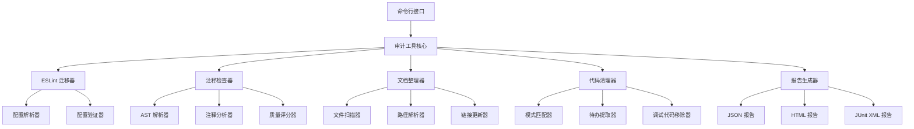

# 设计文档：代码审计和文档整理

## 概述

本设计文档描述了代码审计和文档整理功能的技术实现方案。该功能旨在通过自动化工具和标准化流程，解决项目中存在的配置过时、注释不规范、文档分散、调试代码残留等问题。

### 设计目标

1. **配置现代化**：将 ESLint 配置从旧版 `.eslintrc.cjs` 迁移到新版 `eslint.config.js` 格式
2. **注释规范化**：确保所有代码注释使用中文，提升团队协作效率
3. **文档集中化**：建立统一的文档目录结构，便于查找和维护
4. **代码清洁化**：清理调试代码和管理待办标记，减少代码噪音
5. **质量自动化**：提供统一的审计工具，支持 CI/CD 集成

### 技术栈

- **运行时**：Node.js 18+
- **语言**：TypeScript 5.x
- **代码检查**：ESLint 9.x
- **AST 解析**：@typescript-eslint/parser, vue-eslint-parser
- **文件操作**：fs-extra
- **命令行**：commander
- **测试框架**：Vitest + fast-check（属性测试）

## 架构

### 系统架构图



### 模块职责

#### 1. 审计工具核心（Audit Tool Core）
- 协调各个检查器的执行
- 管理命令行参数和配置
- 聚合检查结果
- 控制退出码

#### 2. ESLint 迁移器（ESLint Migrator）
- 解析旧版配置文件
- 生成新版配置文件
- 验证配置等效性
- 清理旧配置文件

#### 3. 注释检查器（Comment Checker）
- 扫描代码文件中的注释
- 识别缺少中文注释的代码
- 计算注释覆盖率和质量评分
- 生成改进建议

#### 4. 文档整理器（Doc Organizer）
- 扫描项目中的文档文件
- 按类型分类文档
- 移动文档到统一目录
- 更新文档中的路径引用
- 生成文档索引

#### 5. 代码清理器（Code Cleaner）
- 扫描调试代码（console.debug）
- 提取待办标记（TODO/FIXME）
- 提供交互式和批量清理模式
- 生成清理报告

#### 6. 报告生成器（Reporter）
- 生成 JSON 格式报告
- 生成 HTML 格式报告
- 生成 JUnit XML 格式报告
- 支持 CI 模式输出

## 组件和接口

### 核心类型定义

```typescript
// 审计结果类型
interface AuditResult {
  success: boolean
  timestamp: string
  environment: string
  checks: CheckResult[]
  summary: AuditSummary
}

interface CheckResult {
  name: string
  passed: boolean
  issues: Issue[]
  metrics?: Record<string, number>
}

interface Issue {
  file: string
  line: number
  column?: number
  severity: 'error' | 'warning' | 'info'
  message: string
  rule?: string
}

interface AuditSummary {
  totalFiles: number
  totalIssues: number
  errorCount: number
  warningCount: number
  infoCount: number
}

// 配置类型
interface AuditConfig {
  checks: {
    eslint: boolean
    comments: boolean
    debug: boolean
    todos: boolean
  }
  thresholds: {
    commentCoverage: number
    commentQuality: number
  }
  output: {
    format: 'json' | 'html' | 'junit'
    path: string
  }
  ci: boolean
  fix: boolean
}
```

### 1. ESLint 迁移器

```typescript
class ESLintMigrator {
  /**
   * 迁移 ESLint 配置
   * @param options 迁移选项
   * @returns 迁移结果
   */
  async migrate(options: MigrateOptions): Promise<MigrateResult>
  
  /**
   * 验证新配置与旧配置等效
   * @param oldConfig 旧配置路径
   * @param newConfig 新配置路径
   * @returns 验证结果
   */
  async validate(oldConfig: string, newConfig: string): Promise<ValidationResult>
  
  /**
   * 生成新版配置文件
   * @param oldConfig 旧配置对象
   * @returns 新配置对象
   */
  generateNewConfig(oldConfig: LegacyConfig): ESLintConfig
}

interface MigrateOptions {
  dryRun: boolean
  backup: boolean
  deleteOld: boolean
}

interface MigrateResult {
  success: boolean
  configPath: string
  backupPath?: string
  differences: ConfigDifference[]
}

interface ESLintConfig {
  files: string[]
  languageOptions: {
    parser: any
    parserOptions: Record<string, any>
    globals: Record<string, boolean>
  }
  plugins: Record<string, any>
  rules: Record<string, any>
}
```

### 2. 注释检查器

```typescript
class CommentChecker {
  /**
   * 检查文件的注释质量
   * @param files 要检查的文件列表
   * @returns 检查结果
   */
  async check(files: string[]): Promise<CommentCheckResult>
  
  /**
   * 计算文件的注释覆盖率
   * @param file 文件路径
   * @returns 覆盖率（0-1）
   */
  calculateCoverage(file: string): number
  
  /**
   * 计算文件的注释质量评分
   * @param file 文件路径
   * @returns 评分（0-100）
   */
  calculateQualityScore(file: string): number
  
  /**
   * 生成改进建议
   * @param file 文件路径
   * @returns 建议列表
   */
  generateSuggestions(file: string): Suggestion[]
}

interface CommentCheckResult {
  files: FileCommentInfo[]
  overall: OverallCommentInfo
  lowQualityFiles: string[]
}

interface FileCommentInfo {
  path: string
  coverage: number
  qualityScore: number
  missingComments: MissingComment[]
  suggestions: Suggestion[]
}

interface MissingComment {
  type: 'function' | 'class' | 'method' | 'interface' | 'export'
  name: string
  line: number
  isPublicAPI: boolean
}

interface OverallCommentInfo {
  totalFiles: number
  averageCoverage: number
  averageQuality: number
  filesWithLowQuality: number
}
```

### 3. 文档整理器

```typescript
class DocOrganizer {
  /**
   * 整理文档结构
   * @param options 整理选项
   * @returns 整理结果
   */
  async organize(options: OrganizeOptions): Promise<OrganizeResult>
  
  /**
   * 扫描项目中的文档文件
   * @returns 文档文件列表
   */
  async scanDocuments(): Promise<DocumentFile[]>
  
  /**
   * 分类文档
   * @param docs 文档列表
   * @returns 分类后的文档
   */
  classifyDocuments(docs: DocumentFile[]): ClassifiedDocs
  
  /**
   * 更新文档中的路径引用
   * @param doc 文档路径
   * @param moves 移动映射
   */
  async updateLinks(doc: string, moves: Map<string, string>): Promise<void>
  
  /**
   * 生成文档索引
   * @param docs 文档列表
   * @returns 索引内容
   */
  generateIndex(docs: ClassifiedDocs): string
}

interface OrganizeOptions {
  dryRun: boolean
  backup: boolean
  updateLinks: boolean
}

interface OrganizeResult {
  success: boolean
  movedFiles: FileMove[]
  updatedLinks: LinkUpdate[]
  indexPath: string
}

interface DocumentFile {
  path: string
  category: 'deployment' | 'development' | 'features' | 'planning' | 'testing' | 'other'
  title: string
}

interface ClassifiedDocs {
  deployment: DocumentFile[]
  development: DocumentFile[]
  features: DocumentFile[]
  planning: DocumentFile[]
  testing: DocumentFile[]
  other: DocumentFile[]
}
```

### 4. 代码清理器

```typescript
class CodeCleaner {
  /**
   * 扫描调试代码
   * @param files 要扫描的文件列表
   * @returns 调试代码位置
   */
  async scanDebugCode(files: string[]): Promise<DebugCodeLocation[]>
  
  /**
   * 清理调试代码
   * @param options 清理选项
   * @returns 清理结果
   */
  async cleanDebugCode(options: CleanOptions): Promise<CleanResult>
  
  /**
   * 扫描待办标记
   * @param files 要扫描的文件列表
   * @returns 待办标记列表
   */
  async scanTodos(files: string[]): Promise<TodoItem[]>
  
  /**
   * 生成待办事项清单
   * @param todos 待办标记列表
   * @param format 输出格式
   * @returns 清单内容
   */
  generateTodoList(todos: TodoItem[], format: 'markdown' | 'json'): string
}

interface DebugCodeLocation {
  file: string
  line: number
  column: number
  code: string
}

interface CleanOptions {
  mode: 'interactive' | 'batch'
  dryRun: boolean
  backup: boolean
}

interface CleanResult {
  success: boolean
  removedCount: number
  locations: DebugCodeLocation[]
}

interface TodoItem {
  file: string
  line: number
  type: 'TODO' | 'FIXME'
  priority: 'high' | 'medium' | 'low'
  content: string
  context: string
}
```

### 5. 报告生成器

```typescript
class Reporter {
  /**
   * 生成 JSON 报告
   * @param result 审计结果
   * @param path 输出路径
   */
  async generateJSON(result: AuditResult, path: string): Promise<void>
  
  /**
   * 生成 HTML 报告
   * @param result 审计结果
   * @param path 输出路径
   */
  async generateHTML(result: AuditResult, path: string): Promise<void>
  
  /**
   * 生成 JUnit XML 报告
   * @param result 审计结果
   * @param path 输出路径
   */
  async generateJUnit(result: AuditResult, path: string): Promise<void>
  
  /**
   * 输出 CI 模式日志
   * @param result 审计结果
   */
  logCI(result: AuditResult): void
}
```

## 数据模型

### ESLint 配置结构

新版 `eslint.config.js` 采用扁平配置格式：

```javascript
import js from '@eslint/js'
import tsPlugin from '@typescript-eslint/eslint-plugin'
import tsParser from '@typescript-eslint/parser'
import vuePlugin from 'eslint-plugin-vue'
import vueParser from 'vue-eslint-parser'
import prettierConfig from 'eslint-config-prettier'

export default [
  // 全局忽略
  {
    ignores: ['dist/**', 'node_modules/**', '.snapshots/**']
  },
  
  // JavaScript/TypeScript 文件
  {
    files: ['**/*.js', '**/*.ts', '**/*.tsx'],
    languageOptions: {
      parser: tsParser,
      parserOptions: {
        ecmaVersion: 'latest',
        sourceType: 'module'
      },
      globals: {
        browser: true,
        es2021: true,
        node: true
      }
    },
    plugins: {
      '@typescript-eslint': tsPlugin
    },
    rules: {
      ...js.configs.recommended.rules,
      ...tsPlugin.configs.recommended.rules,
      '@typescript-eslint/no-unused-vars': ['warn', { argsIgnorePattern: '^_' }]
    }
  },
  
  // Vue 文件
  {
    files: ['**/*.vue'],
    languageOptions: {
      parser: vueParser,
      parserOptions: {
        parser: tsParser,
        ecmaVersion: 'latest',
        sourceType: 'module'
      }
    },
    plugins: {
      vue: vuePlugin
    },
    rules: {
      ...vuePlugin.configs['vue3-recommended'].rules,
      'vue/multi-word-component-names': 'off'
    }
  },
  
  // Prettier 集成
  prettierConfig
]
```

### 文档目录结构

```
docs/
├── README.md                    # 文档索引（自动生成）
├── deployment/                  # 部署相关文档
│   ├── DEPLOYMENT_GUIDE.md
│   ├── SERVER_OVERVIEW.md
│   └── admin/
│       ├── DEPLOYMENT.md
│       ├── README.nginx.md
│       └── setup-ssl.sh
├── development/                 # 开发相关文档
│   ├── DEVELOPMENT_STANDARDS.md
│   ├── MIGRATION_GUIDE.md
│   └── MAINTENANCE_GUIDE.md
├── features/                    # 功能文档
│   ├── GAME_DOCUMENTATION.md
│   └── admin/
│       ├── README.md
│       └── SYSTEM_CHECK_REPORT.md
├── planning/                    # 规划文档
│   ├── IMPLEMENTATION_ROADMAP.md
│   └── IMPROVEMENT_PLAN.md
└── testing/                     # 测试文档
    └── e2e/
        ├── README.md
        ├── QUICKSTART.md
        ├── SETUP.md
        └── TEST_SUMMARY.md
```

### 审计报告结构

JSON 报告格式：

```json
{
  "success": false,
  "timestamp": "2024-01-15T10:30:00Z",
  "environment": "development",
  "checks": [
    {
      "name": "eslint",
      "passed": true,
      "issues": [],
      "metrics": {
        "filesChecked": 150,
        "errors": 0,
        "warnings": 5
      }
    },
    {
      "name": "comments",
      "passed": false,
      "issues": [
        {
          "file": "src/utils/helper.ts",
          "line": 10,
          "severity": "warning",
          "message": "函数 'formatDate' 缺少中文注释",
          "rule": "missing-chinese-comment"
        }
      ],
      "metrics": {
        "averageCoverage": 0.65,
        "averageQuality": 58,
        "lowQualityFiles": 12
      }
    }
  ],
  "summary": {
    "totalFiles": 150,
    "totalIssues": 23,
    "errorCount": 0,
    "warningCount": 23,
    "infoCount": 0
  }
}
```


## 正确性属性

*属性是一个特征或行为，应该在系统的所有有效执行中保持为真——本质上是关于系统应该做什么的形式化陈述。属性作为人类可读规范和机器可验证正确性保证之间的桥梁。*

### 属性反思

在分析所有验收标准后，我识别出以下可以合并或优化的属性：

**冗余分析：**

1. **文件扫描属性**：需求 2.1、4.1、5.1 都涉及扫描特定类型文件，可以合并为一个通用的文件扫描属性
2. **报告生成属性**：需求 2.3、4.2、4.6、5.2、6.2 都涉及生成报告，可以合并为报告完整性属性
3. **配置验证属性**：需求 8.2、8.3、8.4 都涉及配置比较，可以合并为配置等效性验证
4. **路径更新属性**：需求 3.6、7.6 都涉及更新文档链接，可以合并
5. **退出码属性**：需求 6.6、10.5 都涉及错误时返回非零退出码，可以合并

**保留的独立属性：**
- ESLint 配置迁移的规则保留（1.3）
- 注释检查的过滤规则（2.4、2.5）
- 文档分类逻辑（3.2）
- 选择性删除（4.5）
- 待办事项分组（5.3）
- 质量评分计算（9.1-9.6）
- 增量检查（10.7）

### 属性 1：配置规则保留

*对于任何* ESLint 配置迁移操作，新配置文件中的规则集应该与旧配置文件中的规则集等效（相同的规则名称和规则值）。

**验证需求：1.3**

### 属性 2：文件类型匹配

*对于任何* 指定扩展名列表（如 .vue、.ts、.tsx、.js、.jsx），ESLint 配置应该能够匹配所有具有这些扩展名的文件。

**验证需求：1.4**

### 属性 3：文件扫描完整性

*对于任何* 指定的文件类型集合和目录，扫描器应该找到该目录下所有匹配类型的文件，不遗漏任何符合条件的文件。

**验证需求：2.1, 4.1, 5.1**

### 属性 4：注释识别准确性

*对于任何* 包含函数、类、方法或复杂逻辑块的代码文件，注释检查器应该能够识别这些代码结构及其关联的注释。

**验证需求：2.2**

### 属性 5：报告完整性

*对于任何* 检查结果集合，生成的报告应该包含所有发现的问题，包括文件路径、行号和问题描述，不遗漏任何检查结果。

**验证需求：2.3, 4.2, 4.6, 5.2, 6.2**

### 属性 6：标识符过滤正确性

*对于任何* 英文标识符（函数名、变量名、类名）或技术术语白名单中的词汇，注释检查器不应该将其标记为违反中文注释规范。

**验证需求：2.4, 2.5**

### 属性 7：JSON 序列化往返

*对于任何* 检查报告对象，序列化为 JSON 后再反序列化应该得到等效的对象结构。

**验证需求：2.6**

### 属性 8：文档分类一致性

*对于任何* 文档文件，根据其内容和位置，文档整理器应该将其分类到唯一的类别（部署、开发、维护、游戏等），同一文档不应该被分配到多个类别。

**验证需求：3.2**

### 属性 9：文件移动保留内容

*对于任何* 文档文件，移动操作前后文件的内容应该保持不变（除了路径引用更新）。

**验证需求：3.3**

### 属性 10：排除规则有效性

*对于任何* 在排除列表中的路径（如 .kiro/specs/），文档整理器不应该移动该路径下的任何文件。

**验证需求：3.4**

### 属性 11：索引完整性

*对于任何* 文档集合，生成的索引文件应该包含所有文档的条目，每个条目包含文档路径和描述。

**验证需求：3.5**

### 属性 12：路径引用更新正确性

*对于任何* 包含相对路径引用的文档，当文档被移动后，所有相对路径引用应该被更新为指向正确的目标位置。

**验证需求：3.6, 7.6**

### 属性 13：移动操作可追溯性

*对于任何* 文档移动操作，迁移报告应该记录源路径和目标路径的映射关系。

**验证需求：3.7**

### 属性 14：选择性代码删除

*对于任何* 包含多种 console 方法调用的文件，批量清理模式应该只删除 console.debug 语句，保留 console.error、console.warn、console.info 等其他语句。

**验证需求：4.5**

### 属性 15：待办事项分组逻辑

*对于任何* 待办标记集合，生成的清单应该按文件路径分组，同一文件的所有待办事项应该在同一组中。

**验证需求：5.3**

### 属性 16：Markdown 格式有效性

*对于任何* 待办事项集合，导出的 Markdown 文件应该是有效的 Markdown 格式，包含正确的标题、列表和代码块语法。

**验证需求：5.4**

### 属性 17：待办事项删除准确性

*对于任何* 标记为完成的待办事项，代码清理器应该从源文件中删除对应的 TODO/FIXME 注释行，不影响其他代码。

**验证需求：5.6**

### 属性 18：命令行参数解析正确性

*对于任何* 有效的命令行参数组合，审计工具应该正确解析参数并执行相应的检查，无效参数应该被拒绝并提示错误。

**验证需求：6.3**

### 属性 19：自动修复幂等性

*对于任何* 可修复的问题集合，连续两次执行 --fix 选项应该产生相同的结果（第二次执行不应该再有修复操作）。

**验证需求：6.4**

### 属性 20：HTML 报告格式有效性

*对于任何* 审计结果，生成的 HTML 报告应该是有效的 HTML5 文档，可以在浏览器中正常渲染。

**验证需求：6.5**

### 属性 21：错误退出码一致性

*对于任何* 包含错误或警告的审计结果，工具应该返回非零退出码；对于没有问题的审计结果，应该返回零退出码。

**验证需求：6.6, 10.5**

### 属性 22：Dry-run 模式不修改文件系统

*对于任何* 使用 --dry-run 选项的操作，文件系统的状态在操作前后应该完全相同，不应该有任何文件被创建、修改或删除。

**验证需求：7.2**

### 属性 23：备份完整性

*对于任何* 使用 --backup 选项的文件操作，备份文件的内容应该与原文件在操作前的内容完全相同。

**验证需求：7.3**

### 属性 24：文件冲突检测

*对于任何* 文档移动操作，如果目标路径已存在同名文件，工具应该检测到冲突并报告，不应该静默覆盖。

**验证需求：7.4**

### 属性 25：文档结构图完整性

*对于任何* 目录结构，生成的结构图应该包含所有目录和文件节点，反映实际的层次关系。

**验证需求：7.7**

### 属性 26：配置等效性验证

*对于任何* 测试文件集合，在新旧 ESLint 配置下运行应该产生相同的检查结果（相同的错误和警告）。

**验证需求：8.2, 8.3, 8.4**

### 属性 27：Glob 模式匹配正确性

*对于任何* glob 模式和文件集合，模式匹配的结果应该符合 glob 语法规范，匹配所有符合模式的文件。

**验证需求：8.6**

### 属性 28：注释覆盖率计算正确性

*对于任何* 代码文件，注释覆盖率应该在 0 到 1 之间，且等于（注释行数 / 总代码行数）。

**验证需求：9.1**

### 属性 29：公共 API 识别准确性

*对于任何* 包含导出声明的文件，注释检查器应该识别所有导出的函数、类和接口，并检查它们是否有文档注释。

**验证需求：9.2**

### 属性 30：质量评分范围有效性

*对于任何* 文件的注释质量评分，分数应该在 0 到 100 之间（包含边界值）。

**验证需求：9.3**

### 属性 31：整体报告聚合正确性

*对于任何* 文件集合的注释检查结果，项目整体的平均覆盖率应该等于所有文件覆盖率的算术平均值。

**验证需求：9.4**

### 属性 32：阈值过滤准确性

*对于任何* 质量评分结果和阈值，标识为低质量的文件集合应该恰好是评分低于阈值的文件集合。

**验证需求：9.5**

### 属性 33：改进建议针对性

*对于任何* 缺少注释的代码结构，生成的改进建议应该指向该代码结构的具体位置（文件和行号）。

**验证需求：9.6**

### 属性 34：CI 模式输出简洁性

*对于任何* 审计结果，CI 模式的输出行数应该少于或等于普通模式的输出行数。

**验证需求：10.2**

### 属性 35：JUnit XML 格式有效性

*对于任何* 审计结果，生成的 JUnit XML 报告应该符合 JUnit XML Schema，可以被 CI 工具正确解析。

**验证需求：10.3**

### 属性 36：质量门槛应用正确性

*对于任何* 设置的质量门槛（如最低注释覆盖率），当实际质量指标低于门槛时，工具应该返回失败状态；当达到或超过门槛时，应该返回成功状态。

**验证需求：10.4**

### 属性 37：增量检查文件集合正确性

*对于任何* 变更文件集合，增量检查模式应该只检查变更集合中的文件，不检查未变更的文件。

**验证需求：10.7**


## 错误处理

### 错误分类

#### 1. 配置错误
- **无效的配置文件**：配置文件格式错误或缺少必需字段
- **不兼容的插件版本**：ESLint 插件版本不兼容
- **处理方式**：提前验证配置，提供清晰的错误信息和修复建议

#### 2. 文件系统错误
- **文件不存在**：尝试读取不存在的文件
- **权限不足**：没有读写权限
- **磁盘空间不足**：备份或写入文件时空间不足
- **处理方式**：检查文件存在性和权限，提供友好的错误提示

#### 3. 解析错误
- **语法错误**：代码文件包含语法错误，无法解析 AST
- **编码错误**：文件编码不是 UTF-8
- **处理方式**：跳过无法解析的文件，在报告中标记，继续处理其他文件

#### 4. 运行时错误
- **内存不足**：处理大型文件时内存溢出
- **超时**：操作执行时间过长
- **处理方式**：设置合理的资源限制，提供进度反馈

### 错误恢复策略

#### 原子操作
所有文件修改操作应该是原子的：
- 使用临时文件进行写入
- 写入成功后再替换原文件
- 失败时回滚到原始状态

#### 备份机制
关键操作前自动创建备份：
```typescript
async function safeFileOperation(
  filePath: string,
  operation: (path: string) => Promise<void>
): Promise<void> {
  const backupPath = `${filePath}.backup.${Date.now()}`
  
  try {
    // 创建备份
    await fs.copy(filePath, backupPath)
    
    // 执行操作
    await operation(filePath)
    
    // 成功后删除备份
    await fs.remove(backupPath)
  } catch (error) {
    // 失败时恢复备份
    if (await fs.pathExists(backupPath)) {
      await fs.copy(backupPath, filePath)
      await fs.remove(backupPath)
    }
    throw error
  }
}
```

#### 错误日志
记录详细的错误信息用于调试：
```typescript
interface ErrorLog {
  timestamp: string
  operation: string
  file?: string
  error: {
    name: string
    message: string
    stack?: string
  }
  context: Record<string, any>
}
```

### 用户友好的错误信息

错误信息应该包含：
1. **问题描述**：清晰说明发生了什么
2. **影响范围**：哪些文件或操作受到影响
3. **可能原因**：为什么会发生这个错误
4. **解决建议**：用户可以采取的行动

示例：
```
❌ 错误：无法迁移 ESLint 配置

问题：旧配置文件 .eslintrc.cjs 包含不支持的插件 'eslint-plugin-custom'

影响：配置迁移已中止，未创建新配置文件

原因：该插件可能未安装或不兼容 ESLint 9.x

建议：
  1. 检查 package.json 中是否包含该插件
  2. 更新插件到兼容版本
  3. 或从配置中移除该插件后重试

详细信息：运行 'npm ls eslint-plugin-custom' 查看插件状态
```


## 测试策略

### 双重测试方法

本项目采用单元测试和基于属性的测试（Property-Based Testing, PBT）相结合的策略：

- **单元测试**：验证特定示例、边界情况和错误条件
- **属性测试**：验证跨所有输入的通用属性
- 两者互补，共同确保全面覆盖

### 单元测试重点

单元测试应该专注于：

1. **具体示例**：验证典型用例的正确行为
   - ESLint 配置迁移的标准场景
   - 文档分类的典型文档类型
   - 注释检查的常见代码模式

2. **边界情况**：
   - 空文件、空目录
   - 超大文件（>10MB）
   - 特殊字符和编码问题
   - 嵌套层级很深的目录结构

3. **错误条件**：
   - 文件不存在
   - 权限不足
   - 无效的配置格式
   - 语法错误的代码文件

4. **集成点**：
   - 命令行参数解析
   - 配置文件加载
   - 报告文件写入
   - 外部工具调用（ESLint）

### 属性测试配置

#### 测试库选择
使用 **fast-check** 作为属性测试库（JavaScript/TypeScript 生态系统的标准选择）。

#### 测试配置
每个属性测试必须：
- 运行至少 **100 次迭代**（由于随机化）
- 使用注释标记引用设计文档中的属性
- 标记格式：`// Feature: code-audit-and-docs-organization, Property {number}: {property_text}`

#### 属性测试示例

```typescript
import fc from 'fast-check'
import { describe, it, expect } from 'vitest'
import { ESLintMigrator } from '../ESLintMigrator'

describe('ESLint Migrator Property Tests', () => {
  // Feature: code-audit-and-docs-organization, Property 1: 配置规则保留
  it('should preserve all rules during migration', async () => {
    await fc.assert(
      fc.asyncProperty(
        fc.record({
          rules: fc.dictionary(fc.string(), fc.oneof(fc.string(), fc.integer(), fc.array(fc.anything()))),
          extends: fc.array(fc.string()),
          plugins: fc.array(fc.string())
        }),
        async (oldConfig) => {
          const migrator = new ESLintMigrator()
          const newConfig = migrator.generateNewConfig(oldConfig)
          
          // 验证所有规则都被保留
          const oldRules = Object.keys(oldConfig.rules)
          const newRules = Object.keys(newConfig.rules)
          
          expect(newRules).toEqual(expect.arrayContaining(oldRules))
          
          // 验证规则值相同
          for (const rule of oldRules) {
            expect(newConfig.rules[rule]).toEqual(oldConfig.rules[rule])
          }
        }
      ),
      { numRuns: 100 }
    )
  })

  // Feature: code-audit-and-docs-organization, Property 7: JSON 序列化往返
  it('should preserve report structure through JSON serialization', () => {
    fc.assert(
      fc.property(
        fc.record({
          success: fc.boolean(),
          timestamp: fc.date().map(d => d.toISOString()),
          checks: fc.array(fc.record({
            name: fc.string(),
            passed: fc.boolean(),
            issues: fc.array(fc.record({
              file: fc.string(),
              line: fc.nat(),
              severity: fc.constantFrom('error', 'warning', 'info'),
              message: fc.string()
            }))
          }))
        }),
        (report) => {
          const json = JSON.stringify(report)
          const parsed = JSON.parse(json)
          
          expect(parsed).toEqual(report)
        }
      ),
      { numRuns: 100 }
    )
  })

  // Feature: code-audit-and-docs-organization, Property 22: Dry-run 模式不修改文件系统
  it('should not modify filesystem in dry-run mode', async () => {
    await fc.assert(
      fc.asyncProperty(
        fc.array(fc.record({
          path: fc.string(),
          content: fc.string()
        })),
        async (files) => {
          // 创建临时文件系统快照
          const beforeSnapshot = await captureFilesystemSnapshot()
          
          const organizer = new DocOrganizer()
          await organizer.organize({ dryRun: true })
          
          const afterSnapshot = await captureFilesystemSnapshot()
          
          // 验证文件系统状态完全相同
          expect(afterSnapshot).toEqual(beforeSnapshot)
        }
      ),
      { numRuns: 100 }
    )
  })
})
```

### 测试数据生成器

为属性测试创建自定义生成器：

```typescript
// 生成有效的代码文件
const codeFileArbitrary = fc.record({
  path: fc.constantFrom('src/utils/helper.ts', 'src/components/Button.vue', 'src/main.ts'),
  content: fc.oneof(
    // TypeScript 函数
    fc.constant(`
      /**
       * 格式化日期
       */
      export function formatDate(date: Date): string {
        return date.toISOString()
      }
    `),
    // Vue 组件
    fc.constant(`
      <template>
        <div>{{ message }}</div>
      </template>
      <script setup lang="ts">
      // 消息内容
      const message = ref('Hello')
      </script>
    `)
  )
})

// 生成待办标记
const todoItemArbitrary = fc.record({
  file: fc.string(),
  line: fc.nat(1000),
  type: fc.constantFrom('TODO', 'FIXME'),
  content: fc.string(),
  priority: fc.constantFrom('high', 'medium', 'low')
})

// 生成文档文件
const documentFileArbitrary = fc.record({
  path: fc.constantFrom(
    'docs/DEPLOYMENT_GUIDE.md',
    'docs/DEVELOPMENT_STANDARDS.md',
    'src/admin/README.md'
  ),
  category: fc.constantFrom('deployment', 'development', 'features', 'planning', 'testing'),
  content: fc.string()
})
```

### 测试覆盖率目标

- **代码覆盖率**：≥ 80%
- **分支覆盖率**：≥ 75%
- **属性测试覆盖**：每个正确性属性至少一个属性测试
- **单元测试覆盖**：每个公共 API 至少一个单元测试

### 持续集成测试

在 CI 环境中运行：
1. 所有单元测试
2. 所有属性测试（100 次迭代）
3. 代码覆盖率检查
4. 类型检查（TypeScript）
5. 代码风格检查（ESLint + Prettier）

### 测试组织结构

```
src/
├── audit/
│   ├── AuditTool.ts
│   └── __tests__/
│       ├── AuditTool.test.ts           # 单元测试
│       └── AuditTool.property.test.ts  # 属性测试
├── eslint/
│   ├── ESLintMigrator.ts
│   └── __tests__/
│       ├── ESLintMigrator.test.ts
│       └── ESLintMigrator.property.test.ts
├── comments/
│   ├── CommentChecker.ts
│   └── __tests__/
│       ├── CommentChecker.test.ts
│       └── CommentChecker.property.test.ts
└── docs/
    ├── DocOrganizer.ts
    └── __tests__/
        ├── DocOrganizer.test.ts
        └── DocOrganizer.property.test.ts
```

### 性能测试

虽然不是主要关注点，但应该验证：
- 扫描 1000+ 文件的性能
- 大型文件（>1MB）的处理时间
- 内存使用保持在合理范围（<500MB）

### 测试环境

- **Node.js 版本**：18.x, 20.x（在 CI 中测试多个版本）
- **操作系统**：Linux, macOS, Windows（确保跨平台兼容）
- **文件系统**：使用 memfs 进行隔离测试，避免污染真实文件系统


## 实现细节

### ESLint 配置迁移实现

#### 配置转换逻辑

```typescript
class ESLintMigrator {
  generateNewConfig(oldConfig: LegacyConfig): ESLintConfig {
    const newConfig: ESLintConfig[] = []
    
    // 1. 添加全局忽略配置
    newConfig.push({
      ignores: this.convertIgnorePatterns(oldConfig.ignorePatterns)
    })
    
    // 2. 转换 extends 为实际的配置对象
    const baseConfigs = this.resolveExtends(oldConfig.extends)
    
    // 3. 为不同文件类型创建配置
    const fileGroups = this.groupFilesByParser(oldConfig)
    
    for (const group of fileGroups) {
      newConfig.push({
        files: group.patterns,
        languageOptions: {
          parser: group.parser,
          parserOptions: oldConfig.parserOptions,
          globals: this.convertEnv(oldConfig.env)
        },
        plugins: this.convertPlugins(oldConfig.plugins),
        rules: { ...baseConfigs.rules, ...oldConfig.rules }
      })
    }
    
    return newConfig
  }
  
  private convertEnv(env: Record<string, boolean>): Record<string, boolean> {
    const globals: Record<string, boolean> = {}
    
    if (env.browser) {
      Object.assign(globals, browserGlobals)
    }
    if (env.node) {
      Object.assign(globals, nodeGlobals)
    }
    if (env.es2021) {
      Object.assign(globals, es2021Globals)
    }
    
    return globals
  }
  
  private convertPlugins(plugins: string[]): Record<string, any> {
    const pluginMap: Record<string, any> = {}
    
    for (const plugin of plugins) {
      const pluginModule = require(`eslint-plugin-${plugin}`)
      pluginMap[plugin] = pluginModule
    }
    
    return pluginMap
  }
}
```

#### 配置验证实现

```typescript
async validate(oldConfigPath: string, newConfigPath: string): Promise<ValidationResult> {
  // 1. 加载两个配置
  const oldConfig = await this.loadLegacyConfig(oldConfigPath)
  const newConfig = await this.loadFlatConfig(newConfigPath)
  
  // 2. 比较规则
  const ruleDiffs = this.compareRules(oldConfig, newConfig)
  
  // 3. 在测试文件上运行两个配置
  const testFiles = await this.getTestFiles()
  const oldResults = await this.runESLint(testFiles, oldConfigPath)
  const newResults = await this.runESLint(testFiles, newConfigPath)
  
  // 4. 比较结果
  const resultDiffs = this.compareResults(oldResults, newResults)
  
  return {
    equivalent: ruleDiffs.length === 0 && resultDiffs.length === 0,
    ruleDifferences: ruleDiffs,
    resultDifferences: resultDiffs
  }
}
```

### 注释检查器实现

#### AST 遍历和注释提取

```typescript
class CommentChecker {
  async check(files: string[]): Promise<CommentCheckResult> {
    const results: FileCommentInfo[] = []
    
    for (const file of files) {
      const content = await fs.readFile(file, 'utf-8')
      const ast = this.parseFile(file, content)
      const comments = this.extractComments(ast)
      
      const coverage = this.calculateCoverage(file)
      const qualityScore = this.calculateQualityScore(file)
      const missingComments = this.findMissingComments(ast, comments)
      const suggestions = this.generateSuggestions(file)
      
      results.push({
        path: file,
        coverage,
        qualityScore,
        missingComments,
        suggestions
      })
    }
    
    return this.aggregateResults(results)
  }
  
  private parseFile(file: string, content: string): AST {
    if (file.endsWith('.vue')) {
      return vueParser.parse(content, {
        parser: tsParser,
        sourceType: 'module'
      })
    } else if (file.endsWith('.ts') || file.endsWith('.tsx')) {
      return tsParser.parse(content, {
        sourceType: 'module'
      })
    } else {
      return jsParser.parse(content, {
        sourceType: 'module'
      })
    }
  }
  
  private findMissingComments(ast: AST, comments: Comment[]): MissingComment[] {
    const missing: MissingComment[] = []
    
    // 遍历 AST 查找需要注释的节点
    traverse(ast, {
      FunctionDeclaration(path) {
        if (!this.hasComment(path.node, comments)) {
          missing.push({
            type: 'function',
            name: path.node.id.name,
            line: path.node.loc.start.line,
            isPublicAPI: this.isExported(path)
          })
        }
      },
      ClassDeclaration(path) {
        if (!this.hasComment(path.node, comments)) {
          missing.push({
            type: 'class',
            name: path.node.id.name,
            line: path.node.loc.start.line,
            isPublicAPI: this.isExported(path)
          })
        }
      },
      MethodDefinition(path) {
        if (!this.hasComment(path.node, comments)) {
          missing.push({
            type: 'method',
            name: path.node.key.name,
            line: path.node.loc.start.line,
            isPublicAPI: path.node.accessibility === 'public'
          })
        }
      }
    })
    
    return missing
  }
  
  calculateQualityScore(file: string): number {
    const coverage = this.calculateCoverage(file)
    const publicAPICoverage = this.calculatePublicAPICoverage(file)
    const chineseCommentRatio = this.calculateChineseCommentRatio(file)
    
    // 加权评分
    return Math.round(
      coverage * 30 +           // 覆盖率占 30%
      publicAPICoverage * 50 +  // 公共 API 覆盖率占 50%
      chineseCommentRatio * 20  // 中文注释比例占 20%
    )
  }
}
```

### 文档整理器实现

#### 文档分类逻辑

```typescript
class DocOrganizer {
  classifyDocuments(docs: DocumentFile[]): ClassifiedDocs {
    const classified: ClassifiedDocs = {
      deployment: [],
      development: [],
      features: [],
      planning: [],
      testing: [],
      other: []
    }
    
    for (const doc of docs) {
      const category = this.determineCategory(doc)
      classified[category].push(doc)
    }
    
    return classified
  }
  
  private determineCategory(doc: DocumentFile): string {
    const path = doc.path.toLowerCase()
    const content = doc.content.toLowerCase()
    
    // 基于路径的分类
    if (path.includes('deploy') || path.includes('server')) {
      return 'deployment'
    }
    if (path.includes('test') || path.includes('e2e')) {
      return 'testing'
    }
    if (path.includes('roadmap') || path.includes('plan')) {
      return 'planning'
    }
    
    // 基于内容的分类
    if (content.includes('部署') || content.includes('服务器')) {
      return 'deployment'
    }
    if (content.includes('开发') || content.includes('标准')) {
      return 'development'
    }
    if (content.includes('功能') || content.includes('游戏')) {
      return 'features'
    }
    if (content.includes('测试')) {
      return 'testing'
    }
    
    return 'other'
  }
  
  async updateLinks(doc: string, moves: Map<string, string>): Promise<void> {
    let content = await fs.readFile(doc, 'utf-8')
    
    // 匹配 Markdown 链接：[text](path)
    const linkRegex = /\[([^\]]+)\]\(([^)]+)\)/g
    
    content = content.replace(linkRegex, (match, text, path) => {
      // 解析相对路径
      const absolutePath = this.resolveRelativePath(doc, path)
      
      // 检查是否有新路径
      if (moves.has(absolutePath)) {
        const newPath = moves.get(absolutePath)!
        const newRelativePath = this.calculateRelativePath(doc, newPath)
        return `[${text}](${newRelativePath})`
      }
      
      return match
    })
    
    await fs.writeFile(doc, content, 'utf-8')
  }
}
```

### 代码清理器实现

#### 调试代码扫描

```typescript
class CodeCleaner {
  async scanDebugCode(files: string[]): Promise<DebugCodeLocation[]> {
    const locations: DebugCodeLocation[] = []
    
    for (const file of files) {
      const content = await fs.readFile(file, 'utf-8')
      const lines = content.split('\n')
      
      for (let i = 0; i < lines.length; i++) {
        const line = lines[i]
        
        // 匹配 console.debug
        const match = /console\.debug\s*\(/g.exec(line)
        if (match) {
          locations.push({
            file,
            line: i + 1,
            column: match.index,
            code: line.trim()
          })
        }
      }
    }
    
    return locations
  }
  
  async cleanDebugCode(options: CleanOptions): Promise<CleanResult> {
    const locations = await this.scanDebugCode(await this.getFiles())
    
    if (options.dryRun) {
      return {
        success: true,
        removedCount: locations.length,
        locations
      }
    }
    
    let removedCount = 0
    
    for (const location of locations) {
      if (options.mode === 'interactive') {
        const shouldRemove = await this.promptUser(location)
        if (!shouldRemove) continue
      }
      
      await this.removeDebugLine(location)
      removedCount++
    }
    
    return {
      success: true,
      removedCount,
      locations: locations.slice(0, removedCount)
    }
  }
  
  private async removeDebugLine(location: DebugCodeLocation): Promise<void> {
    const content = await fs.readFile(location.file, 'utf-8')
    const lines = content.split('\n')
    
    // 删除指定行
    lines.splice(location.line - 1, 1)
    
    await fs.writeFile(location.file, lines.join('\n'), 'utf-8')
  }
}
```

### 命令行接口实现

```typescript
#!/usr/bin/env node
import { Command } from 'commander'
import { AuditTool } from './audit/AuditTool'

const program = new Command()

program
  .name('code-audit')
  .description('代码审计和文档整理工具')
  .version('1.0.0')

program
  .command('audit')
  .description('运行代码审计')
  .option('--eslint', '运行 ESLint 检查')
  .option('--comments', '运行注释检查')
  .option('--debug', '检查调试代码')
  .option('--todos', '检查待办标记')
  .option('--fix', '自动修复可修复的问题')
  .option('--ci', '使用 CI 模式')
  .option('--report <format>', '生成报告 (json|html|junit)', 'json')
  .option('--output <path>', '报告输出路径', './audit-report')
  .option('--threshold <number>', '质量门槛', '60')
  .action(async (options) => {
    const tool = new AuditTool(options)
    const result = await tool.run()
    
    if (!result.success) {
      process.exit(1)
    }
  })

program
  .command('migrate-eslint')
  .description('迁移 ESLint 配置')
  .option('--dry-run', '预览迁移而不执行')
  .option('--backup', '创建备份')
  .option('--no-delete-old', '保留旧配置文件')
  .action(async (options) => {
    const migrator = new ESLintMigrator()
    const result = await migrator.migrate(options)
    
    if (result.success) {
      console.log('✅ ESLint 配置迁移成功')
    } else {
      console.error('❌ ESLint 配置迁移失败')
      process.exit(1)
    }
  })

program
  .command('organize-docs')
  .description('整理文档结构')
  .option('--dry-run', '预览整理而不执行')
  .option('--backup', '创建备份')
  .option('--update-links', '更新文档链接', true)
  .action(async (options) => {
    const organizer = new DocOrganizer()
    const result = await organizer.organize(options)
    
    if (result.success) {
      console.log('✅ 文档整理成功')
      console.log(`移动了 ${result.movedFiles.length} 个文件`)
      console.log(`更新了 ${result.updatedLinks.length} 个链接`)
    } else {
      console.error('❌ 文档整理失败')
      process.exit(1)
    }
  })

program.parse()
```

## 部署和使用

### 安装

```bash
# 安装依赖
npm install

# 构建工具
npm run build

# 全局安装（可选）
npm link
```

### 使用示例

```bash
# 运行完整审计
code-audit audit --eslint --comments --debug --todos

# 自动修复问题
code-audit audit --fix

# 生成 HTML 报告
code-audit audit --report html --output ./reports/audit.html

# CI 模式
code-audit audit --ci --threshold 70

# 迁移 ESLint 配置
code-audit migrate-eslint --backup

# 整理文档（预览）
code-audit organize-docs --dry-run

# 整理文档（执行）
code-audit organize-docs --backup
```

### GitHub Actions 集成

```yaml
name: Code Audit

on:
  push:
    branches: [ main, develop ]
  pull_request:
    branches: [ main ]

jobs:
  audit:
    runs-on: ubuntu-latest
    
    steps:
      - uses: actions/checkout@v3
      
      - name: Setup Node.js
        uses: actions/setup-node@v3
        with:
          node-version: '18'
      
      - name: Install dependencies
        run: npm ci
      
      - name: Run code audit
        run: npm run audit -- --ci --threshold 70 --report junit
      
      - name: Upload audit report
        if: always()
        uses: actions/upload-artifact@v3
        with:
          name: audit-report
          path: ./audit-report.xml
      
      - name: Publish test results
        if: always()
        uses: EnricoMi/publish-unit-test-result-action@v2
        with:
          files: ./audit-report.xml
```

## 总结

本设计文档详细描述了代码审计和文档整理功能的技术实现方案，包括：

1. **模块化架构**：将功能分解为独立的检查器和工具，便于维护和扩展
2. **37 个正确性属性**：通过属性测试确保系统在各种输入下的正确行为
3. **完善的错误处理**：提供友好的错误信息和恢复机制
4. **双重测试策略**：结合单元测试和属性测试，确保全面覆盖
5. **CI/CD 集成**：支持自动化质量检查和报告生成

该设计遵循现代软件工程最佳实践，确保代码质量、可维护性和可扩展性。
