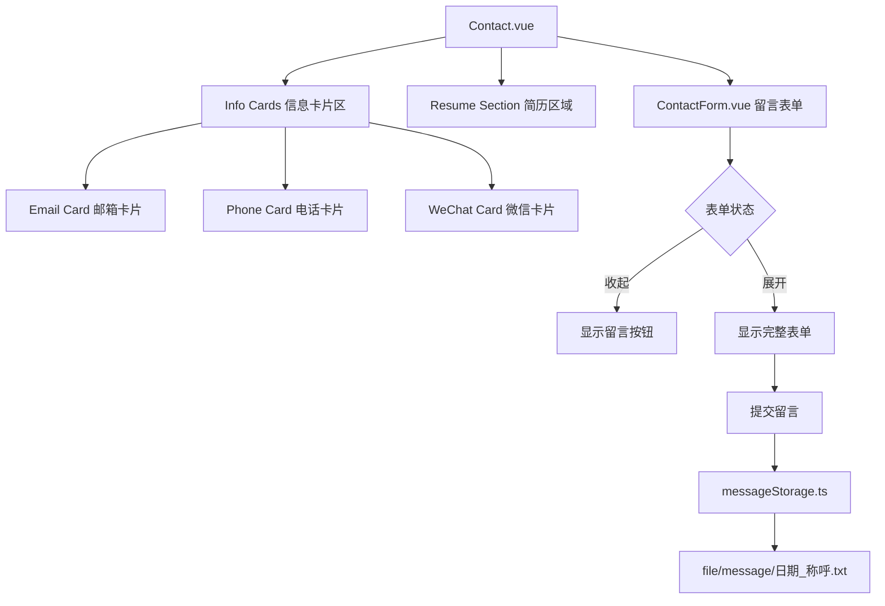

# 设计文档：联系页面更新

## 概述

本设计文档描述联系页面的更新方案，包括添加微信信息卡片、重新设计留言栏为可折叠形式、实现留言本地存储、修复简历下载路径以及优化页面布局。

设计遵循现有项目的 Vue 3 + TypeScript + Composition API 架构风格，复用现有的设计系统变量和组件模式。

## 架构

### 组件结构

```
src/
├── views/
│   └── Contact.vue          # 联系页面主组件（更新）
├── components/common/
│   └── ContactForm.vue      # 留言表单组件（重构）
└── utils/
    └── messageStorage.ts    # 留言存储工具（新增）
```

### 数据流



## 组件和接口

### 1. Contact.vue 更新

#### 页面布局结构

```vue
<template>
  <div class="contact">
    <!-- 头部区域 -->
    <section class="contact-header">
      <h1>联系我</h1>
      <p>期待与您的交流</p>
    </section>

    <!-- 联系信息区域 - 三列网格 -->
    <section class="contact-info">
      <div class="info-grid">
        <InfoCard type="email" />
        <InfoCard type="phone" />
        <InfoCard type="wechat" />
      </div>
    </section>

    <!-- 简历下载区域 - 整合到信息区 -->
    <section class="resume-section">
      <ResumeDownload />
    </section>

    <!-- 留言区域 - 底部可折叠 -->
    <section class="message-section">
      <ContactForm />
    </section>
  </div>
</template>
```

#### 微信卡片实现

```typescript
// 微信号复制功能
const copyWechat = async () => {
  const wechatId = '14775378984'
  try {
    await navigator.clipboard.writeText(wechatId)
    showCopySuccess.value = true
    setTimeout(() => {
      showCopySuccess.value = false
    }, 2000)
  } catch (error) {
    // 降级方案：使用 execCommand
    const textArea = document.createElement('textarea')
    textArea.value = wechatId
    document.body.appendChild(textArea)
    textArea.select()
    document.execCommand('copy')
    document.body.removeChild(textArea)
    showCopySuccess.value = true
  }
}
```

#### 简历下载路径修复

```typescript
// 更新简历下载路径
const downloadResume = async () => {
  const resumePath = '/file/CV/黄彦杰-个人简历.pdf'
  const link = document.createElement('a')
  link.href = resumePath
  link.download = '黄彦杰_简历.pdf'
  document.body.appendChild(link)
  link.click()
  document.body.removeChild(link)
}
```

### 2. ContactForm.vue 重构

#### 状态管理

```typescript
interface MessageFormData {
  nickname: string      // 称呼（原姓名）
  contact: string       // 联系方式（原邮箱）
  message: string       // 留言内容
}

const isExpanded = ref(false)  // 表单展开状态
const formData = reactive<MessageFormData>({
  nickname: '',
  contact: '',
  message: ''
})
```

#### 折叠/展开逻辑

```typescript
// 切换表单展开状态
const toggleForm = () => {
  if (!isExpanded.value) {
    isExpanded.value = true
  }
}

// 提交后收起表单
const handleSubmit = async () => {
  // ... 验证和提交逻辑
  await saveMessage(formData)
  resetForm()
  isExpanded.value = false
}
```

### 3. messageStorage.ts 新增

#### 接口定义

```typescript
interface MessageData {
  nickname: string
  contact: string
  message: string
  timestamp: string
}

interface SaveResult {
  success: boolean
  filename?: string
  error?: string
}
```

#### 存储实现

```typescript
/**
 * 保存留言到本地文件
 * 文件格式：最小空间的纯文本格式
 * 命名格式：YYYY-MM-DD_称呼.txt
 */
export async function saveMessage(data: MessageData): Promise<SaveResult> {
  const date = new Date().toISOString().split('T')[0]
  const filename = `${date}_${data.nickname}.txt`
  
  // 最小空间格式
  const content = [
    data.nickname,
    data.contact,
    data.message,
    data.timestamp
  ].join('\n')
  
  // 注意：前端无法直接写入文件系统
  // 需要通过后端 API 或使用 localStorage 作为替代方案
  // 这里使用 localStorage 模拟
  try {
    const key = `message_${filename}`
    localStorage.setItem(key, content)
    return { success: true, filename }
  } catch (error) {
    return { success: false, error: '保存失败' }
  }
}
```

## 数据模型

### MessageFormData（留言表单数据）

| 字段 | 类型 | 说明 |
|------|------|------|
| nickname | string | 留言者称呼 |
| contact | string | 联系方式（电话/邮箱/微信等） |
| message | string | 留言内容 |

### StoredMessage（存储的留言）

| 字段 | 类型 | 说明 |
|------|------|------|
| nickname | string | 留言者称呼 |
| contact | string | 联系方式 |
| message | string | 留言内容 |
| timestamp | string | 提交时间戳 |

### 文件存储格式

```
张三
13800138000
您好，我对您的项目很感兴趣...
2024-01-15T10:30:00.000Z
```

每行一个字段，无额外标记，最小化存储空间。


## 正确性属性

*属性是一种应该在系统所有有效执行中保持为真的特征或行为——本质上是关于系统应该做什么的形式化陈述。属性作为人类可读规范和机器可验证正确性保证之间的桥梁。*

基于验收标准的预分析，以下是可测试的正确性属性：

### Property 1: 文件名格式一致性

*对于任意* 日期和留言者称呼组合，生成的文件名应符合 `YYYY-MM-DD_称呼.txt` 格式，其中日期部分为有效的 ISO 日期格式。

**Validates: Requirements 3.2**

### Property 2: 留言存储往返一致性

*对于任意* 有效的留言数据（包含称呼、联系方式、留言内容、时间戳），序列化存储后再反序列化应能得到与原始数据等价的对象。

**Validates: Requirements 3.3**

### Property 3: 表单状态切换幂等性

*对于任意* 表单初始状态，连续多次点击展开按钮后，表单应始终处于展开状态（展开操作是幂等的）。

**Validates: Requirements 2.4, 2.5**

## 错误处理

### 微信复制失败

- 主要方案：使用 `navigator.clipboard.writeText()` API
- 降级方案：使用 `document.execCommand('copy')` 兼容旧浏览器
- 用户反馈：显示复制失败提示，建议手动复制

### 留言保存失败

- 捕获存储异常（localStorage 满、权限问题等）
- 显示错误提示："保存失败，请稍后重试"
- 保留表单数据，允许用户重试

### 简历下载失败

- 检测文件是否存在（HEAD 请求）
- 文件不存在时显示错误提示
- 提供重试按钮

### 表单验证错误

- 称呼：必填，不能为空
- 联系方式：必填，不能为空
- 留言内容：必填，不能为空
- 实时验证，失焦时显示错误信息

## 测试策略

### 单元测试

使用 Vitest 进行单元测试，覆盖以下场景：

1. **ContactForm 组件测试**
   - 初始状态为收起
   - 点击展开按钮后表单展开
   - 表单字段标签正确（称呼、联系方式、留言）
   - 表单验证逻辑
   - 提交成功后表单收起

2. **Contact 页面测试**
   - 三个信息卡片正确渲染
   - 微信卡片点击复制功能
   - 简历下载路径正确

3. **messageStorage 工具测试**
   - 文件名生成格式正确
   - 存储内容格式正确
   - 错误处理正确

### 属性测试

使用 fast-check 进行属性测试，每个属性至少运行 100 次迭代：

1. **Property 1 测试**
   - 生成随机日期和称呼
   - 验证文件名格式符合规范
   - **Feature: contact-page-update, Property 1: 文件名格式一致性**

2. **Property 2 测试**
   - 生成随机留言数据
   - 序列化后反序列化
   - 验证数据等价性
   - **Feature: contact-page-update, Property 2: 留言存储往返一致性**

3. **Property 3 测试**
   - 生成随机点击次数
   - 验证最终状态为展开
   - **Feature: contact-page-update, Property 3: 表单状态切换幂等性**

### 测试配置

```typescript
// vitest.config.ts 中的属性测试配置
export default defineConfig({
  test: {
    // 属性测试最小迭代次数
    fuzz: {
      iterations: 100
    }
  }
})
```
