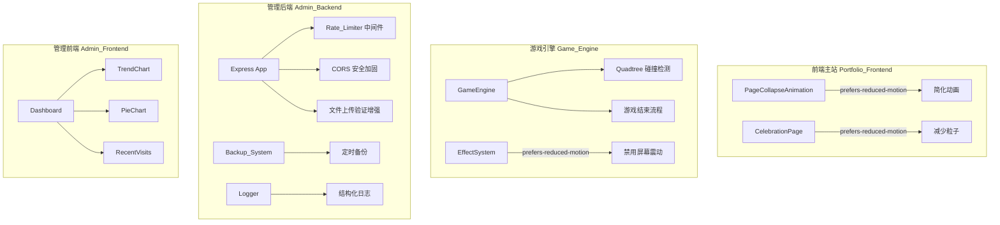

# 设计文档：项目审计与升级

## 概述

本设计文档针对项目审计中发现的 10 个需求，提供具体的技术修复方案和升级设计。修复范围涵盖游戏引擎（Game_Engine）、管理后端（Admin_Backend）、管理前端（Admin_Frontend）和前端主站（Portfolio_Frontend）四个子系统。

技术栈：
- 前端：Vue 3 + TypeScript + Vite + Tailwind CSS
- 后端：Express.js + TypeScript + SQLite（sql.js）
- 游戏：Canvas 2D API + TypeScript
- 测试：Vitest（前端）+ Jest（后端）+ fast-check（属性测试）

## 架构

整体修改不改变现有架构，而是在各子系统内部进行增强和修复。



## 组件与接口

### 1. 游戏结束流程（需求 1）

当前 `PlayerAircraft.ts` 的 `die()` 方法中有 `// TODO: 触发游戏结束` 注释。需要实现完整的游戏结束回调机制。

**方案**：在 `PlayerAircraft` 中添加 `onDeath` 回调，由 `GameEngine` 注册。当玩家死亡时，回调触发游戏结束流程。

```typescript
// PlayerAircraft.ts 中添加回调
export class PlayerAircraft implements Entity {
  private onDeathCallback: (() => void) | null = null

  setOnDeath(callback: () => void): void {
    this.onDeathCallback = callback
  }

  private die(): void {
    this.health = 0
    this.isActive = false
    if (this.onDeathCallback) {
      this.onDeathCallback()
    }
  }
}
```

`GameEngine` 需要新增 `onGameOver` 回调和 `triggerGameOver()` 方法：

```typescript
// GameEngine.ts 中添加
export class GameEngine {
  private onGameOverCallback: ((score: number) => void) | null = null

  setOnGameOver(callback: (score: number) => void): void {
    this.onGameOverCallback = callback
  }

  triggerGameOver(): void {
    this.stop()
    if (this.onGameOverCallback) {
      this.onGameOverCallback(this.currentScore)
    }
  }
}
```

### 2. 四叉树碰撞检测（需求 2）

当前 `GameEngine.checkCollisions()` 使用 O(n²) 双重循环。替换为四叉树空间分区算法。

**四叉树接口**：

```typescript
// Quadtree.ts
interface QuadtreeNode {
  bounds: { x: number; y: number; width: number; height: number }
  entities: Entity[]
  children: QuadtreeNode[] | null
  level: number
}

export class Quadtree {
  private root: QuadtreeNode
  private maxEntities: number = 4  // 每个节点最大实体数
  private maxLevel: number = 5     // 最大深度

  constructor(bounds: { x: number; y: number; width: number; height: number }) {
    this.root = { bounds, entities: [], children: null, level: 0 }
  }

  // 清空并重建
  clear(): void
  // 插入实体
  insert(entity: Entity): void
  // 获取可能碰撞的实体对
  getPotentialCollisions(): [Entity, Entity][]
  // 查询与给定区域重叠的实体
  query(bounds: { x: number; y: number; width: number; height: number }): Entity[]
}
```

`GameEngine.checkCollisions()` 改为：

```typescript
private checkCollisions(): void {
  // 构建四叉树
  const quadtree = new Quadtree({
    x: 0, y: 0,
    width: this.canvas.width,
    height: this.canvas.height
  })

  // 插入所有活跃实体
  for (const entity of this.entities) {
    if (entity.isActive) {
      quadtree.insert(entity)
    }
  }

  // 获取潜在碰撞对并检测
  const pairs = quadtree.getPotentialCollisions()
  for (const [entityA, entityB] of pairs) {
    if (checkAABBCollision(entityA, entityB)) {
      this.checkPlayerHit(entityA, entityB)
      // ... 现有碰撞处理逻辑
    }
  }
}
```

### 3. Dashboard 图表组件（需求 3）

在 `src/admin/frontend/src/components/dashboard/` 下新增三个组件，使用已安装的 ECharts 库。

**组件接口**：

```typescript
// TrendChart.vue - 访问趋势折线图
interface TrendChartProps {
  period: '7d' | '30d'  // 时间范围
}

// PieChart.vue - 内容分类饼图
interface PieChartProps {
  data: { name: string; value: number }[]
}

// RecentVisits.vue - 最近访问记录
interface RecentVisitsProps {
  limit?: number  // 默认 10
}
```

后端需要新增 API 端点：
- `GET /api/dashboard/trend?period=7d|30d` - 访问趋势数据
- `GET /api/dashboard/content-stats` - 内容分类统计
- `GET /api/dashboard/recent-visits?limit=10` - 最近访问记录

### 4. API 请求限流（需求 4）

使用 `express-rate-limit` 库实现。创建 `src/admin/backend/src/middleware/rateLimit.ts`。

```typescript
// rateLimit.ts
import rateLimit from 'express-rate-limit'

// 通用 API 限流：15分钟内最多 100 次
export const generalLimiter = rateLimit({
  windowMs: 15 * 60 * 1000,
  max: 100,
  standardHeaders: true,  // X-RateLimit-* 响应头
  legacyHeaders: false,
  message: {
    success: false,
    message: '请求过于频繁，请稍后再试',
    retryAfter: 0  // 动态填充
  }
})

// 登录接口限流：15分钟内最多 5 次
export const loginLimiter = rateLimit({
  windowMs: 15 * 60 * 1000,
  max: 5,
  standardHeaders: true,
  legacyHeaders: false,
  message: {
    success: false,
    message: '登录尝试过于频繁，请 15 分钟后再试',
    retryAfter: 0
  }
})
```

### 5. CORS 安全加固（需求 5）

修改 `src/admin/backend/src/app.ts` 中的 CORS 配置：

```typescript
const corsOptions: cors.CorsOptions = {
  origin: (origin, callback) => {
    if (process.env.NODE_ENV !== 'production') {
      // 开发环境允许所有来源
      callback(null, true)
      return
    }

    const allowedOrigins = process.env.CORS_ORIGIN?.split(',').map(s => s.trim())
    if (!allowedOrigins || allowedOrigins.length === 0) {
      console.warn('[安全] CORS_ORIGIN 未配置，拒绝所有跨域请求')
      callback(new Error('CORS 未配置'))
      return
    }

    if (!origin || allowedOrigins.includes(origin)) {
      callback(null, true)
    } else {
      console.warn(`[安全] 拒绝来自 ${origin} 的跨域请求`)
      callback(new Error('不允许的跨域来源'))
    }
  },
  // ... 其余配置不变
}
```

### 6. 文件上传安全加固（需求 6）

在 `src/admin/backend/src/services/file.ts` 中增强 Magic Bytes 验证。当前已有 `isValidImageFile`、`isValidAudioFile` 等函数，需要增强其 Magic Bytes 检查逻辑。

```typescript
// Magic Bytes 签名表
const MAGIC_BYTES: Record<string, Buffer[]> = {
  'image/jpeg': [Buffer.from([0xFF, 0xD8, 0xFF])],
  'image/png': [Buffer.from([0x89, 0x50, 0x4E, 0x47])],
  'image/gif': [Buffer.from([0x47, 0x49, 0x46])],
  'image/webp': [Buffer.from([0x52, 0x49, 0x46, 0x46])],
  'application/pdf': [Buffer.from([0x25, 0x50, 0x44, 0x46])],
  'audio/mpeg': [Buffer.from([0xFF, 0xFB]), Buffer.from([0xFF, 0xF3]), Buffer.from([0x49, 0x44, 0x33])],
  'audio/ogg': [Buffer.from([0x4F, 0x67, 0x67, 0x53])],
  'audio/wav': [Buffer.from([0x52, 0x49, 0x46, 0x46])]
}

// 文件大小限制
const FILE_SIZE_LIMITS: Record<string, number> = {
  image: 10 * 1024 * 1024,   // 10MB
  audio: 50 * 1024 * 1024,   // 50MB
  resume: 20 * 1024 * 1024   // 20MB
}

function validateMagicBytes(buffer: Buffer, expectedType: string): boolean {
  const signatures = MAGIC_BYTES[expectedType]
  if (!signatures) return false
  return signatures.some(sig => buffer.subarray(0, sig.length).equals(sig))
}
```

### 7. SQLite 数据库自动备份（需求 7）

创建 `src/admin/backend/src/services/backup.ts`。

```typescript
export class BackupSystem {
  private backupDir: string
  private maxBackups: number = 7
  private intervalMs: number = 24 * 60 * 60 * 1000  // 24小时
  private timer: NodeJS.Timeout | null = null

  constructor(backupDir: string) {
    this.backupDir = backupDir
  }

  // 启动自动备份
  start(): void
  // 停止自动备份
  stop(): void
  // 手动触发备份
  createBackup(): { success: boolean; path?: string; size?: number; error?: string }
  // 清理旧备份
  private cleanOldBackups(): void
  // 获取备份列表
  listBackups(): { filename: string; size: number; createdAt: Date }[]
}
```

后端新增 API：
- `POST /api/backup/create` - 手动触发备份
- `GET /api/backup/list` - 获取备份列表

### 8. 结构化日志系统（需求 8）

创建 `src/admin/backend/src/utils/logger.ts`。

```typescript
enum LogLevel {
  DEBUG = 0,
  INFO = 1,
  WARN = 2,
  ERROR = 3
}

interface LogEntry {
  timestamp: string
  level: string
  module: string
  message: string
  data?: unknown
}

export class Logger {
  private module: string
  private logDir: string
  private maxFileSize: number = 10 * 1024 * 1024  // 10MB
  private maxAge: number = 30  // 30天

  constructor(module: string) {
    this.module = module
    this.logDir = path.resolve(__dirname, '../../logs')
  }

  debug(message: string, data?: unknown): void
  info(message: string, data?: unknown): void
  warn(message: string, data?: unknown): void
  error(message: string, data?: unknown): void

  // 写入日志文件
  private writeToFile(entry: LogEntry): void
  // 清理过期日志
  private cleanOldLogs(): void
}

// 工厂函数
export function createLogger(module: string): Logger {
  return new Logger(module)
}
```

### 9. prefers-reduced-motion 支持（需求 9）

**EffectSystem**：添加 `reducedMotion` 标志，禁用屏幕震动。

```typescript
export class EffectSystem {
  private reducedMotion: boolean = false

  setReducedMotion(enabled: boolean): void {
    this.reducedMotion = enabled
  }

  triggerScreenShake(intensity?: number): void {
    if (this.reducedMotion) return  // 直接跳过
    // ... 现有逻辑
  }
}
```

**PageCollapseAnimation.vue**：检测 `prefers-reduced-motion`，使用简单淡出替代复杂动画。

```typescript
const prefersReducedMotion = window.matchMedia('(prefers-reduced-motion: reduce)').matches

async function startAnimation() {
  if (prefersReducedMotion) {
    // 简单淡出：直接黑屏过渡
    await simpleFadeOut()
    easterEggStore.enterCMDWindow()
    return
  }
  // ... 现有复杂动画
}
```

**CelebrationPage.vue**：在 CSS 中添加 `@media (prefers-reduced-motion: reduce)` 规则，禁用浮动和闪烁动画。

### 10. Spec 任务状态同步（需求 10）

直接修改对应 spec 的 `tasks.md` 文件，将已完成子任务的父任务标记为 `[x]`。对于 `easter-egg-game` spec，根据实际代码实现情况更新任务状态。

## 数据模型

### 备份记录

```typescript
interface BackupRecord {
  id: number
  filename: string       // 备份文件名，如 admin_2024-01-15_120000.db
  filepath: string       // 完整路径
  size: number           // 文件大小（字节）
  createdAt: string      // ISO 8601 时间戳
  status: 'success' | 'failed'
  error?: string         // 失败原因
}
```

### 日志条目

```typescript
interface LogEntry {
  timestamp: string      // ISO 8601 时间戳
  level: 'debug' | 'info' | 'warn' | 'error'
  module: string         // 模块名，如 'auth', 'file', 'backup'
  message: string        // 日志消息
  data?: Record<string, unknown>  // 附加数据
  requestId?: string     // 请求 ID（用于追踪）
}
```

### 四叉树节点

```typescript
interface QuadtreeNode {
  bounds: { x: number; y: number; width: number; height: number }
  entities: Entity[]     // 当前节点包含的实体
  children: QuadtreeNode[] | null  // 四个子节点（NW, NE, SW, SE）
  level: number          // 当前深度
}
```

### Dashboard 数据

```typescript
// 访问趋势数据点
interface TrendDataPoint {
  date: string           // YYYY-MM-DD
  visits: number         // 访问次数
  uniqueVisitors: number // 独立访客数
}

// 内容分类统计
interface ContentStat {
  category: string       // 分类名称
  count: number          // 数量
}

// 最近访问记录
interface RecentVisit {
  id: number
  visitTime: string      // ISO 8601
  pagePath: string       // 访问页面路径
  referrer: string       // 来源
  userAgent: string      // 浏览器信息
}
```


## 正确性属性

*正确性属性是系统在所有有效执行中都应保持为真的特征或行为——本质上是关于系统应该做什么的形式化陈述。属性是人类可读规范与机器可验证正确性保证之间的桥梁。*

### Property 1: 玩家死亡触发游戏结束

*For any* 玩家飞机实例和任意伤害序列，当累计伤害使血量降至零或以下时，游戏结束回调应该被恰好调用一次。

**Validates: Requirements 1.1**

### Property 2: 四叉树与暴力算法碰撞结果一致

*For any* 一组随机位置和大小的实体（数量 1-200），四叉树碰撞检测返回的碰撞对集合应该与 O(n²) 暴力算法返回的碰撞对集合完全一致（集合相等）。

**Validates: Requirements 2.1, 2.3, 2.4**

### Property 3: 请求限流正确性

*For any* IP 地址和限流配置（窗口时间、最大请求数），在窗口时间内发送的请求数不超过最大值时应全部通过（HTTP 200），超过最大值后的请求应返回 HTTP 429。

**Validates: Requirements 4.1, 4.2, 4.3**

### Property 4: 限流响应头完整性

*For any* API 请求的响应，响应头中应包含 X-RateLimit-Limit（正整数）、X-RateLimit-Remaining（非负整数）和 X-RateLimit-Reset（未来时间戳）三个字段，且 Remaining 不超过 Limit。

**Validates: Requirements 4.4**

### Property 5: CORS 域名白名单验证

*For any* 域名字符串和白名单配置，在生产环境下，请求来源在白名单中时应被允许，不在白名单中时应被拒绝（HTTP 403）。

**Validates: Requirements 5.1, 5.3**

### Property 6: 文件类型双重验证

*For any* 文件名和文件内容的组合，只有当文件扩展名在允许列表中且文件内容的 Magic Bytes 与声明的类型匹配时，文件上传验证才应通过。扩展名不匹配或 Magic Bytes 不匹配的文件应被拒绝。

**Validates: Requirements 6.1, 6.3, 6.4**

### Property 7: 文件大小限制

*For any* 文件类型（图片、音频、简历）和文件大小，超过对应类型大小限制的文件应被拒绝，未超过限制的文件应通过大小验证。

**Validates: Requirements 6.2**

### Property 8: 备份文件数量上限

*For any* 连续 N 次（N >= 1）备份操作后，备份目录中的备份文件数量应不超过 7 个，且保留的是最近的 min(N, 7) 个备份。

**Validates: Requirements 7.2**

### Property 9: 日志格式正确性

*For any* 日志级别和消息内容，Logger 输出的日志应为有效 JSON 格式，且包含 timestamp（ISO 8601）、level、module 和 message 四个必需字段。

**Validates: Requirements 8.1**

### Property 10: 日志级别过滤

*For any* 配置的最低日志级别和任意日志调用，只有级别大于等于最低级别的日志才应被写入，低于最低级别的日志应被忽略。

**Validates: Requirements 8.2**

### Property 11: reducedMotion 禁用屏幕震动

*For any* EffectSystem 实例，当 reducedMotion 设置为 true 时，无论调用多少次 triggerScreenShake，getScreenOffset 返回的偏移量应始终为 {x: 0, y: 0}。

**Validates: Requirements 9.1**

## 错误处理

### 游戏引擎错误处理
- 游戏结束回调异常：使用 try-catch 包裹回调调用，异常时仍确保游戏循环停止
- 四叉树构建异常：回退到暴力算法，记录警告日志

### 后端错误处理
- 限流中间件异常：放行请求但记录错误日志，避免阻断正常服务
- CORS 验证异常：拒绝请求并返回 500，记录错误日志
- 文件上传验证异常：拒绝上传并返回 400，记录错误详情
- 备份失败：记录错误日志，不影响主服务运行，下一周期重试
- 日志写入失败：回退到 console 输出，不影响业务逻辑

### 前端错误处理
- Dashboard 数据加载失败：显示错误提示和重试按钮
- ECharts 初始化失败：显示文本替代内容
- prefers-reduced-motion 检测失败：默认不启用减少动画模式

## 测试策略

### 测试框架

- **前端单元测试和属性测试**：Vitest + fast-check
- **后端单元测试和属性测试**：Jest + fast-check
- **E2E 测试**：Playwright（已有配置）

### 属性测试配置

- 每个属性测试最少运行 100 次迭代
- 使用 fast-check 库生成随机测试数据
- 每个测试用注释标注对应的设计属性编号
- 标注格式：`Feature: project-audit-upgrade, Property N: 属性描述`

### 单元测试

单元测试覆盖以下场景：
- 游戏结束流程的具体状态转换（example）
- Dashboard 组件渲染正确性（example）
- 备份操作成功/失败场景（example）
- prefers-reduced-motion 动画简化（example）
- CORS 未配置时的拒绝行为（edge-case）

### 属性测试

属性测试覆盖 11 个正确性属性，重点关注：
- 四叉树碰撞检测的模型测试（Property 2）—— 最关键
- 文件类型双重验证（Property 6）—— 安全相关
- 请求限流正确性（Property 3）—— 安全相关
- 日志格式和级别过滤（Property 9, 10）—— 基础设施

### 测试优先级

1. **P0**：Property 2（碰撞检测一致性）、Property 1（游戏结束触发）
2. **P1**：Property 3-7（安全相关属性）
3. **P2**：Property 8-11（基础设施属性）
