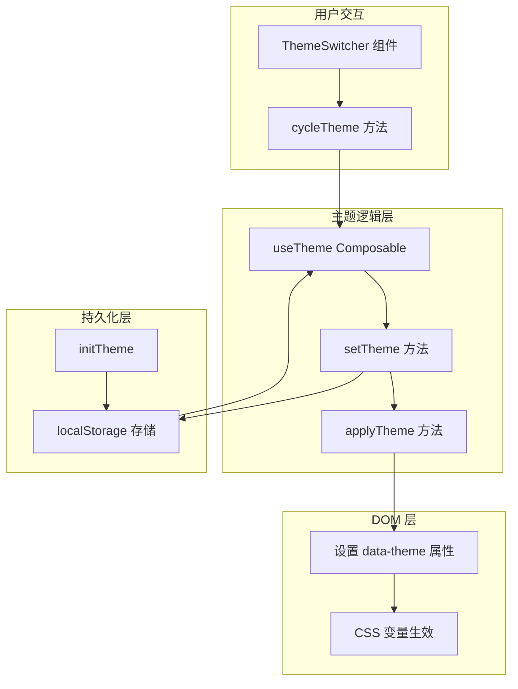

# 设计文档

## 概述

本设计文档描述了主题切换功能修复的技术方案。修复分为两个主要部分：

1. **主站主题切换修复**：解决主题切换无效果的问题
2. **管理系统硬编码颜色修复**：将硬编码颜色值替换为 CSS 变量

## 架构

### 主题系统架构



### 问题根因分析

#### 主站问题

经过代码分析，主站主题切换问题的根本原因是：

1. **CSS 变量优先级问题**：`index.css` 中 `:root` 选择器定义了默认的深色主题变量，但 `[data-theme="light"]` 选择器的优先级与 `:root` 相同
2. **初始化时机问题**：`useTheme.ts` 的 `initTheme()` 在 `onMounted` 中调用，但 CSS 变量已经在页面加载时应用了 `:root` 的默认值

#### 管理系统问题

管理系统存在大量硬编码颜色值：

| 文件 | 硬编码颜色示例 |
|------|---------------|
| `Login.vue` | `#667eea`, `#764ba2`, `#fff`, `#303133`, `#909399` |
| `NotFound.vue` | `#f5f7fa`, `#409eff`, `#303133`, `#909399` |
| `Dashboard.vue` | `#667eea`, `#764ba2`, `#f093fb`, `#f5576c`, `#4facfe`, `#00f2fe`, `#43e97b`, `#38f9d7`, `#fff` |
| `Content.vue` | `#667eea`, `#764ba2`, `#fff` |
| SEO 组件 | `#ECF5FF`, `#D9ECFF`, `#409EFF`, `#606266`, `#909399`, `#F5F7FA` 等 |

## 组件和接口

### 主站 useTheme Composable 修复

```typescript
// src/composables/useTheme.ts

/**
 * 主题管理 Composable
 * 
 * 修复点：
 * 1. 确保 applyTheme 正确设置 data-theme 属性
 * 2. 添加 CSS 变量优先级处理
 */
export function useTheme() {
  // ... 现有代码 ...

  /**
   * 应用主题到 DOM
   * 修复：确保 data-theme 属性正确设置
   */
  const applyTheme = (): void => {
    if (typeof document === 'undefined') {
      return
    }
    
    const theme = resolvedTheme.value
    const root = document.documentElement
    
    // 关键修复：确保设置 data-theme 属性
    root.setAttribute('data-theme', theme)
    
    // 添加过渡动画类
    root.classList.add('theme-transition')
    
    setTimeout(() => {
      root.classList.remove('theme-transition')
    }, TRANSITION_DURATION)
  }
}
```

### 管理系统 CSS 变量映射

需要在 `themes.scss` 中添加以下变量映射：

```scss
// 信息卡片背景色
--info-card-bg: #ECF5FF;           // 浅色主题
--info-card-bg: rgba(64, 158, 255, 0.1);  // 深色主题

// 警告卡片背景色
--warning-card-bg: #FDF6EC;        // 浅色主题
--warning-card-bg: rgba(230, 162, 60, 0.1);  // 深色主题

// 成功卡片背景色
--success-card-bg: #F0F9EB;        // 浅色主题
--success-card-bg: rgba(103, 194, 58, 0.1);  // 深色主题

// 代码预览背景色
--code-preview-bg: #F5F7FA;        // 浅色主题
--code-preview-bg: #262727;        // 深色主题

// 渐变色（用于装饰性元素）
--gradient-primary: linear-gradient(135deg, #667eea 0%, #764ba2 100%);
--gradient-success: linear-gradient(135deg, #43e97b 0%, #38f9d7 100%);
--gradient-info: linear-gradient(135deg, #4facfe 0%, #00f2fe 100%);
--gradient-warning: linear-gradient(135deg, #f093fb 0%, #f5576c 100%);
```

## 数据模型

### 主题模式类型

```typescript
type ThemeMode = 'dark' | 'light' | 'system'

interface ThemeConfig {
  mode: ThemeMode
  resolvedTheme: 'dark' | 'light'
}
```

### CSS 变量命名规范

| 类别 | 命名模式 | 示例 |
|------|---------|------|
| 背景色 | `--bg-*` | `--bg-color`, `--bg-color-page` |
| 文字色 | `--text-*` | `--text-primary`, `--text-secondary` |
| 边框色 | `--border-*` | `--border-color`, `--border-color-light` |
| 状态色 | `--{status}-*` | `--success-color`, `--warning-color` |
| 组件特定 | `--{component}-*` | `--card-bg`, `--input-bg` |

## 正确性属性

*正确性属性是一种特征或行为，应该在系统的所有有效执行中保持为真——本质上是关于系统应该做什么的形式化陈述。属性作为人类可读规范和机器可验证正确性保证之间的桥梁。*

### Property 1: 主题循环切换一致性

*对于任意* 初始主题模式，调用 `cycleTheme()` 后，主题应按照 dark → light → system → dark 的顺序循环切换。

**验证: 需求 1.1**

### Property 2: data-theme 属性同步

*对于任意* 主题模式设置，`document.documentElement.getAttribute('data-theme')` 应该返回与 `resolvedTheme` 一致的值（'dark' 或 'light'）。

**验证: 需求 1.2, 1.3**

### Property 3: localStorage 往返一致性

*对于任意* 有效的主题模式，保存到 localStorage 后再读取，应该得到相同的主题模式值。

**验证: 需求 1.7, 1.8**

### Property 4: 系统主题跟随

*对于任意* 系统主题偏好（dark 或 light），当主题模式为 'system' 时，`resolvedTheme` 应该与系统偏好一致。

**验证: 需求 1.6**

### Property 5: 硬编码颜色消除

*对于任意* 管理系统的 Vue 组件样式，不应包含硬编码的十六进制颜色值（`#xxx` 或 `#xxxxxx`），除非是渐变色的一部分且已定义为 CSS 变量。

**验证: 需求 2.2-2.9, 3.1-3.5**

## 错误处理

### localStorage 不可用

```typescript
try {
  localStorage.setItem(STORAGE_KEY, newMode)
} catch (error) {
  console.warn('[useTheme] localStorage 不可用，主题偏好不会被持久化')
}
```

### 无效主题模式

```typescript
if (!VALID_MODES.includes(newMode)) {
  console.warn(`[useTheme] 无效的主题模式: ${newMode}，使用默认值`)
  newMode = 'system'
}
```

## 测试策略

### 单元测试

1. **useTheme Composable 测试**
   - 测试 `cycleTheme()` 循环切换逻辑
   - 测试 `setTheme()` 设置主题逻辑
   - 测试 `initTheme()` 初始化逻辑
   - 测试 localStorage 持久化

2. **CSS 变量测试**
   - 验证 `[data-theme="light"]` 选择器正确应用浅色变量
   - 验证 `[data-theme="dark"]` 选择器正确应用深色变量

### 属性测试

使用 Vitest 的属性测试功能：

```typescript
import { fc } from '@fast-check/vitest'

// Property 1: 主题循环切换一致性
test.prop([fc.constantFrom('dark', 'light', 'system')])('主题循环切换', (initialMode) => {
  // Feature: theme-switching-fix, Property 1: 主题循环切换一致性
  const { mode, cycleTheme, setTheme } = useTheme()
  setTheme(initialMode)
  
  const expectedNext = {
    dark: 'light',
    light: 'system',
    system: 'dark'
  }
  
  cycleTheme()
  expect(mode.value).toBe(expectedNext[initialMode])
})
```

### 集成测试

1. **主站主题切换端到端测试**
   - 点击主题切换按钮
   - 验证页面颜色变化
   - 刷新页面验证主题持久化

2. **管理系统主题切换测试**
   - 切换到深色主题
   - 验证所有页面元素颜色正确变化
   - 验证无硬编码颜色残留
