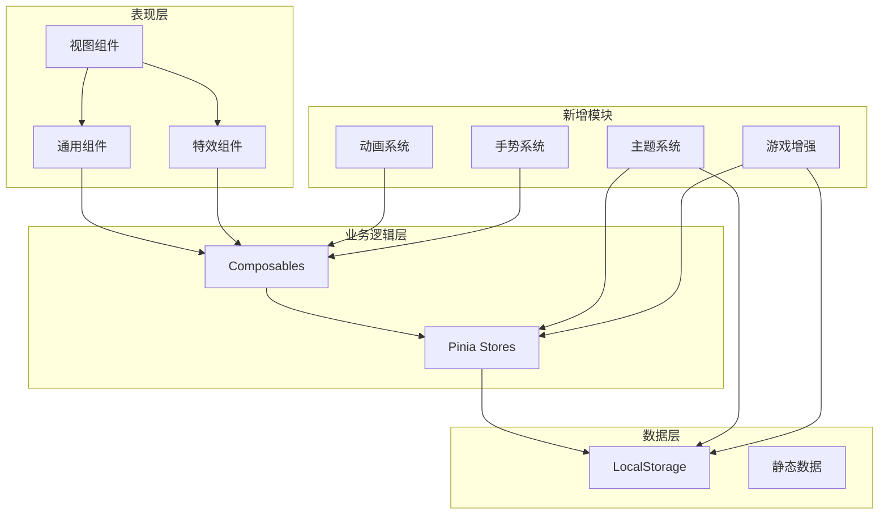
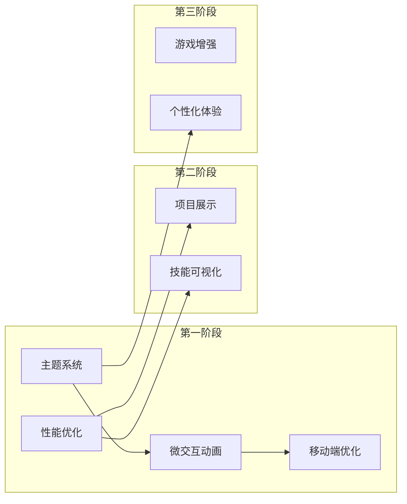

# 设计文档

## 概述

本设计文档描述了 Vue 3 个人求职网站增强功能的技术架构和实现方案。增强功能分为三个阶段实施，涵盖主题系统、微交互动画、移动端优化、性能优化、项目展示、技能可视化、彩蛋游戏增强和个性化体验。

设计遵循以下原则：
- **渐进增强**：新功能不影响现有功能的正常运行
- **组件复用**：最大化利用现有组件和 Composables
- **性能优先**：所有新功能都考虑性能影响
- **可访问性**：遵循 WCAG AA 标准

## 架构

### 整体架构图



### 模块依赖关系



## 组件和接口

### 1. 主题系统

#### useTheme Composable

```typescript
// src/composables/useTheme.ts
import { ref, computed, watch, onMounted } from 'vue'

export type ThemeMode = 'dark' | 'light' | 'system'

export interface ThemeConfig {
  mode: ThemeMode
  resolvedTheme: 'dark' | 'light'
}

export function useTheme() {
  const STORAGE_KEY = 'theme-preference'
  
  const mode = ref<ThemeMode>('system')
  const systemPrefersDark = ref(true)
  
  const resolvedTheme = computed<'dark' | 'light'>(() => {
    if (mode.value === 'system') {
      return systemPrefersDark.value ? 'dark' : 'light'
    }
    return mode.value
  })
  
  const setTheme = (newMode: ThemeMode): void => {
    mode.value = newMode
    localStorage.setItem(STORAGE_KEY, newMode)
    applyTheme()
  }
  
  const cycleTheme = (): void => {
    const modes: ThemeMode[] = ['dark', 'light', 'system']
    const currentIndex = modes.indexOf(mode.value)
    const nextIndex = (currentIndex + 1) % modes.length
    setTheme(modes[nextIndex])
  }
  
  const applyTheme = (): void => {
    document.documentElement.setAttribute('data-theme', resolvedTheme.value)
    document.documentElement.classList.add('theme-transition')
    setTimeout(() => {
      document.documentElement.classList.remove('theme-transition')
    }, 300)
  }
  
  const initTheme = (): void => {
    const saved = localStorage.getItem(STORAGE_KEY) as ThemeMode | null
    if (saved && ['dark', 'light', 'system'].includes(saved)) {
      mode.value = saved
    }
    
    const mediaQuery = window.matchMedia('(prefers-color-scheme: dark)')
    systemPrefersDark.value = mediaQuery.matches
    
    mediaQuery.addEventListener('change', (e) => {
      systemPrefersDark.value = e.matches
      if (mode.value === 'system') {
        applyTheme()
      }
    })
    
    applyTheme()
  }
  
  return {
    mode,
    resolvedTheme,
    setTheme,
    cycleTheme,
    initTheme,
  }
}
```

#### ThemeSwitcher 组件

```vue
<!-- src/components/common/ThemeSwitcher.vue -->
<template>
  <button
    class="theme-switcher"
    :aria-label="ariaLabel"
    @click="cycleTheme"
  >
    <span class="icon" :class="iconClass">
      <!-- 图标根据当前主题显示 -->
    </span>
  </button>
</template>

<script setup lang="ts">
import { computed } from 'vue'
import { useTheme } from '@/composables/useTheme'

const { mode, cycleTheme } = useTheme()

const iconClass = computed(() => ({
  'icon-sun': mode.value === 'light',
  'icon-moon': mode.value === 'dark',
  'icon-system': mode.value === 'system',
}))

const ariaLabel = computed(() => {
  const labels = {
    dark: '切换到浅色主题',
    light: '切换到跟随系统',
    system: '切换到深色主题',
  }
  return labels[mode.value]
})
</script>
```

### 2. 微交互动画系统

#### useRipple Composable

```typescript
// src/composables/useRipple.ts
import { ref } from 'vue'

export interface RippleInstance {
  id: number
  x: number
  y: number
  size: number
}

export function useRipple() {
  const ripples = ref<RippleInstance[]>([])
  let rippleId = 0
  
  const createRipple = (event: MouseEvent): void => {
    const target = event.currentTarget as HTMLElement
    const rect = target.getBoundingClientRect()
    const size = Math.max(rect.width, rect.height) * 2
    const x = event.clientX - rect.left - size / 2
    const y = event.clientY - rect.top - size / 2
    
    const ripple: RippleInstance = {
      id: rippleId++,
      x,
      y,
      size,
    }
    
    ripples.value.push(ripple)
    
    setTimeout(() => {
      ripples.value = ripples.value.filter(r => r.id !== ripple.id)
    }, 600)
  }
  
  return {
    ripples,
    createRipple,
  }
}
```

#### useCard3D Composable

```typescript
// src/composables/useCard3D.ts
import { ref, computed } from 'vue'

export interface Card3DTransform {
  rotateX: number
  rotateY: number
  scale: number
}

export function useCard3D(maxRotation: number = 10) {
  const isHovering = ref(false)
  const mouseX = ref(0)
  const mouseY = ref(0)
  
  const transform = computed<Card3DTransform>(() => {
    if (!isHovering.value) {
      return { rotateX: 0, rotateY: 0, scale: 1 }
    }
    return {
      rotateX: (mouseY.value - 0.5) * maxRotation * -1,
      rotateY: (mouseX.value - 0.5) * maxRotation,
      scale: 1.02,
    }
  })
  
  const transformStyle = computed(() => {
    const { rotateX, rotateY, scale } = transform.value
    return {
      transform: `perspective(1000px) rotateX(${rotateX}deg) rotateY(${rotateY}deg) scale(${scale})`,
    }
  })
  
  const handleMouseMove = (event: MouseEvent): void => {
    const target = event.currentTarget as HTMLElement
    const rect = target.getBoundingClientRect()
    mouseX.value = (event.clientX - rect.left) / rect.width
    mouseY.value = (event.clientY - rect.top) / rect.height
  }
  
  const handleMouseEnter = (): void => {
    isHovering.value = true
  }
  
  const handleMouseLeave = (): void => {
    isHovering.value = false
  }
  
  return {
    transform,
    transformStyle,
    handleMouseMove,
    handleMouseEnter,
    handleMouseLeave,
  }
}
```

#### useScrollAnimation Composable

```typescript
// src/composables/useScrollAnimation.ts
import { ref, onMounted, onUnmounted } from 'vue'

export type AnimationType = 'fade-in' | 'slide-up' | 'slide-left' | 'scale-in'

export interface ScrollAnimationOptions {
  type?: AnimationType
  delay?: number
  threshold?: number
  once?: boolean
}

export function useScrollAnimation(options: ScrollAnimationOptions = {}) {
  const {
    type = 'fade-in',
    delay = 0,
    threshold = 0.1,
    once = true,
  } = options
  
  const elementRef = ref<HTMLElement | null>(null)
  const isVisible = ref(false)
  let observer: IntersectionObserver | null = null
  
  const animationClass = computed(() => ({
    'scroll-animate': true,
    [`scroll-animate--${type}`]: true,
    'scroll-animate--visible': isVisible.value,
  }))
  
  const animationStyle = computed(() => ({
    transitionDelay: `${delay}ms`,
  }))
  
  onMounted(() => {
    if (!elementRef.value) return
    
    // 检查用户是否启用了减少动画
    const prefersReducedMotion = window.matchMedia('(prefers-reduced-motion: reduce)').matches
    if (prefersReducedMotion) {
      isVisible.value = true
      return
    }
    
    observer = new IntersectionObserver(
      (entries) => {
        entries.forEach((entry) => {
          if (entry.isIntersecting) {
            isVisible.value = true
            if (once && observer) {
              observer.unobserve(entry.target)
            }
          } else if (!once) {
            isVisible.value = false
          }
        })
      },
      { threshold }
    )
    
    observer.observe(elementRef.value)
  })
  
  onUnmounted(() => {
    if (observer) {
      observer.disconnect()
    }
  })
  
  return {
    elementRef,
    isVisible,
    animationClass,
    animationStyle,
  }
}
```

### 3. 移动端手势系统

#### useGesture Composable

```typescript
// src/composables/useGesture.ts
import { ref, onMounted, onUnmounted } from 'vue'

export interface GestureConfig {
  minDistance?: number
  minVelocity?: number
  onSwipeLeft?: () => void
  onSwipeRight?: () => void
  onSwipeUp?: () => void
  onSwipeDown?: () => void
}

export function useGesture(config: GestureConfig = {}) {
  const {
    minDistance = 50,
    minVelocity = 0.3,
    onSwipeLeft,
    onSwipeRight,
    onSwipeUp,
    onSwipeDown,
  } = config
  
  const elementRef = ref<HTMLElement | null>(null)
  const isSwiping = ref(false)
  
  let startX = 0
  let startY = 0
  let startTime = 0
  
  const handleTouchStart = (e: TouchEvent): void => {
    const touch = e.touches[0]
    startX = touch.clientX
    startY = touch.clientY
    startTime = Date.now()
    isSwiping.value = true
  }
  
  const handleTouchEnd = (e: TouchEvent): void => {
    if (!isSwiping.value) return
    
    const touch = e.changedTouches[0]
    const deltaX = touch.clientX - startX
    const deltaY = touch.clientY - startY
    const deltaTime = Date.now() - startTime
    
    const velocityX = Math.abs(deltaX) / deltaTime
    const velocityY = Math.abs(deltaY) / deltaTime
    
    const isHorizontal = Math.abs(deltaX) > Math.abs(deltaY)
    
    if (isHorizontal && Math.abs(deltaX) >= minDistance && velocityX >= minVelocity) {
      if (deltaX > 0 && onSwipeRight) {
        onSwipeRight()
        triggerHapticFeedback()
      } else if (deltaX < 0 && onSwipeLeft) {
        onSwipeLeft()
        triggerHapticFeedback()
      }
    } else if (!isHorizontal && Math.abs(deltaY) >= minDistance && velocityY >= minVelocity) {
      if (deltaY > 0 && onSwipeDown) {
        onSwipeDown()
      } else if (deltaY < 0 && onSwipeUp) {
        onSwipeUp()
      }
    }
    
    isSwiping.value = false
  }
  
  const triggerHapticFeedback = (): void => {
    if ('vibrate' in navigator) {
      navigator.vibrate(10)
    }
  }
  
  onMounted(() => {
    if (!elementRef.value) return
    elementRef.value.addEventListener('touchstart', handleTouchStart, { passive: true })
    elementRef.value.addEventListener('touchend', handleTouchEnd, { passive: true })
  })
  
  onUnmounted(() => {
    if (!elementRef.value) return
    elementRef.value.removeEventListener('touchstart', handleTouchStart)
    elementRef.value.removeEventListener('touchend', handleTouchEnd)
  })
  
  return {
    elementRef,
    isSwiping,
  }
}
```

### 4. 项目展示模块

#### 数据模型扩展

```typescript
// src/types/project.ts
export interface Project {
  id: string
  name: string
  description: string
  period: string
  role: string
  technologies: string[]
  highlights: string[]
  screenshots: string[]
  demoUrl?: string
  sourceUrl?: string
  category: 'work' | 'personal' | 'open-source'
}

export interface ProjectFilter {
  technology?: string
  category?: Project['category']
}
```

#### ImageCarousel 组件

```typescript
// src/components/common/ImageCarousel.vue 接口
export interface ImageCarouselProps {
  images: string[]
  autoPlay?: boolean
  interval?: number
  showIndicators?: boolean
  showArrows?: boolean
}

export interface ImageCarouselEmits {
  (e: 'change', index: number): void
}
```

### 5. 技能树可视化

#### SkillTree 数据结构

```typescript
// src/types/skillTree.ts
export interface SkillTreeNode {
  id: string
  name: string
  level: number  // 0-100 熟练度
  experience?: string  // 使用年限
  children?: SkillTreeNode[]
}

export interface SkillTreeConfig {
  layout: 'radial' | 'orthogonal'
  expandLevel: number  // 默认展开层级
  nodeSize: (level: number) => number
}
```

### 6. 游戏增强模块

#### LeaderboardManager

```typescript
// src/game/LeaderboardManager.ts
export interface ScoreEntry {
  id: string
  playerName: string
  score: number
  stage: number
  timestamp: number
  achievements: string[]
}

export interface LeaderboardConfig {
  maxEntries: number
  storageKey: string
}

export class LeaderboardManager {
  private readonly config: LeaderboardConfig
  
  constructor(config: Partial<LeaderboardConfig> = {}) {
    this.config = {
      maxEntries: 10,
      storageKey: 'game_leaderboard',
      ...config,
    }
  }
  
  getScores(): ScoreEntry[] {
    const data = localStorage.getItem(this.config.storageKey)
    return data ? JSON.parse(data) : []
  }
  
  addScore(entry: Omit<ScoreEntry, 'id'>): { rank: number; isHighScore: boolean } {
    const scores = this.getScores()
    const newEntry: ScoreEntry = {
      ...entry,
      id: crypto.randomUUID(),
    }
    
    scores.push(newEntry)
    scores.sort((a, b) => b.score - a.score)
    
    const trimmed = scores.slice(0, this.config.maxEntries)
    localStorage.setItem(this.config.storageKey, JSON.stringify(trimmed))
    
    const rank = trimmed.findIndex(s => s.id === newEntry.id) + 1
    const isHighScore = rank > 0 && rank <= this.config.maxEntries
    
    return { rank, isHighScore }
  }
  
  isHighScore(score: number): boolean {
    const scores = this.getScores()
    if (scores.length < this.config.maxEntries) return true
    return score > scores[scores.length - 1].score
  }
  
  clearScores(): void {
    localStorage.removeItem(this.config.storageKey)
  }
}
```

#### AchievementSystem

```typescript
// src/game/AchievementSystem.ts
export interface Achievement {
  id: string
  name: string
  description: string
  icon: string
  condition: (stats: GameStats) => boolean
  unlockedAt?: number
}

export interface GameStats {
  totalScore: number
  highestStage: number
  totalKills: number
  totalPlayTime: number
  perfectStages: number
}

export class AchievementSystem {
  private readonly storageKey = 'game_achievements'
  private achievements: Achievement[]
  
  constructor(achievements: Achievement[]) {
    this.achievements = achievements
  }
  
  checkAchievements(stats: GameStats): Achievement[] {
    const unlocked = this.getUnlockedAchievements()
    const newlyUnlocked: Achievement[] = []
    
    for (const achievement of this.achievements) {
      if (unlocked.includes(achievement.id)) continue
      
      if (achievement.condition(stats)) {
        achievement.unlockedAt = Date.now()
        newlyUnlocked.push(achievement)
        this.saveUnlockedAchievement(achievement.id)
      }
    }
    
    return newlyUnlocked
  }
  
  getUnlockedAchievements(): string[] {
    const data = localStorage.getItem(this.storageKey)
    return data ? JSON.parse(data) : []
  }
  
  private saveUnlockedAchievement(id: string): void {
    const unlocked = this.getUnlockedAchievements()
    if (!unlocked.includes(id)) {
      unlocked.push(id)
      localStorage.setItem(this.storageKey, JSON.stringify(unlocked))
    }
  }
  
  getAllAchievements(): Achievement[] {
    return this.achievements
  }
}
```

### 7. 个性化体验

#### useGreeting Composable

```typescript
// src/composables/useGreeting.ts
import { computed } from 'vue'

export interface GreetingConfig {
  morning: string
  afternoon: string
  evening: string
  night: string
}

export function useGreeting(config?: Partial<GreetingConfig>) {
  const defaultConfig: GreetingConfig = {
    morning: '早上好',
    afternoon: '下午好',
    evening: '晚上好',
    night: '夜深了',
    ...config,
  }
  
  const greeting = computed(() => {
    const hour = new Date().getHours()
    
    if (hour >= 5 && hour < 12) {
      return defaultConfig.morning
    } else if (hour >= 12 && hour < 18) {
      return defaultConfig.afternoon
    } else if (hour >= 18 && hour < 22) {
      return defaultConfig.evening
    } else {
      return defaultConfig.night
    }
  })
  
  return { greeting }
}
```

#### useReadingProgress Composable

```typescript
// src/composables/useReadingProgress.ts
import { ref, onMounted, onUnmounted } from 'vue'

export function useReadingProgress() {
  const progress = ref(0)
  
  const updateProgress = (): void => {
    const scrollTop = window.scrollY
    const docHeight = document.documentElement.scrollHeight - window.innerHeight
    progress.value = docHeight > 0 ? Math.min((scrollTop / docHeight) * 100, 100) : 0
  }
  
  onMounted(() => {
    window.addEventListener('scroll', updateProgress, { passive: true })
    updateProgress()
  })
  
  onUnmounted(() => {
    window.removeEventListener('scroll', updateProgress)
  })
  
  return { progress }
}
```

#### useKeyboardNavigation Composable

```typescript
// src/composables/useKeyboardNavigation.ts
import { onMounted, onUnmounted } from 'vue'
import { useRouter } from 'vue-router'

export interface KeyboardNavigationConfig {
  routes: string[]
  enableNumberKeys?: boolean
  enableArrowKeys?: boolean
  onNavigate?: (route: string) => void
}

export function useKeyboardNavigation(config: KeyboardNavigationConfig) {
  const router = useRouter()
  const { routes, enableNumberKeys = true, enableArrowKeys = true, onNavigate } = config
  
  const handleKeyDown = (e: KeyboardEvent): void => {
    // 忽略输入框中的按键
    if (e.target instanceof HTMLInputElement || e.target instanceof HTMLTextAreaElement) {
      return
    }
    
    // 数字键导航 (1-9)
    if (enableNumberKeys && e.key >= '1' && e.key <= '9') {
      const index = parseInt(e.key) - 1
      if (index < routes.length) {
        navigateTo(routes[index])
      }
    }
    
    // 方向键导航
    if (enableArrowKeys) {
      const currentIndex = routes.indexOf(router.currentRoute.value.path)
      
      if (e.key === 'ArrowRight' || e.key === 'ArrowDown') {
        const nextIndex = (currentIndex + 1) % routes.length
        navigateTo(routes[nextIndex])
      } else if (e.key === 'ArrowLeft' || e.key === 'ArrowUp') {
        const prevIndex = (currentIndex - 1 + routes.length) % routes.length
        navigateTo(routes[prevIndex])
      }
    }
    
    // Escape 键返回
    if (e.key === 'Escape') {
      router.back()
    }
  }
  
  const navigateTo = (route: string): void => {
    router.push(route)
    onNavigate?.(route)
  }
  
  onMounted(() => {
    window.addEventListener('keydown', handleKeyDown)
  })
  
  onUnmounted(() => {
    window.removeEventListener('keydown', handleKeyDown)
  })
}
```

## 数据模型

### 主题配置

```typescript
// src/types/theme.ts
export type ThemeMode = 'dark' | 'light' | 'system'

export interface ThemeColors {
  // 主色调
  primary: string
  primaryDark: string
  primaryLight: string
  secondary: string
  accent: string
  
  // 背景色
  bgPrimary: string
  bgSecondary: string
  bgTertiary: string
  bgCard: string
  
  // 文字色
  textPrimary: string
  textSecondary: string
  textMuted: string
  
  // 边框
  border: string
  borderLight: string
}

export interface ThemeState {
  mode: ThemeMode
  colors: ThemeColors
}
```

### 游戏状态扩展

```typescript
// src/types/game.ts (扩展)
export interface GameState {
  // 现有字段...
  
  // 新增字段
  leaderboard: ScoreEntry[]
  achievements: {
    unlocked: string[]
    pending: Achievement[]
  }
  stats: GameStats
}
```


## 正确性属性

*属性是指在系统所有有效执行中都应该保持为真的特征或行为——本质上是关于系统应该做什么的形式化陈述。属性作为人类可读规范和机器可验证正确性保证之间的桥梁。*

### 属性 1：主题模式循环切换

*对于任意* 当前主题模式（dark/light/system），调用 cycleTheme() 后，主题模式应该按照 dark → light → system → dark 的顺序循环切换。

**验证: 需求 1.2**

### 属性 2：主题偏好往返持久化

*对于任意* 有效的主题模式值，设置主题后保存到 localStorage，然后从 localStorage 读取并应用，应该得到相同的主题模式。

**验证: 需求 1.4, 1.5**

### 属性 3：系统主题跟随

*对于任意* 系统主题偏好（深色/浅色），当主题模式设置为 'system' 时，resolvedTheme 应该与系统偏好一致。

**验证: 需求 1.6**

### 属性 4：主题配置完整性

*对于任意* 主题配置对象，必须包含所有必需的 CSS 变量键：primary、bgPrimary、bgSecondary、textPrimary、textSecondary、border。

**验证: 需求 1.7**

### 属性 5：涟漪效果位置计算

*对于任意* 按钮元素和点击坐标，涟漪效果的位置应该以点击位置为中心，大小应该足以覆盖整个按钮。

**验证: 需求 2.1**

### 属性 6：卡片 3D 变换计算

*对于任意* 卡片元素和鼠标位置（相对于卡片的 0-1 归一化坐标），计算出的旋转角度应该在 [-maxRotation, +maxRotation] 范围内，且鼠标在中心时旋转角度为 0。

**验证: 需求 2.3, 2.4**

### 属性 7：路由方向判断

*对于任意* 路由历史记录和目标路由，如果目标路由是历史记录的最后一项，则方向应为 'backward'，否则为 'forward'。

**验证: 需求 2.6**

### 属性 8：滚动动画配置

*对于任意* 滚动动画配置（类型、延迟、阈值），生成的 CSS 类名和样式应该正确反映配置值。

**验证: 需求 2.8**

### 属性 9：手势识别与阈值判断

*对于任意* 触摸起点和终点坐标以及时间间隔，只有当水平滑动距离 ≥ 50px 且速度 ≥ 阈值时，才应触发左右滑动事件。

**验证: 需求 3.1, 3.2**

### 属性 10：项目数据展示完整性

*对于任意* 有效的项目数据对象，渲染后的内容应该包含项目名称、时间段、角色、描述、技术栈和亮点所有字段。

**验证: 需求 5.2**

### 属性 11：轮播索引计算

*对于任意* 图片数组和当前索引，向左切换应该使索引减 1（循环到末尾），向右切换应该使索引加 1（循环到开头）。

**验证: 需求 5.3**

### 属性 12：项目筛选逻辑

*对于任意* 项目列表和技术栈筛选条件，筛选结果应该只包含技术栈数组中包含该技术的项目。

**验证: 需求 5.5**

### 属性 13：技能树节点展开折叠

*对于任意* 技能树节点，展开后再折叠应该恢复到原始状态（往返属性）。

**验证: 需求 6.2**

### 属性 14：技能节点大小计算

*对于任意* 技能熟练度值（0-100），计算出的节点大小应该与熟练度成正比，且在合理的最小/最大范围内。

**验证: 需求 6.4**

### 属性 15：排行榜存储限制

*对于任意* 分数记录序列，排行榜最多只保留 10 条记录，且保留的是分数最高的 10 条。

**验证: 需求 7.1**

### 属性 16：排行榜排序

*对于任意* 排行榜中的分数记录，记录应该按分数降序排列。

**验证: 需求 7.2**

### 属性 17：高分判断

*对于任意* 当前排行榜和新分数，如果排行榜未满（< 10 条）或新分数高于最低分，则应判断为高分。

**验证: 需求 7.3**

### 属性 18：成就系统状态管理

*对于任意* 游戏统计数据和成就定义，满足条件的成就应该被解锁，解锁状态应该持久化存储，且成就列表应该正确反映解锁状态。

**验证: 需求 7.5, 7.6, 7.7**

### 属性 19：问候语时间判断

*对于任意* 小时值（0-23），问候语应该根据时间段返回正确的问候：5-11 点返回"早上好"，12-17 点返回"下午好"，18-21 点返回"晚上好"，其他时间返回"夜深了"。

**验证: 需求 8.1**

### 属性 20：阅读进度计算

*对于任意* 滚动位置和文档高度，进度值应该等于 (scrollTop / (docHeight - viewportHeight)) * 100，且结果应该在 [0, 100] 范围内。

**验证: 需求 8.2**

### 属性 21：键盘导航

*对于任意* 路由列表和当前路由索引，按数字键 N 应该导航到第 N 个路由，按方向键应该导航到相邻路由（循环），按 Escape 应该触发返回操作。

**验证: 需求 8.4, 8.5**

## 错误处理

### 主题系统错误处理

| 错误场景 | 处理策略 |
|---------|---------|
| localStorage 不可用 | 回退到内存存储，主题偏好不持久化 |
| 存储的主题值无效 | 重置为默认值 'system' |
| 系统主题媒体查询不支持 | 默认使用深色主题 |

### 手势系统错误处理

| 错误场景 | 处理策略 |
|---------|---------|
| 触摸事件不支持 | 禁用手势功能，不影响其他功能 |
| navigator.vibrate 不支持 | 静默忽略触觉反馈 |

### 游戏增强错误处理

| 错误场景 | 处理策略 |
|---------|---------|
| localStorage 配额超限 | 清除旧数据，保留最新记录 |
| JSON 解析失败 | 重置为空数组/对象 |
| 成就条件函数抛出异常 | 捕获异常，跳过该成就检查 |

### 图片加载错误处理

| 错误场景 | 处理策略 |
|---------|---------|
| 图片加载失败 | 显示占位图，记录错误日志 |
| 图片 URL 无效 | 显示默认占位图 |

## 测试策略

### 测试方法

本项目采用双重测试策略：

1. **单元测试**：验证具体示例、边界情况和错误条件
2. **属性测试**：验证跨所有输入的通用属性

两种测试方法互补，共同提供全面的测试覆盖。

### 属性测试配置

- **测试框架**：Vitest + fast-check
- **最小迭代次数**：每个属性测试至少运行 100 次
- **标签格式**：`Feature: website-enhancement-v2, Property N: {property_text}`

### 测试文件组织

```
src/
├── composables/
│   └── __tests__/
│       ├── useTheme.test.ts           # 单元测试
│       ├── useTheme.property.test.ts  # 属性测试 (属性 1-4)
│       ├── useRipple.property.test.ts # 属性测试 (属性 5)
│       ├── useCard3D.property.test.ts # 属性测试 (属性 6)
│       ├── useGesture.property.test.ts # 属性测试 (属性 9)
│       ├── useGreeting.property.test.ts # 属性测试 (属性 19)
│       ├── useReadingProgress.property.test.ts # 属性测试 (属性 20)
│       └── useKeyboardNavigation.property.test.ts # 属性测试 (属性 21)
├── components/
│   └── common/
│       └── __tests__/
│           ├── ImageCarousel.property.test.ts # 属性测试 (属性 11)
│           └── ProjectFilter.property.test.ts # 属性测试 (属性 12)
├── game/
│   └── __tests__/
│       ├── LeaderboardManager.property.test.ts # 属性测试 (属性 15-17)
│       └── AchievementSystem.property.test.ts # 属性测试 (属性 18)
└── router/
    └── __tests__/
        └── routeDirection.property.test.ts # 属性测试 (属性 7)
```

### 单元测试重点

- 边界情况（空数组、极值等）
- 错误处理路径
- 组件集成点
- 特定示例验证

### 属性测试重点

- 通用属性验证
- 往返属性（序列化/反序列化）
- 不变量（排序、范围限制等）
- 幂等性（重复操作）
