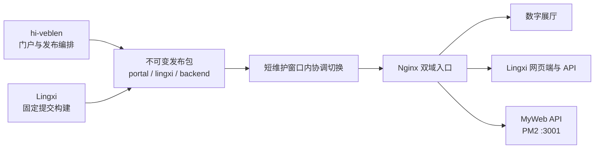

<div align="center">
  <p><code>HYJ.ARCHIVE // SIGNAL 99 // ONLINE</code></p>
  <h1>hi-veblen</h1>
  <p><strong>沉浸式个人数字艺术展厅，也是 Lingxi 网页端的主入口。</strong></p>
  <p>
    <a href="https://hi-veblen.com/">进入展厅</a>
    ·
    <a href="https://lingxi.hi-veblen.com/">进入 Lingxi</a>
    ·
    <a href="./docs/README.md">项目文档</a>
  </p>
  <p>
    <a href="https://github.com/Timking123/hi-veblen/actions/workflows/ci.yml">
      
    </a>
  </p>
</div>


## 展厅正在运行什么

hi-veblen 把个人履历、项目、影像与交互实验组织成一座可探索的数字展厅。首页不是传统作品集目录，而是一套持续运行的终端界面：系统 HUD、Canvas 视觉层、音频与画质控制、路由转场共同维持同一套叙事。门户同时提供 Lingxi 的独立入口，两个产品共享发布链路，但代码和数据边界保持分离。

| 入口 | 内容 |
| --- | --- |
| `/` | Signal Landing，展厅总控与导航 |
| `/about`、`/skills`、`/projects` | 身份档案、能力矩阵与作品归档 |
| `/gallery` | 影像与数字艺术画廊 |
| `/os` | Legacy OS、终端交互与隐藏游戏 |
| `/contact` | 通讯控制台 |
| Lingxi | 自定义角色、关系校准与专属对话，运行于独立域名 |

## 两个仓库各守一层

| 仓库 | 负责范围 | 不负责的内容 |
| --- | --- | --- |
| [`hi-veblen`](https://github.com/Timking123/hi-veblen) | 数字展厅、Legacy OS、门户 API、双站发布编排 | Lingxi 的 PersonaSpec、会话与认知核心 |
| [`Lingxi`](https://github.com/Timking123/Lingxi) | 角色创建、用户会话、宿主与网关、专属对话 | 门户内容与展厅交互 |



Lingxi 通过 `LINGXI_SHA` 固定到可审计提交。一次发布会生成带校验和与 revision 文件的不可变制品，再同步切换门户、Lingxi 网页端和 Lingxi 后端三个指针。MyWeb API 由独立 PM2 进程维护，双站发布只验证其健康状态，不替换它的运行目录。

## 技术栈

| 层 | 选择 |
| --- | --- |
| 门户 | Vue 3.5、TypeScript 5.9、Vue Router 4.6、Pinia 3 |
| 构建与样式 | Vite 7、Tailwind CSS 4、PostCSS |
| 动效 | Canvas、CSS、系统级路由转场与音频控制 |
| 门户 API | Express、TypeScript、SQLite、PM2 |
| 验证 | Vitest、Playwright、GitHub Actions |

## 本地启动

环境要求：Node.js `>=20.19 || >=22.12`，npm 使用随 Node.js 提供的稳定版本。

```bash
git clone https://github.com/Timking123/hi-veblen.git
cd hi-veblen
npm ci
npm run dev
```

开发服务器默认运行在 `http://localhost:5173`。只浏览展厅时无需启动 Lingxi；需要联调入口时，将 `.env.example` 复制为 `.env.local` 并修改 `VITE_LINGXI_URL`。

| 变量 | 本地模板值 | 用途 |
| --- | --- | --- |
| `VITE_BASE_URL` | `/` | 门户资源基路径 |
| `VITE_API_BASE_URL` | `/api` | 门户 API 前缀 |
| `VITE_LINGXI_URL` | `http://localhost:5174/` | Lingxi 网页端入口 |
| `VITE_ENABLE_ANALYTICS` | `false` | 是否上报匿名访问指标 |

## 常用命令

```bash
npm run type-check
npm run test -- src/views/__tests__/Home.test.ts
npm run build:skip-check
npx playwright install chromium
npx playwright test e2e/art-museum-experience.spec.ts --project=chromium
```

下一次生产发布使用的 CI 把结果分成四组，只有前三组构成发布证明。本轮提交的远端 CI 成功前，下表只是待生效的门禁定义，不能反推最近一次生产发布已经经过这些检查。

| 检查组 | 范围 | 是否阻断 |
| --- | --- | --- |
| `Release gate` | 根项目 type-check、Home 关键测试、生产构建 | 是 |
| `Admin quality` | 管理端 type-check、34 项测试与构建，后端生产构建 | 是 |
| `Portal E2E` | Chromium 门户体验冒烟 | 是 |
| `Legacy diagnostics (non-blocking)` | 旧全量 lint、unit 与 backend tests | 否，只保留完整诊断 |

`npm run test` 和 `npm run lint` 覆盖历史代码面。遗留诊断失败会被完整展示，不能用来宣称全量回归通过。

当前 legacy 计数、游戏子系统风险和依赖残留见 [已知质量边界](./docs/KNOWN_ISSUES.md)。

## 发布与回滚

下一次生产发布仅走 [`.github/workflows/deploy.yml`](./.github/workflows/deploy.yml)。该 workflow 固定 Lingxi 提交，要求同一门户 SHA 的三个严格 CI check 已成功，并重跑 Lingxi 确定性总检。切换时先停止 Lingxi mutation，在短维护窗口内协调替换三个版本指针；同 SHA 后端健康后恢复公网，任一步失败都会恢复上一组指针与服务配置。

当前生产仍为 portal `f766147`、Lingxi frontend/backend `eaa79c5`。严格 CI、独立 Python 3.12 release venv 和新增安全头要等下一次 workflow 成功并完成公网复验后才算上线。

完整操作边界见 [生产发布与回滚](./docs/PRODUCTION_DEPLOYMENT.md)。仓库不再维护 Docker、Vercel、服务器手工上传等第二套发布路线。

## 文档与安全

- [文档索引](./docs/README.md)
- [生产发布与回滚](./docs/PRODUCTION_DEPLOYMENT.md)
- [已知质量边界](./docs/KNOWN_ISSUES.md)
- [视觉系统设计](./docs/next-generation-sci-fi-terminal-portfolio-design.md)
- [彩蛋游戏文档](./docs/GAME_DOCUMENTATION.md)
- [安全策略](./SECURITY.md)

安全问题请通过 GitHub Private Security Advisory 私下报告，不要在公开 Issue 中粘贴凭据、用户数据或可利用细节。
