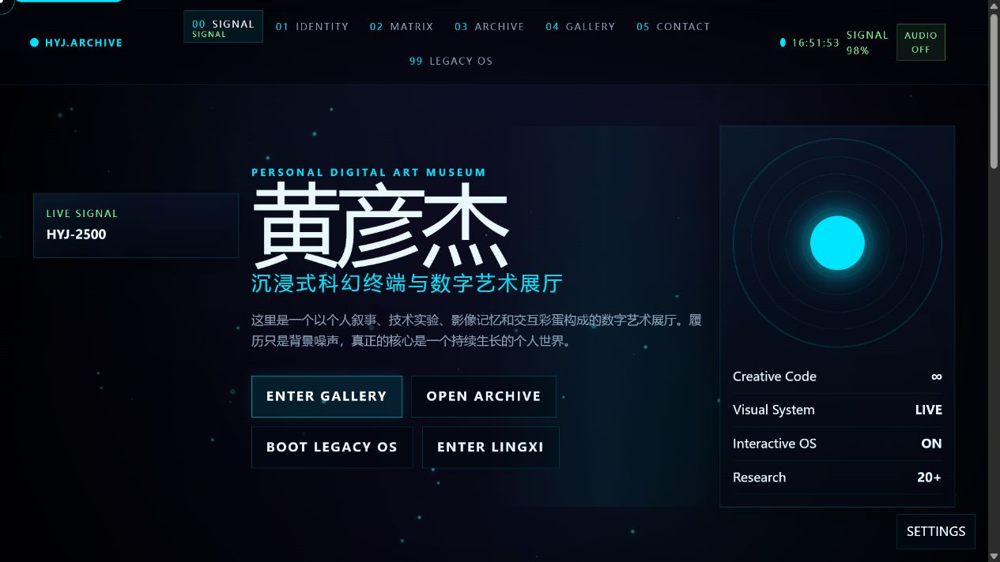
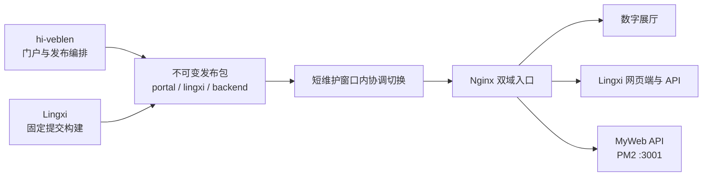

<div align="center">
  <p><code>HYJ.ARCHIVE // SIGNAL 99 // ONLINE</code></p>
  <h1>hi-veblen</h1>
  <p><strong>沉浸式个人数字艺术展厅，也是 Lingxi 网页端的主入口。</strong></p>
  <p>
    <a href="https://hi-veblen.com/">进入展厅</a>
    ·
    <a href="https://lingxi.hi-veblen.com/">进入 Lingxi</a>
    ·
    <a href="./docs/README.md">项目文档</a>
  </p>
  <p>
    <a href="https://github.com/Timking123/hi-veblen/actions/workflows/ci.yml">
      
    </a>
  </p>
</div>



## 展厅正在运行什么

hi-veblen 把个人履历、项目、影像与交互实验组织成一座可探索的数字展厅。首页不是传统作品集目录，而是一套持续运行的终端界面：系统 HUD、Canvas 视觉层、音频与画质控制、路由转场共同维持同一套叙事。门户同时提供 Lingxi 的独立入口，两个产品共享发布链路，但代码和数据边界保持分离。

| 入口 | 内容 |
| --- | --- |
| `/` | Signal Landing，展厅总控与导航 |
| `/about`、`/skills`、`/projects` | 身份档案、能力矩阵与作品归档 |
| `/gallery` | 影像与数字艺术画廊 |
| `/os` | Legacy OS、终端交互与隐藏游戏 |
| `/contact` | 通讯控制台 |
| Lingxi | 自定义角色、关系校准与专属对话，运行于独立域名 |

## 两个仓库各守一层

| 仓库 | 负责范围 | 不负责的内容 |
| --- | --- | --- |
| [`hi-veblen`](https://github.com/Timking123/hi-veblen) | 数字展厅、Legacy OS、门户 API、双站发布编排 | Lingxi 的 PersonaSpec、会话与认知核心 |
| [`Lingxi`](https://github.com/Timking123/Lingxi)（私有） | 网页应用网关、角色创建事务、用户会话、宿主与认知核心 | 门户内容、展厅交互与发布编排 |



Lingxi 是只向授权协作者开放的独立仓库，发布 workflow 通过只读凭据检出 `LINGXI_SHA` 指向的提交。它的网关承担登录、onboarding、角色创建与绑定、会话适配等网页应用事务，不是单纯的协议转发层。一次发布会生成带校验和与 revision 文件的不可变制品，再协调切换门户、Lingxi 网页端和 Lingxi 后端三个指针；Lingxi 的运行数据不进入 `hi-veblen` 仓库或发布制品。MyWeb API 由独立 PM2 进程维护，双站发布只验证其健康状态，不替换它的运行目录。

## 技术栈

| 层 | 选择 |
| --- | --- |
| 门户 | Vue 3.5、TypeScript 5.9、Vue Router 4.6、Pinia 3 |
| 构建与样式 | Vite 7、Tailwind CSS 4、PostCSS |
| 动效 | Canvas、CSS、系统级路由转场与音频控制 |
| 门户 API | Express、TypeScript、SQLite、PM2 |
| 验证 | Vitest、Playwright、GitHub Actions |

## 本地启动

环境要求：Node.js `22.12+`，CI 使用 Node.js 22；npm 使用随 Node.js 提供的稳定版本。

```bash
git clone https://github.com/Timking123/hi-veblen.git
cd hi-veblen
npm ci
npm run dev
```

开发服务器默认运行在 `http://localhost:5173`。只浏览展厅时无需启动 Lingxi；需要联调入口时，将 `.env.example` 复制为 `.env.local` 并修改 `VITE_LINGXI_URL`。

| 变量 | 本地模板值 | 用途 |
| --- | --- | --- |
| `VITE_BASE_URL` | `/` | 门户资源基路径 |
| `VITE_API_BASE_URL` | `/api` | 门户 API 前缀 |
| `VITE_LINGXI_URL` | `http://localhost:5174/` | Lingxi 网页端入口 |
| `VITE_ENABLE_ANALYTICS` | `false` | 是否上报匿名访问指标 |

## 常用命令

```bash
npm run type-check
npm run test -- src/views/__tests__/Home.test.ts
npm run build
npx playwright install chromium
npx playwright test e2e/art-museum-experience.spec.ts --project=chromium
```

当前生产版本使用的 CI 分为四组，只有前三组构成发布证明。Portal `d099480` 的 [CI run `29161853006`](https://github.com/Timking123/hi-veblen/actions/runs/29161853006) 四个 job 均为 success；Lingxi `014bdc1` 的 [CI run `29159820620`](https://github.com/Timking123/Lingxi/actions/runs/29159820620) 中，Web、Python 3.11 与 Python 3.12 三个确定性 job 全部通过。

| 检查组 | 范围 | 是否阻断 |
| --- | --- | --- |
| `Release gate` | 根项目 type-check、Home 关键测试、生产构建 | 是 |
| `Admin quality` | 管理端 type-check、34 项测试与构建，后端生产构建 | 是 |
| `Portal E2E` | Chromium 门户体验冒烟 | 是 |
| `Legacy diagnostics (non-blocking)` | 旧全量 lint、unit 与 backend tests | 否，只保留完整诊断 |

`Legacy diagnostics (non-blocking)` 显示 success 只表示非阻断包装已完整执行并保留诊断结果，不表示其中的 legacy 命令通过。`npm run test` 和 `npm run lint` 覆盖历史代码面；遗留失败仍会被完整展示，不能用来宣称全量回归通过。

当前 legacy 计数、游戏子系统风险和依赖残留见 [已知质量边界](./docs/KNOWN_ISSUES.md)。

## 仓库结构

| 路径 | 内容 |
| --- | --- |
| `src/components`、`src/views` | 展厅界面、路由页面与交互组件 |
| `src/game`、`src/os` | 彩蛋游戏、Legacy OS 与终端体验 |
| `src/admin` | 独立的管理端前后端 |
| `e2e` | Portal Chromium 端到端门禁 |
| `scripts`、`.github/workflows` | 构建辅助、质量门与双站发布事务 |
| `docs` | 生产运维、设计规范与已知边界 |

## 发布与回滚

生产发布仅走 [`.github/workflows/deploy.yml`](./.github/workflows/deploy.yml)。该 workflow 固定 Lingxi 提交，要求同一门户 SHA 的三个严格 CI check 已成功，并重跑 Lingxi 确定性总检。切换前失败时，当前指针和服务保持不变；进入维护或完成切换后失败时，workflow 会尝试恢复上一组指针与服务配置，并重新验证旧 revision、服务健康和 Nginx 维护守卫。恢复门没有全部通过时，维护与 `PRESERVE` 标记会保留，Lingxi 服务停止并转入人工恢复。

[生产 workflow `29162079426`](https://github.com/Timking123/hi-veblen/actions/runs/29162079426) 的构建与部署 job 均已成功，当前生产为 portal `d099480`、Lingxi frontend/backend/host `014bdc1`。本次发布清理 1 个无保护的旧 staging 目录，并按“最新 5 份、保护 4 个事务目标”的规则删除 3 份过期 release；独立只读复核确认 staging 为空、release 精确 5 份。独立 Python 3.12 release venv、`pip check`、新安全头与公网协议检查均已通过，两个 Lingxi systemd 单元的 `DropInPaths` 为空。

完整操作边界见 [生产发布与回滚](./docs/PRODUCTION_DEPLOYMENT.md)。仓库不再维护 Docker、Vercel、服务器手工上传等第二套发布路线。

## 使用与许可

`hi-veblen` 是公开源码仓库，但当前没有发布开源许可证。公开可见不代表已经授予复制、修改或再分发许可；开发约定见 [开发规范](./docs/DEVELOPMENT_STANDARDS.md)。Lingxi 仓库及其中的角色、会话与认知实现仍保持私有。

## 文档与安全

- [文档索引](./docs/README.md)
- [生产发布与回滚](./docs/PRODUCTION_DEPLOYMENT.md)
- [已知质量边界](./docs/KNOWN_ISSUES.md)
- [视觉系统设计](./docs/next-generation-sci-fi-terminal-portfolio-design.md)
- [彩蛋游戏文档](./docs/GAME_DOCUMENTATION.md)
- [安全策略](./SECURITY.md)

安全问题请通过 GitHub Private Security Advisory 私下报告，不要在公开 Issue 中粘贴凭据、用户数据或可利用细节。
