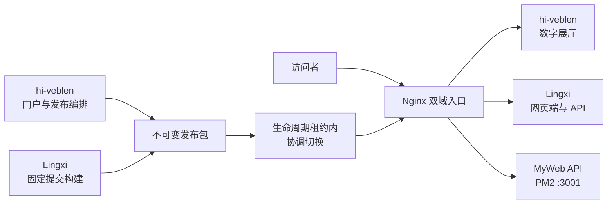

<div align="center">
  <p><code>HYJ.ARCHIVE // SIGNAL 99 // ONLINE</code></p>
  <h1>hi-veblen</h1>
  <p><strong>一座能逛、能听、能交互的个人数字艺术展厅，也是 Lingxi 的公共入口。</strong></p>
  <p>
    <a href="https://hi-veblen.com/">进入展厅</a>
    ·
    <a href="https://lingxi.hi-veblen.com/">进入 Lingxi</a>
    ·
    <a href="./docs/README.md">阅读文档</a>
  </p>
  <p>
    <a href="https://github.com/Timking123/hi-veblen/actions/workflows/ci.yml">
      
    </a>
    
    
    
  </p>
</div>


## 这座展厅是什么

hi-veblen 没有把履历、项目和照片平铺成一张长表。它把身份档案、工作经历、作品、影像与交互实验放进同一套终端叙事里：页面像一台持续接收信号的设备，Canvas 视觉层、系统 HUD、路由转场、音频和画质控制共同维持这段体验。

普通访问者可以直接浏览内容，也可以进入 Legacy OS 寻找隐藏交互。门户还提供 Lingxi 的独立入口。两边共用一条经过校验的生产发布链，代码、运行数据和职责边界则保持分离。

| 去哪里 | 会看到什么 |
| --- | --- |
| `/` | Signal Landing，展厅总控、状态面板与主要入口 |
| `/about`、`/education`、`/experience` | 身份档案、教育背景与职业经历 |
| `/skills` | 能力矩阵 |
| `/projects`、`/projects/:id` | 作品归档与项目详情 |
| `/gallery` | 影像与数字艺术画廊 |
| `/os` | Legacy OS、终端交互与隐藏游戏 |
| `/contact` | 通讯控制台 |
| Lingxi | 自定义角色、关系校准与专属对话，运行在独立域名 |

## 两个仓库怎样协作

| 仓库 | 负责范围 | 不负责的内容 |
| --- | --- | --- |
| [`hi-veblen`](https://github.com/Timking123/hi-veblen) | 数字展厅、Legacy OS、门户 API、双站发布编排 | Lingxi 的 PersonaSpec、会话与认知核心 |
| [`Lingxi`](https://github.com/Timking123/Lingxi)（私有） | 网页应用网关、角色创建事务、用户会话、宿主与认知核心 | 门户内容、展厅交互与发布编排 |



Lingxi 只向授权协作者开放。发布 workflow 通过只读凭据检出 `LINGXI_SHA` 指向的提交，将门户、Lingxi 网页端和 Lingxi 后端组合成带校验和与 revision 文件的不可变制品，再协调切换三组生产指针。Lingxi 的角色、会话和记忆数据不会进入 `hi-veblen` 仓库或发布制品。

MyWeb API 由独立 PM2 进程维护。双站发布会验证它是否健康，但不会替换它的运行目录，也不会代替数据库迁移和 API 回滚流程。

## 技术实现

| 体验层 | 普通读者可以这样理解 | 工程实现 |
| --- | --- | --- |
| 展厅界面 | 页面不是静态简历，而是一套可探索的终端界面 | Vue 3.5、Vue Router 4.6、Pinia 3、TypeScript 5.9 严格模式 |
| 视觉与动效 | 背景、状态和转场会随页面与设备能力变化 | Canvas、CSS、路由转场、音频与画质控制、`prefers-reduced-motion` 降级 |
| 构建与样式 | 开发时快速刷新，发布时生成可缓存的静态资源 | Rolldown Vite 7、Tailwind CSS 4、PostCSS |
| 门户 API | 联系表单、内容与访问数据由独立服务处理 | Express、TypeScript、SQLite、PM2 |
| 自动验证 | 每次候选版本都要先过固定检查，再允许发布 | Vitest、Playwright、GitHub Actions |
| 生产切换 | 新旧版本各自保留，失败时恢复上一组指针 | 不可变 release、SHA-256 校验、`flock`、生命周期租约、维护守卫 |

## 本地启动

环境要求：Node.js `22.12+`。CI 使用 Node.js 22，npm 使用随 Node.js 提供的稳定版本。

```bash
git clone https://github.com/Timking123/hi-veblen.git
cd hi-veblen
npm ci
npm run dev
```

开发服务器默认运行在 `http://localhost:5173`。只浏览展厅时无需启动 Lingxi；需要联调入口时，将 `.env.example` 复制为 `.env.local`，再修改 `VITE_LINGXI_URL`。

| 变量 | 本地模板值 | 用途 |
| --- | --- | --- |
| `VITE_BASE_URL` | `/` | 门户资源基路径 |
| `VITE_API_BASE_URL` | `/api` | 门户 API 前缀 |
| `VITE_LINGXI_URL` | `http://localhost:5174/` | Lingxi 网页端入口 |
| `VITE_ENABLE_ANALYTICS` | `false` | 是否上报匿名访问指标 |

## 常用检查

```bash
npm run type-check
npm run test -- src/views/__tests__/Home.test.ts
npm run build
npx playwright install chromium
npx playwright test e2e/art-museum-experience.spec.ts --project=chromium
```

截至 2026-07-14，Portal `3b0f010a0fb495504d0c3ffa01006f8bc33a8475` 的 [CI run `29301865888` attempt 2](https://github.com/Timking123/hi-veblen/actions/runs/29301865888/attempts/2) 四个 job 均为 success。attempt 1 因 GitHub 托管 runner 访问 APT 镜像超时而中断，未形成项目代码失败结论；同一提交重跑后四路通过。Lingxi `55255df61ae6aef89ce5d8e4d46ba637ca3cd632` 的 [CI run `29301558361`](https://github.com/Timking123/Lingxi/actions/runs/29301558361) 中，Web、Python 3.11 与 Python 3.12 三个确定性 job 全部通过。前三组门户检查负责阻断发布，`Legacy diagnostics (non-blocking)` 只保留旧全量诊断结果。

| 检查组 | 覆盖范围 | 是否阻断发布 |
| --- | --- | --- |
| `Release gate` | 根项目类型检查、Home 关键契约、生产构建与发布事务自检 | 是 |
| `Admin quality` | 管理端类型检查、34 项测试与构建，后端生产构建 | 是 |
| `Portal E2E` | Chromium 门户体验冒烟 | 是 |
| `Legacy diagnostics (non-blocking)` | 旧全量 lint、unit 与 backend tests | 否，只保留完整诊断 |

`Legacy diagnostics (non-blocking)` 显示 success，只表示诊断命令跑完并保留了结果，不表示其中的 legacy 命令已经全部通过。历史计数、当前游戏子系统风险和依赖残留见 [已知质量边界](./docs/KNOWN_ISSUES.md)。

## 仓库结构

```text
hi-veblen/
├─ src/components + src/views   展厅界面、路由页面与交互组件
├─ src/game + src/os            隐藏游戏与 Legacy OS
├─ src/admin                    独立管理端前后端
├─ e2e                          Portal Chromium 端到端门禁
├─ scripts                      发布与验收辅助脚本
├─ .github/workflows            CI 与双站发布事务
└─ docs                         运维、设计规范与已知边界
```

## 发布与回滚

生产发布只走 [`.github/workflows/deploy.yml`](./.github/workflows/deploy.yml)。workflow 固定 Lingxi 提交，要求同一门户 SHA 的三个严格 CI check 已成功，并重跑 Lingxi 确定性总检。远端使用服务器发布锁和跨步骤生命周期租约，同一时刻只允许一个拥有明确 `run_id-run_attempt` 的事务上传、切换或清理自己的暂存目录。

上传目录创建后立即写入 `PRESERVE`；完成切换的 release 写入 `DEPLOYED`。切换前失败不会改变当前指针。进入维护或完成切换后失败时，workflow 会尝试恢复上一组指针、服务与 Nginx 配置，并重新验证旧 revision 和健康状态。恢复门未全部通过时，现场保护标记会保留，Lingxi 服务停止并转入人工恢复。

截至 2026-07-14，[生产 workflow `29302920011`](https://github.com/Timking123/hi-veblen/actions/runs/29302920011) 的构建与部署 job 均为 success，构建耗时 3 分 30 秒，部署耗时 1 分 50 秒。线上版本为 portal `3b0f010a0fb495504d0c3ffa01006f8bc33a8475`、Lingxi frontend/backend/host `55255df61ae6aef89ce5d8e4d46ba637ca3cd632`。构建和部署日志分别搜索 `Traceback`、`AssertionError`、`FileNotFoundError`，六项检查均为 0 命中；匿名公网协议探针 24/24 通过，两站 `release.txt`、入口资源、MIME、安全头、缺失资源 404 和健康接口都符合发布契约。Lingxi 的 `ok`、`ready`、`continuity_ok` 与 `production_auth_safe` 均为 `true`。

真实 Chromium 复验覆盖 1440×900、1024×768、768×1024、375×812、844×390、812×375 六档 Lingxi 视口，全部保持横向溢出 0、单一裂缝宿主和单一 ready Canvas；`hover`、`click`、`drag`、`long_press` 四类页面会话痕迹刷新后仍完整保留。Portal 首屏连续帧有效，双站控制台 warning/error 为 0。完整证据归档在 `E:\MyAgent Test\P6生产浏览器验收\2026-07-14_1124_P6短会话鉴权优化最终生产复验\`。本轮没有生产用户凭据，因此没有把公开入口验收写成登录后角色创建、历史分页或完整对话验收；Windows Chromium 也不替代 iOS、Android、Safari 与真实平板真机。

完整边界与人工恢复要求见 [生产发布与回滚](./docs/PRODUCTION_DEPLOYMENT.md)。仓库不再维护 Docker、Vercel、服务器手工上传等第二套发布路线。

## 使用与许可

`hi-veblen` 是公开源码仓库，但当前没有发布开源许可证。公开可见不代表已经授予复制、修改或再分发许可。开发约定见 [开发规范](./docs/DEVELOPMENT_STANDARDS.md)，Lingxi 仓库及其中的角色、会话与认知实现仍保持私有。

## 文档与安全

- [文档索引](./docs/README.md)
- [生产发布与回滚](./docs/PRODUCTION_DEPLOYMENT.md)
- [已知质量边界](./docs/KNOWN_ISSUES.md)
- [视觉系统设计](./docs/next-generation-sci-fi-terminal-portfolio-design.md)
- [彩蛋游戏文档](./docs/GAME_DOCUMENTATION.md)
- [安全策略](./SECURITY.md)

安全问题请通过 GitHub Private Security Advisory 私下报告，不要在公开 Issue 中粘贴凭据、用户数据或可利用细节。
